[](https://react.dev)
[](https://vitejs.dev)
[](https://www.python.org)
[](https://fastapi.tiangolo.com)
[](https://pywebview.flowrl.com)
[](https://github.com/yt-dlp/yt-dlp)
[](https://ffmpeg.org)
[](https://github.com/TeamPiped/Piped)


<h1 align="center">
  <br>
  
  <br>
  YT-Deluxe
  <br>
</h1>

<h4 align="center">
  Premium YouTube Media Downloader
</h4>

**YT Deluxe** is a *Free & OpenSource, Full-stack, Feature-rich* **YouTube Downloader and Media Management Hybrid (Web & Desktop) Self-Hosted Application** with a **"Premium Liquid Glass"** UI. Built with a React frontend and a robust FastAPI backend, **YT Deluxe** empowers users to **Search**, **Preview**, and **Download** YouTube Videos and Audio with a streamlined, premium experience.

---

## Table of Contents

<details>
<summary><a href="#1-why-yt-deluxe">1. Why YT Deluxe?</a></summary>

- [1.1 The Problem](#11-the-problem)
- [1.2 The Solution](#12-the-solution)

</details>

<details>
<summary><a href="#2-features-overview">2. Features Overview</a></summary>

- [2.1 Frontend (Modern UI)](#21-frontend-modern-ui)
- [2.2 Backend (Advanced Engine)](#22-backend-advanced-engine)

</details>

<details>
<summary><a href="#3-demo">3. Demo</a></summary>
</details>

<details>
<summary><a href="#4-project-structure">4. Project Structure</a></summary>
</details>

<details>
<summary><a href="#5-architecture--workflows">5. Architecture &amp; Workflows</a></summary>

- [5.1 Complete User Lifecycle](#51-complete-user-lifecycle)
- [5.2 Infinite Scroll & Content Discovery Architecture](#52-infinite-scroll--content-discovery-architecture)
- [5.3 System Performance & Optimization Architecture](#53-system-performance--optimization-architecture)
- [5.3 Hybrid Video Player Architecture](#53-hybrid-video-player-architecture)
- [5.4 Format Fetch, Preset Display & Download System](#54-format-fetch-preset-display--download-system)
- [5.5 Precision Trimming Architecture](#55-precision-trimming-architecture)
- [5.6 Trimmer Component Architecture](#56-trimmer-component-architecture)
- [5.7 Hosted Web Application Architecture](#57-hosted-web-application-architecture)
- [5.8 Native Windows Desktop Architecture](#58-native-windows-desktop-architecture)
- [5.9 System Architecture & Workflows](#59-system-architecture--workflows)

</details>

<details>
<summary><a href="#6-installation-and-setup-local-development">6. Installation and Setup (Local Development)</a></summary>

- [6.1 Frontend Dependencies](#61-frontend-dependencies)
- [6.2 Backend Dependencies](#62-backend-dependencies)
- [6.3 Desktop Dependencies](#63-desktop-dependencies)
- [6.4 Prerequisites](#64-prerequisites)
- [6.5 Frontend Setup (Local)](#65-frontend-setup-local)
- [6.6 Backend Setup (Local)](#66-backend-setup-local)

</details>

<details>
<summary><a href="#7-api-reference">7. API Reference</a></summary>
</details>

<details>
<summary><a href="#8-usage-guide">8. Usage Guide</a></summary>

- [8.1 Search and Discovery](#81-search-and-discovery)
- [8.2 Download & Trimming Management](#82-download--trimming-management)
- [8.3 Batch Processing](#83-batch-processing)
- [8.4 Real-time Performance Tracking](#84-real-time-performance-tracking)
- [8.5 History and Storage Management](#85-history-and-storage-management)
- [8.6 Native Desktop Integrations](#86-native-desktop-integrations)
- [8.7 User Feedback](#87-user-feedback)
- [8.8 API Usage Examples (CLI/cURL)](#88-api-usage-examples-clicurl)

</details>

<details>
<summary><a href="#9-building--deploying-the-web-app">9. Building &amp; Deploying the Web App</a></summary>

- [9.1 Backend (Cloud Web Service)](#91-backend-cloud-web-service)
- [9.2 Frontend (Static Hosted App)](#92-frontend-static-hosted-app)
- [9.3 Connecting Frontend & Backend](#93-connecting-frontend--backend)

</details>

<details>
<summary><a href="#10-building-for-desktop-windows-exe">10. Building for Desktop (Windows .exe)</a></summary>

- [10.1 Environment Preparation (Crucial)](#101-environment-preparation-crucial)
- [10.2 Build Static Frontend](#102-build-static-frontend)
- [10.3 Bundle Backend via PyInstaller](#103-bundle-backend-via-pyinstaller)
- [10.4 Build UI Launcher via PyInstaller](#104-build-ui-launcher-via-pyinstaller)
- [10.5 Post-Build Testing (Port 8000 Conflict Awareness)](#105-post-build-testing-port-8000-conflict-awareness)
- [10.6 Create the Final Setup Installer (Inno Setup)](#106-create-the-final-setup-installer-inno-setup)
- [10.7 Distribution Integrity & SHA-256 Verification](#107-distribution-integrity--sha-256-verification)

</details>

<details>
<summary><a href="#11-contributing">11. Contributing</a></summary>
</details>

<details>
<summary><a href="#12-legal">12. Legal</a></summary>

- [12.1 License](#121-license)
- [12.2 Privacy Policy](#122-privacy-policy)
- [12.3 Terms & Conditions](#123-terms--conditions)
- [12.4 Disclaimer](#124-disclaimer)

</details>

<details>
<summary><a href="#14-support--maintenance">14. Support &amp; Maintenance</a></summary>
</details>

---

## 1. Why YT Deluxe?

### 1.1 The Problem

In today’s digital-first world, YouTube is one of the largest sources of video and audio content. However, YouTube itself does not allow direct downloading for offline use, creating significant inconvenience for learners, creators, and researchers. Most existing third-party downloaders are plagued with intrusive ads, malware risks, confusing interfaces, and limited format options.

### 1.2 The Solution

**YT-Deluxe** is envisioned as a clean, ad-free, free and and open source feature-rich media management system. It provides a secure environment for users to preserve digital content in multiple qualities and formats. By leveraging a state-of-the-art **"Liquid Glass"** interface and a robust backend architecture, it bridges the gap between raw technical power and premium user experience.

---

## 2. Features Overview

### 2.1 Frontend (Modern UI)

- **React 18 & Vite**: Ultra-fast, responsive UI leveraging modern concurrent rendering and hooks.
- **Liquid Glass Design Language**: Premium, high-blur, and transparent styling via TailwindCSS with **`rounded-xl`** geometry for consistent modern aesthetics.
- **Multilingual & Hinglish Support**: Native support for English, Hindi, German, and conversational **Hinglish** (Hindi-English) with persistent state synchronization.
- **Dynamic Mode Detection**: React automatically switches UI features (like local paths) based on the `isDesktop` environment flag.
- **Framer Motion**: Smooth, high-performance UI animations, including premium 'Sliding Pill' tab transitions and entrance effects.
- **Integrated Legal Hub**: Dedicated informational sections for About, Privacy Policy, and Terms & Conditions directly inside the app.
- **Lucide Icons**: Clean, light-weight, and professional-grade icon library.

### 2.2 Backend (Advanced Engine)

- **FastAPI Core**: Blazing fast asynchronous processing with comprehensive endpoint management.
- **Advanced yt-dlp Extractor**: The core extraction engine handles all YouTube video/audio fetching, format resolution, and download execution with **PO Token** (Proof of Origin) support to bypass bot detection. Also serves as the reliable fallback data source for trending and search when external APIs are unavailable.
- **Multi-Source Metadata Enrichment**: Supplements yt-dlp with rich metadata using a parallel race condition across 3 sources: **Piped API**, **YouTube Page Scraping**, and **Return YouTube Dislike (RYD) API**. This guarantees ultra-fast metadata loading (~3s) even when community APIs are blocked by YouTube, providing upload dates, real avatars, and accurate like counts instantly.
- **Integrated FFmpeg Merge**: Seamlessly merges high-res (1080p+) DASH video/audio streams into a single high-quality file.
- **Unified Download Engine**: On Windows Desktop, files are natively routed to your `Downloads` folder, with an "Open Folder" feature.
- **Thumbnail API Proxy**: Bypasses CORS and environment restrictions in desktop mode by routing image downloads through a secure backend proxy.
- **Precision Trimming**: Trim specific segments from your downloads with no quality re-encoding loss, featuring **MM:SS** time formatting.
- **Streamlined Preferences**: Removed technical "Advanced" overhead to focus on a cleaner, simplified user experience.
- **Progress Tracking**: Real-time download speed, percentage, and ETA polling.
- **History Persistence**: User downloads are logged and persist across sessions (JSON on Desktop, LocalStorage on Web).
- **Auto-Cleanup Daemon**: Server-side temp files are wiped after delivery to ensure data privacy and prevent bloating.
- **CORS Enabled**: Secure communication between frontend and backend.

---

## 3. Demo


**Home / Search Page**
<p align="center">
  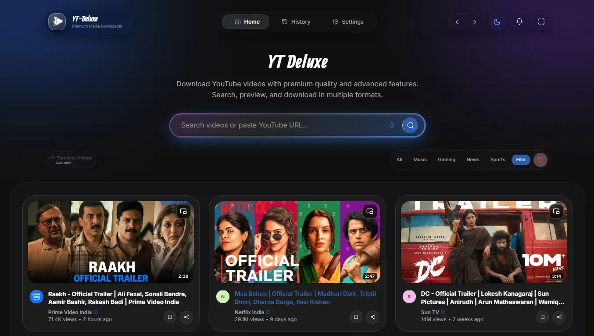
  &nbsp;
  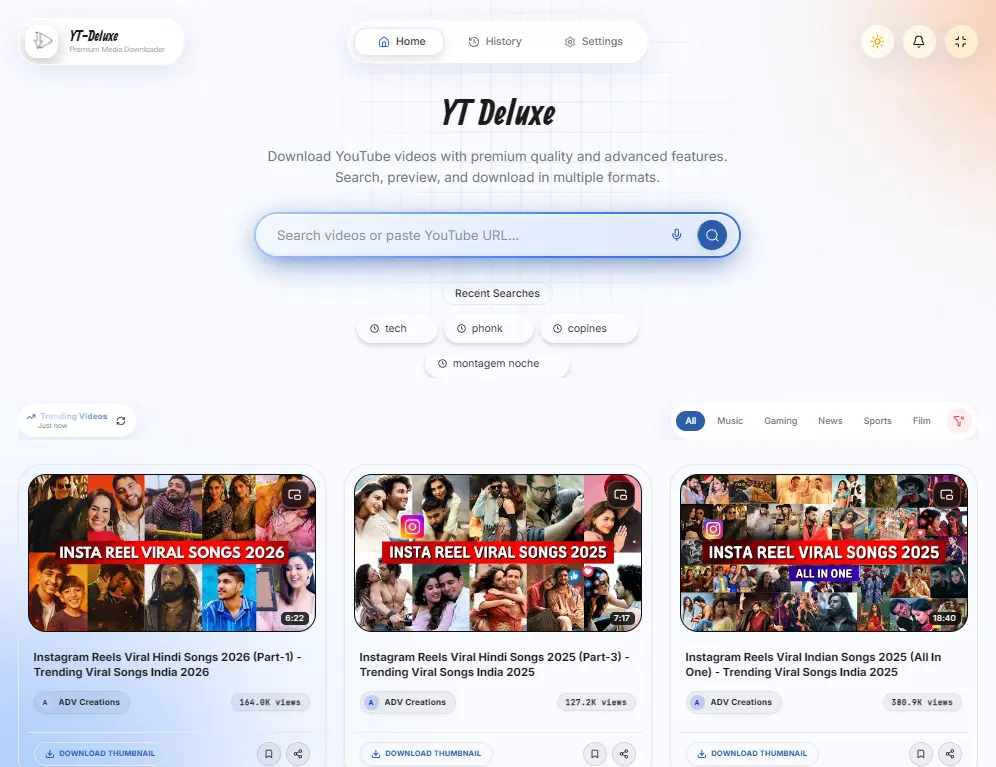
</p>


## 4. Project Structure

```text
yt-deluxe/
├── .gitignore                  # Git ignore rules
├── .nvmrc                      # Node version pin
├── ARCHITECTURE.md             # Full technical documentation
├── CHANGELOG.md                # Release & version history
├── README.md                   # Project overview & quick start
│
├── frontend/                   # React app (Vite + TailwindCSS)
│   ├── index.html              # HTML entry point
│   ├── package.json            # NPM dependencies & scripts
│   ├── vite.config.mjs         # Vite build configuration
│   ├── vitest.config.mjs       # Vitest test runner configuration
│   ├── .eslintrc.cjs           # ESLint configuration
│   ├── tailwind.config.js      # TailwindCSS theme & plugins
│   ├── postcss.config.js       # PostCSS pipeline config
│   ├── jsconfig.json           # JS path aliases
│   ├── sync-version.js         # Syncs version across package files
│   ├── vercel.json             # Vercel deployment config (Web)
│   ├── public/                 # Static public assets
│   │   ├── assets/             # Images, logos, icons
│   │   ├── fonts/              # Self-hosted web fonts
│   │   ├── manifest.json       # PWA manifest
│   │   ├── robots.txt          # Search engine crawl rules
│   │   ├── completed.mp3       # Download complete sound
│   │   ├── started.mp3         # Download started sound
│   │   └── error.mp3           # Download error sound
│   └── src/                    # Application source
│       ├── index.jsx           # React DOM entry point
│       ├── App.jsx             # Root App component
│       ├── Routes.jsx          # Client-side routing definitions
│       ├── pages/              # Full-page views
│       │   ├── home-search-dashboard/    # Home & trending feed
│       │   ├── search-results-page/      # Keyword search results
│       │   ├── video-details-download/   # Video player & download UI
│       │   ├── download-history-management/ # History & disk usage
│       │   ├── user-settings-preferences/   # Settings & preferences
│       │   └── NotFound.jsx              # 404 fallback page
│       ├── components/         # Reusable UI components
│       │   ├── ui/             # Core UI primitives
│       │   │   ├── Header.jsx              # Top navigation & search bar
│       │   │   ├── GlobalPIPPlayer.jsx     # Picture-in-Picture player
│       │   │   ├── GlobalProgressFloater.jsx # Download progress overlay
│       │   │   ├── ShareModal.jsx          # Share dialog
│       │   │   ├── PermissionDialog.jsx    # Desktop permission prompts
│       │   │   ├── ProgressNotification.jsx # Toast notifications
│       │   │   ├── CustomDropdown.jsx      # Styled dropdown menu
│       │   │   ├── Button.jsx              # Reusable button
│       │   │   ├── Input.jsx               # Styled text input
│       │   │   ├── Select.jsx              # Select/combobox
│       │   │   ├── Checkbox.jsx            # Styled checkbox
│       │   │   ├── ThemeToggle.jsx         # Dark/light mode toggle
│       │   │   ├── UndoToast.jsx           # Undo action toast
│       │   │   ├── WifiLoader.jsx          # Connection spinner
│       │   │   └── the-infinite-grid.jsx   # Animated background grid
│       │   ├── AppIcon.jsx     # Dynamic app icon component
│       │   ├── AppImage.jsx    # Lazy image with fallback
│       │   ├── ErrorBoundary.jsx # React error boundary
│       │   ├── PageSkeleton.jsx  # Loading skeleton layouts
│       │   └── ScrollToTop.jsx   # Scroll restoration on navigation
│       ├── context/            # React context providers
│       │   ├── DownloadContext.jsx  # Global download state & queue
│       │   └── PIPContext.jsx       # PIP player state
│       ├── styles/             # Global stylesheets
│       │   ├── index.css       # Base CSS reset & variables
│       │   └── tailwind.css    # Tailwind directive entry
│       ├── locales/            # i18n translation files
│       │   ├── en.json         # English
│       │   ├── hi.json         # Hindi
│       │   ├── de.json         # German
│       │   └── hg.json         # Hinglish
│       └── utils/              # Utility modules
│           ├── api.js          # Backend API communication client
│           ├── dataCache.js    # In-memory cache for search & trending
│           ├── storage.js      # localStorage abstraction layer
│           ├── dateFormat.js   # Relative & absolute date formatting
│           ├── fileNaming.js   # Download filename sanitization
│           ├── permissions.js  # Desktop permission helpers
│           ├── i18n.js         # i18next initialization
│           ├── cn.js           # clsx/tailwind-merge helper
│           └── ThemeContext.jsx # Theme provider & hook
│
├── backend/                    # FastAPI Python application
│   ├── main.py                 # All routes, background tasks & logic
│   ├── requirements.txt        # Python package dependencies
│   ├── Dockerfile              # Docker container definition
│   ├── export_cookies.py       # Browser cookie extraction utility
│   ├── ffmpeg.exe              # Bundled FFmpeg binary (Windows)
│   ├── bgutil-ytdlp-pot-provider/ # PO Token provider for yt-dlp
│   ├── secrets_runtime/        # Runtime secrets & cookie storage
│   └── tempfiles/              # Ephemeral download processing dir
│
├── desktop/                    # Native Windows Desktop wrapper
│   ├── launcher.py             # Spawns backend & PyWebView window
│   ├── build.spec              # PyInstaller .exe bundle config
│   ├── requirements.txt        # Desktop-only Python dependencies
│   ├── assets/
│   │   └── icon.ico            # Application window icon
│   └── installer/              # Inno Setup 6 distribution package
│       ├── setup.iss           # Inno Setup installer script
│       └── MicrosoftEdgeWebview2Setup.exe  # Bundled WebView2 installer
│
├── website/                    # Static marketing/landing site
│   ├── index.html              # Landing page
│   ├── features.html           # Features showcase
│   ├── about.html              # About the project
│   ├── updates.html            # Changelog/updates page
│   ├── privacy.html            # Privacy policy
│   ├── terms.html              # Terms of use
│   ├── disclaimer.html         # Legal disclaimer
│   ├── license.html            # License page
│   ├── 404.html                # Not found page
│   ├── robots.txt              # SEO crawl rules
│   ├── assets/                 # Images & media
│   ├── css/                    # Stylesheets
│   └── js/                     # Scripts
│
├── docs/                       # Documentation assets
│   └── assets/                 # Screenshots & media for README
│
└── config/                     # Reserved for future config files
```

---

## 5. Architecture & Workflows

### 5.1 Complete User Lifecycle

*The full step-by-step journey from URL/keyword input to a saved media file on your device.*


```mermaid
flowchart TD
    A["User enters URL or keyword\n(Search page)"] --> B["GET /api/search\nyt-dlp / YouTube search API\nReturns title, thumbnail, duration, channel"]
    B --> C["VideoCard rendered in search grid"]
    C --> D{"User hover > 600ms?"}
    D -- Yes --> E["YouTube iframe loads\n(Hybrid Player Layer 1)\nor backend stream fallback"]
    D -- No --> F["User clicks card"]
    E --> F
    F --> G["Navigate to VideoDetailsDownload\nPhase 1: GET /api/video/quick (Multi-Source)\nPhase 2: GET /api/video?url=... (yt-dlp)"]
    G --> H["Phase 1 renders instant metadata (~3s)\nPhase 2 builds formats + all_formats (~6s)"]
    H --> I["videoData set in index.jsx\nDownloadTabs + VideoTrimmer receive props"]
    I --> J["User sees:\nQuick Actions sidebar\nQuick Download preset cards\nAdvanced Options quality grid"]
    J --> K{"User action?"}
    K -- "Quick Actions\n(1-click)" --> L["handleDownload direct\nno format_id\nbackend auto-selects"]
    K -- "Preset card\nor quality grid" --> M["handlePresetDownload /\nhandleCustomDownload\nformat_id + container resolved"]
    K -- "Advanced Grid\n(Show All Formats)" --> N["advancedSelectedId set\nexact stream format_id locked"]
    L & M & N --> O["POST /api/download\nFormData: url, quality, format, format_id,\naudio_format_id, container, convert_to_mp3,\nrename, trim_start, trim_end"]
    O --> P["download_worker() spawned\nas background task"]
    P --> Q{"Which backend path?"}
    Q -- "format_id set\n(Exact stream)" --> R["FORMAT_ID PATH\nDerives native container\nCodec-compatible audio spec"]
    Q -- "type=audio or\nconvert_to_mp3" --> S["AUDIO PATH\nMP3 transcode or\nNative M4A / Opus"]
    Q -- "Quality label only\n(no format_id)" --> T["QUALITY PATH\nbestvideo height<=N\n+bestaudio"]
    R & S & T --> U["yt-dlp downloads streams\nFFmpeg merges if needed"]
    U --> V{"Trim requested?"}
    V -- Yes --> W["Unique _ytd_taskid prefix\nFFmpeg -ss START -t DUR -c copy\nRename to clean filename"]
    V -- No --> X["Snapshot diff file detection\nNew file identified"]
    W & X --> Y{"isDesktop?"}
    Y -- Desktop --> Z["File saved to\nYT Deluxe Downloads/\nVideos or Music folder"]
    Y -- Web --> AA["FileResponse streamed\nto browser\nAuto-cleanup after 10 min"]
    Z & AA --> AB["History logged\ntask status = completed\nFrontend progress reaches 100%"]
```

> **In plain words:** Think of this as the master map of the entire app. You type a song or video name, the app searches YouTube, shows you results with a tiny preview on hover. You click one, the app quietly fetches every quality option YouTube has for that video. You pick what you want or let the app decide click Download, and the file lands in your folder. Everything between those two actions (search and saved file) is what this diagram shows.

### Step-by-step breakdown

---

#### Step 1: Search or URL Entry

**Component:** `SearchPage` | **API:** `GET /api/search?q=...`

The user types a keyword (e.g., "lofi beats") or pastes a direct YouTube URL into the search bar and presses Enter. The frontend calls `GET /api/search?q=<query>`. The backend runs `yt-dlp` with `ytsearch10:<query>` to get the top 10 results from YouTube, returning for each: title, channel name, duration, view count, publish date, and thumbnail URL. If a direct URL is pasted, the search is skipped and the user is routed straight to the details page.

> The app never talks to the YouTube website directly from your browser all YouTube communication goes through the backend, which also handles cookies and PO Token negotiation invisibly.

---

#### Step 2: Search Results Grid

**Component:** `VideoCard`

The 10 results are rendered as a responsive card grid. Each card shows the thumbnail image, video title, channel name, duration badge, and view count. Cards are lazy-loaded so images only fetch when they scroll into view. No video data or stream URLs are fetched at this point only the lightweight metadata from Step 1:.

---

#### Step 3: Hover Preview (Hybrid Player)

**Component:** `VideoCard` | **API:** `GET /api/stream` (fallback only)

When the user hovers over a card for more than 600ms, a video preview activates inside the card thumbnail area. The app first tries to load a YouTube iframe embed (`youtube.com/embed/{videoId}?autoplay=1&muted=1`). If YouTube allows it, the preview plays from YouTube's CDN zero backend cost. If YouTube blocks embedding (age-gate, copyright restriction), the app silently switches to `GET /api/stream?url=...&quality=360p` and plays via a native `<video>` tag. Moving the cursor away resets the state; the next hover starts fresh.

> The 600ms delay is intentional it prevents accidental previews when the user is just scanning through results.

---

#### Step 4: User Clicks a Card

**Component:** React Router

Clicking a card triggers a client-side navigation to `/video?url=<youtube_url>`. No page reload happens React Router mounts the `VideoDetailsDownload` page component and passes the URL as a query parameter.

---

#### Step 5: Video Details Page & Format Fetch

**Component:** `index.jsx` | **API:** `GET /api/video/quick?id=...` & `GET /api/video?url=...`

As soon as `VideoDetailsDownload` mounts, it launches two parallel API requests:
1. **Phase 1 (Quick Metadata):** Calls `GET /api/video/quick` which runs a 3-source parallel race (Piped, YT Scrape, RYD) to instantly return title, views, likes, avatar, and upload date. The UI renders this within ~3s to eliminate the loading skeleton.
2. **Phase 2 (Formats):** Calls `GET /api/video` which runs `yt-dlp` with `skip_download: True` to extract the full stream manifest.

Once Phase 2 completes, it processes every format in the manifest:

- **Audio streams** filtered by codec, sorted by bitrate, deduplicated to one per codec family (Opus, AAC, other), max 3 total
- **Video streams** the single best stream per resolution height (by `tbr` then `filesize`) is kept for `formats`; every raw stream is kept for `all_formats`

The response returns two lists: `formats` (recommended, 5–8 entries) and `all_formats` (every unique stream, often 20–40 entries).

---

#### Step 6: Formats Populate the UI

**Component:** `DownloadTabs`, `VideoTrimmer`

`index.jsx` stores the API response in `videoData` state and passes it as props to both `<DownloadTabs>` and `<VideoTrimmer>`. Inside `DownloadTabs`, `useMemo` hooks filter `videoData.formats` into `videoQualities` (type=video, sorted by height desc) and `audioQualities` (type=audio, sorted by quality index). These power the Quick Download preset cards and the full quality grid. `videoData.all_formats` powers the "Show All Advanced Formats" dropdown.

---

#### Step 7: User Selects Quality / Format / Container

**Component:** `DownloadTabs`

The user has three download surfaces to choose from:

| Surface | What it does |
|---------|-------------|
| **Quick Actions** (sidebar) | Three hardcoded 1-click buttons Best Video, Audio Only, Thumbnail. No configuration, no format_id. Backend auto-selects. |
| **Quick Download** (preset cards) | Three auto-picked cards: best, middle, lowest quality. Clicking one sets `selectedQuality` and resolves `format_id`. |
| **Advanced Options** (quality grid + dropdown) | Full quality grid from all `videoQualities`/`audioQualities`. "Show All Advanced Formats" exposes every raw stream by `format_id`. Container dropdown selects MP4/MKV/WebM/MOV or Auto (native). |

Any selection calls `onSelect(config)` which updates `selectedConfig` in `index.jsx` the single source of truth for the current download configuration.

---

#### Step 8: Optional: VideoTrimmer Engagement

**Component:** `VideoTrimmer` | **API:** `GET /api/stream`

The `VideoTrimmer` is rendered below `DownloadTabs` but starts in a dormant state no network requests, just a static thumbnail placeholder. It only fetches a stream URL when the user explicitly interacts: drags a handle, types a time, clicks a preset chip (First 30s, Last 5m, etc.), or clicks the Preview button.

Once unlocked (`previewEnabled = true`), the trimmer loads the backend stream URL into a `<video>` tag and enables the seek/preview controls. The user sets `trimStart` and `trimEnd` values which are stored in `selectedConfig.trim_start` and `selectedConfig.trim_end`.

> Lazy loading means opening the details page costs zero extra server requests for users who don't need trimming.

---

#### Step 9: User Clicks Download

**Component:** `DownloadContext` | **API:** `POST /api/download`

Clicking Download calls `addDownload(config, videoData)` in `DownloadContext`. This maps `selectedConfig` to an API payload and builds a `FormData` object with all fields:

```
url, quality, format, format_id, audio_format_id,
container, convert_to_mp3, rename, trim_start, trim_end,
type, channel, thumbnail
```

`POST /api/download` is sent. The backend immediately returns a `task_id` (UUID) and spawns `download_worker()` as a FastAPI `BackgroundTask`. The frontend begins polling `GET /api/progress/{task_id}` every second to update the progress bar.

---

#### Step 10: Backend Download Worker

**Component:** `main.py: download_worker()` | **API:** internal

The worker takes one of three paths based on the payload:

| Path | Triggered when | Strategy |
|------|---------------|----------|
| **FORMAT_ID** | `format_id` is set and `type != 'audio'` | Looks up stream native ext, derives safe container, builds codec-compatible audio spec, sets `merge_output_format` only if needed |
| **AUDIO** | `type == 'audio'` or `convert_to_mp3 == True` | MP3: `FFmpegExtractAudio` + `EmbedThumbnail`. M4A: `writethumbnail` + `EmbedThumbnail`. Opus/WebM: `FFmpegMetadata` only |
| **QUALITY LABEL** | No `format_id`, quality string only | `bestvideo[height<=N][ext=mp4]+bestaudio[ext=m4a]/bestvideo[height<=N]+bestaudio/best` |

`yt-dlp.download([url])` runs and streams progress events back to the task status store. FFmpeg merges audio+video streams if they were downloaded separately (DASH format).

---

#### Step 11: File Detection & Trim

**Component:** `main.py` (post-download logic)

After `yt-dlp` completes, the backend must locate the output file:

- **Trimmed requests** `outtmpl` was prefixed with `_ytd_{task_id[:12]}` before download. The backend finds the file by scanning for that unique prefix 100% deterministic.
- **Normal requests** uses a snapshot diff: directory listing before download vs after. New files are matched by title prefix. Two fallbacks exist: files modified in the last 90s matching the title (covers in-place overwrite), then the most-recently-modified file in the last 60s.

If `trim_start`/`trim_end` were set, FFmpeg runs: `ffmpeg -ss START -t DURATION -c copy output.ext`. Stream copy (`-c copy`) preserves 100% quality. If copy fails, it re-encodes. The temp prefixed file is then renamed to the clean user-facing filename.

---

#### Step 12: File Delivery

**Component:** `DownloadProgress` | **API:** `GET /api/progress/{task_id}`, `GET /api/download-file/{task_id}`

The frontend's polling detects `status: completed`. Depending on environment:

| Mode | Delivery |
|------|---------|
| **Desktop (isDesktop = true)** | File was already written directly to `~/YT Deluxe Downloads/Videos/` or `Music/`. Frontend shows "Open File" and "Open Folder" buttons that call `POST /api/desktop/open-file`. |
| **Web (isDesktop = false)** | `FileResponse` streams the file to the browser. The browser's native download dialog triggers and saves to the user's Downloads folder. |

---

#### Step 13: History & Cleanup

**Component:** `DownloadContext`, `main.py` | **API:** `GET /api/history`

A history entry is written to `~/.yt-deluxe/history.json` containing: title, channel, thumbnail URL, file path, file size, format, quality, and timestamp. On Web mode, a background cleanup task auto-deletes the temp server file after 10 minutes. The frontend's history panel reads `GET /api/history` and shows all past downloads with re-download and delete options.

---


### 5.2 Infinite Scroll & Content Discovery Architecture

*Complete technical architecture of the cursor-based infinite trending feed, auto-extending search cache, and VirtuosoGrid-powered DOM virtualization.*

---

#### 5.2.1 System Overview

YT Deluxe uses a **four-layer content delivery architecture** for both Trending and Search feeds, with the **Piped public API** as the primary metadata source and **yt-dlp** as fallback:

```
┌─────────────────────────────────────────────────────────────────┐
│                         BROWSER (React)                          │
│   ┌──────────────────────┐    ┌───────────────────────────────┐ │
│   │   TrendingSection    │    │       SearchResults           │ │
│   │  VirtuosoGrid (DOM   │    │  VirtuosoGrid (DOM            │ │
│   │   Virtualization)    │    │   Virtualization)             │ │
│   │  endReached() →      │    │  endReached() →               │ │
│   │  onLoadMore()        │    │  onLoadMore()                 │ │
│   └──────────┬───────────┘    └──────────────┬────────────────┘ │
└──────────────┼──────────────────────────────-┼──────────────────┘
               │ GET /api/trending             │ GET /api/search
               │ ?cursor=N&limit=18            │ ?q=phonk&page=N
┌──────────────▼──────────────────────────────-▼──────────────────┐
│                    FastAPI Backend (main.py)                      │
│  ┌───────────────────────────┐  ┌───────────────────────────┐   │
│  │   _trending_cache         │  │   _search_cache           │   │
│  │   cursor-based slicing    │  │   Piped cursor + page     │   │
│  │   auto-extend on low      │  │   auto-extend on low      │   │
│  │   remaining (< limit)     │  │   remaining (≤ 2 pages)   │   │
│  └─────────────┬─────────────┘  └─────────────┬─────────────┘   │
└────────────────┼────────────────────────────── ┼─────────────────┘
                 │                                │
     ┌───────────▼────────────────────────────────▼───────────┐
     │          Piped Public API (PRIMARY)                     │
     │  Instances: api.piped.private.coffee                    │
     │             pipedapi.kavin.rocks                        │
     │             pipedapi.leptons.xyz                         │
     │  Endpoints: /trending?region=IN                         │
     │             /search?q=...&filter=videos                 │
     │             /nextpage/search (cursor-based)             │
     │  Returns:   uploadedDate, uploaderAvatar,               │
     │             uploaderVerified, nextpage cursor            │
     └───────────────────────┬─────────────────────────────────┘
                             │ fallback (if all instances fail)
     ┌───────────────────────▼─────────────────────────────────┐
     │          yt-dlp → YouTube (FALLBACK)                     │
     │  ytsearchN: keyword      ytsearchN: query               │
     │  Basic metadata only (no uploadedDate, no avatars)       │
     └─────────────────────────────────────────────────────────┘
```

---

#### 5.2.2 Backend: `/api/trending` yt-dlp Core with Piped API Enrichment

> **Data Source Strategy**: The trending endpoint uses a **dual data source** approach. For the "All" category, metadata is first fetched via the Piped API (`/trending?region=IN`) for rich fields like `uploadedDate` and `uploaderAvatar`. For category-specific trending (Music, Gaming, etc.), Piped's search endpoint is used with category keywords. If all Piped instances are unavailable, the system falls back to **yt-dlp** the core extraction engine using keyword-based search (`ytsearch`).

##### 5.2.2.1 Constants & Cache Structure

```python
TRENDING_CACHE_TTL  = 30 * 60   # 30-minute TTL per category
TRENDING_FETCH_SIZE = 120        # Full background fill size (BG thread)
TRENDING_QUICK_FETCH = 21        # Quick sync fetch serves page 1 instantly
TRENDING_PAGE_SIZE  = 18         # Videos served per frontend request (3-col grid × 6 rows)

# Piped API multi-instance failover
PIPED_API_INSTANCES = [
  "https://api.piped.private.coffee",
  "https://pipedapi.kavin.rocks",
  "https://pipedapi.leptons.xyz",
]
PIPED_TIMEOUT = 10  # seconds per instance

_trending_cache: dict = {
    "{category_id}_{region}": {
        "results": [ ...video objects... ],
        "expires_at": float,  # unix timestamp
        "filling": bool       # True while background fill thread is running
    }
}
```

##### 5.2.2.2 Piped-First Trending Flow

First load uses a **three-phase strategy**: Piped API → yt-dlp keyword fallback → background fill:

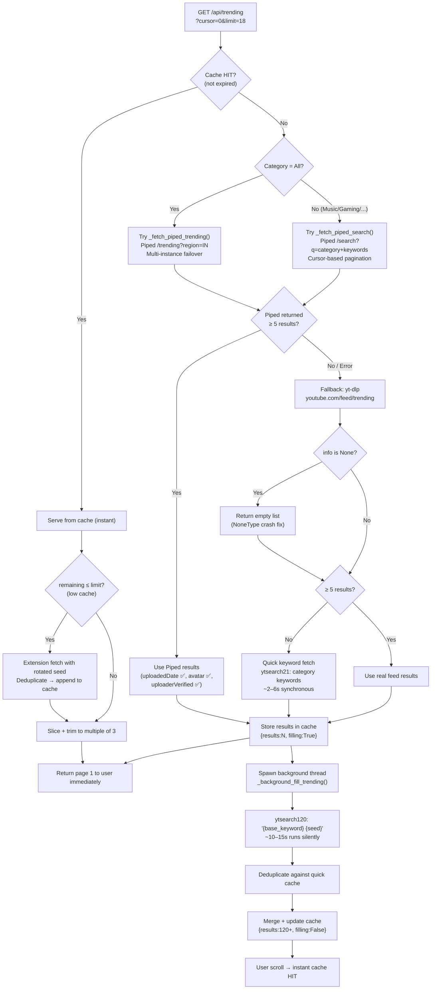
```mermaid
flowchart TD
    A["GET /api/trending\n?cursor=0&limit=18"] --> B{"Cache HIT?\n(not expired)"}

    B -- "Yes" --> C["Serve from cache (instant)"]
    B -- "No" --> PA{"Category = All?"}

    PA -- "Yes" --> PB["Try _fetch_piped_trending()\nPiped /trending?region=IN\nMulti-instance failover"]
    PA -- "No (Music/Gaming/...)" --> PC["Try _fetch_piped_search()\nPiped /search?q=category+keywords\nCursor-based pagination"]

    PB --> PD{"Piped returned\n≥ 5 results?"}
    PC --> PD

    PD -- "Yes" --> PE["Use Piped results\n(uploadedDate ✅, avatar ✅,\nuploaderVerified ✅)"]
    PD -- "No / Error" --> D["Fallback: yt-dlp\nyoutube.com/feed/trending"]

    D --> E{"info is None?"}
    E -- "Yes" --> F["Return empty list\n(NoneType crash fix)"]
    E -- "No" --> G{"≥ 5 results?"}

    F --> G
    G -- "No" --> H["Quick keyword fetch\nytsearch21: category keywords\n~2–6s synchronous"]
    G -- "Yes" --> I["Use real feed results"]

    PE --> J["Store results in cache\n{results:N, filling:True}"]
    H --> J
    I --> J
    J --> K["Return page 1 to user immediately"]

    J --> L["Spawn background thread\n_background_fill_trending()"]
    L --> M["ytsearch120: '{base_keyword} {seed}'\n~10–15s runs silently"]
    M --> N["Deduplicate against quick cache"]
    N --> O["Merge + update cache\n{results:120+, filling:False}"]
    O --> P["User scroll → instant cache HIT"]

    C --> Q{"remaining ≤ limit?\n(low cache)"}
    Q -- "Yes" --> R["Extension fetch with rotated seed\nDeduplicate → append to cache"]
    Q -- "No" --> S["Slice + trim to multiple of 3"]
    R --> S
    S --> K
```

##### 5.2.2.3 Auto-Extension Logic

The cache extends **before** the user hits the end, not after. The extension fires when `remaining ≤ limit`:

```python
remaining = total - cursor          # videos left in cache
if remaining <= limit:              # about to run out
    seed = seeds[seed_index % len(seeds)]   # rotate: latest, viral, new, top...
    keyword = f"{base_keyword} {seed}"
    # fetch → deduplicate → append to _trending_cache
```

Seed rotation uses `(total // TRENDING_FETCH_SIZE) + int(time.time() // 600)` so every 10-minute window and every new batch uses a different seed, ensuring diverse content.

##### 5.2.2.4 Grid-Aligned Responses

Backend always trims results to a **multiple of 3** (matching the 3-column CSS grid):

```python
GRID_COLS = 3
if len(page_videos) >= GRID_COLS and len(page_videos) % GRID_COLS != 0:
    trim_count = len(page_videos) % GRID_COLS
    page_videos = page_videos[:-trim_count]
```

This prevents partial rows (e.g., returning 17 videos that fill 5 full rows + 2 orphaned cards).

##### 5.2.2.5 Keyword Fallback Map

```python
cat_keyword_map = {
    "0":  "trending viral today India",
    "10": "trending music songs India",
    "20": "trending gaming India",
    "25": "trending news today",
    "17": "trending sports highlights",
    "1":  "trending movies trailers",
}
```

##### 5.2.2.6 Real Feed NoneType Fix

YouTube's `feed/trending` URL now redirects to the YouTube homepage when accessed without cookies, causing yt-dlp to return `None` instead of a valid info dict. The fix:

```python
# Before (crashed with: 'NoneType' object has no attribute 'get')
entries = info.get('entries') or []

# After (safe)
if not info:
    return []          # triggers keyword fallback gracefully
entries = info.get('entries') or []
```

This converts a noisy `AttributeError` crash into a clean empty-list return, immediately activating the keyword fallback path without any visible error to the user.

---

#### 5.2.3 Backend: `/api/search` yt-dlp Core with Piped API Enrichment

> **Data Source Strategy**: The search endpoint uses a **dual data source** approach. For page 1, metadata is fetched via the Piped API (`/search?q=...&filter=videos`) for rich fields like `uploadedDate`, `uploaderAvatar`, and cursor-based `nextpage` tokens. For subsequent pages, Piped's cursor is used via `_fetch_piped_search_nextpage()`. If all Piped instances are unavailable or the `nextpage` param is absent, the system falls back to **yt-dlp** the core extraction engine with page-based caching and background fill.

##### 5.2.3.1 Constants & Cache Structure

```python
SEARCH_PAGE_SIZE   = 18     # 3-col grid × 6 rows per page
SEARCH_CACHE_FETCH = 180    # Full background fill (ytsearch180:)
SEARCH_QUICK_FETCH = 21     # Quick sync fetch serves page 1 instantly
SEARCH_CACHE_TTL   = 30 * 60

_search_cache: dict = {
    "{q}": {
        "results": [ ...video objects... ],
        "piped_results": [ ...piped video objects... ],  # Piped-sourced results
        "piped_nextpage": str | None,  # Piped cursor token for next page
        "expires_at": float,
        "extension_count": int,  # how many auto-extends have fired
        "filling": bool          # True while background fill thread is running
    }
}
```

##### 5.2.3.2 Auto-Extension Trigger

Unlike Trending (cursor-based), Search uses **page-number** pagination for yt-dlp fallback and **cursor tokens** for Piped. Extension fires when ≤ 2 pages remain:

```python
EXTEND_THRESHOLD = SEARCH_PAGE_SIZE * 2   # 36 results = 2 pages

start_pos = (page - 1) * SEARCH_PAGE_SIZE
remaining  = total - start_pos

if remaining <= EXTEND_THRESHOLD:
    ext_count = cached.get('extension_count', 0)
    seed = seeds[ext_count % len(seeds)]
    extended_query = f"{q} {seed}"   # e.g. "phonk latest"
    # fetch → deduplicate by id → append → extension_count++
```

##### 5.2.3.3 Piped-First Search Flow

Search uses a **Piped-first strategy** with cursor-based pagination. The endpoint is `async` so yt-dlp runs in a thread pool via `run_in_executor`, keeping the FastAPI event loop unblocked:

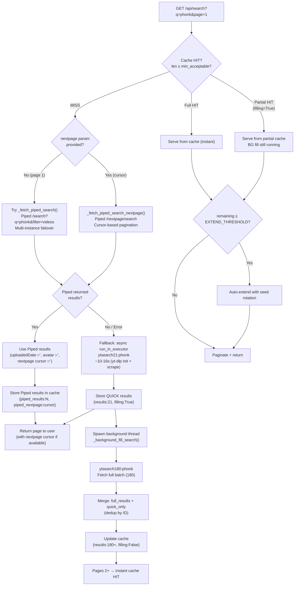
```mermaid
flowchart TD
    A["GET /api/search?q=phonk&page=1"] --> B{"Cache HIT?\nlen ≥ min_acceptable?"}

    B -- "Full HIT" --> C["Serve from cache (instant)"]
    B -- "Partial HIT\n(filling=True)" --> D["Serve from partial cache\nBG fill still running"]
    B -- "MISS" --> PA{"nextpage param\nprovided?"}

    PA -- "Yes (cursor)" --> PB["_fetch_piped_search_nextpage()\nPiped /nextpage/search\nCursor-based pagination"]
    PA -- "No (page 1)" --> PC["Try _fetch_piped_search()\nPiped /search?q=phonk&filter=videos\nMulti-instance failover"]

    PC --> PD{"Piped returned\nresults?"}
    PB --> PD

    PD -- "Yes" --> PE["Use Piped results\n(uploadedDate ✅, avatar ✅,\nnextpage cursor ✅)"]
    PD -- "No / Error" --> E["Fallback: async run_in_executor\nytsearch21:phonk\n~10-16s (yt-dlp init + scrape)"]

    PE --> PF["Store Piped results in cache\n{piped_results:N, piped_nextpage:cursor}"]
    PF --> G["Return page to user\n(with nextpage cursor if available)"]

    E --> F["Store QUICK results\n{results:21, filling:True}"]
    F --> G

    F --> H["Spawn background thread\n_background_fill_search()"]
    H --> I["ytsearch180:phonk\nFetch full batch (180)"]
    I --> J["Merge: full_results + quick_only\n(dedup by ID)"]
    J --> K["Update cache\n{results:180+, filling:False}"]
    K --> L["Pages 2+ → instant cache HIT"]

    C --> M{"remaining ≤ EXTEND_THRESHOLD?"}
    D --> M
    M -- "Yes" --> N["Auto-extend with seed rotation"]
    M -- "No" --> O["Paginate + return"]
    N --> O
```

##### 5.2.3.4 Async Endpoint & Benchmark Results

`/api/search` is declared `async def` and uses `asyncio.get_event_loop().run_in_executor(None, ...)` to offload the blocking yt-dlp call to the default thread pool. This means FastAPI can still handle **other concurrent requests** (history, storage, trending) while a search scrape is in progress.

```python
async def search_videos(q: str, page: int = 1):
    import asyncio as _asyncio
    ...
    def _do_quick_fetch():
        with YoutubeDL(ydl_opts_quick) as ydl:
            res = ydl.extract_info(f"ytsearch{SEARCH_QUICK_FETCH}:{q}", download=False)
        return [_normalize_entry(e) for e in (res.get('entries') or []) if e and e.get('id')]

    loop = _asyncio.get_event_loop()
    all_results = await loop.run_in_executor(None, _do_quick_fetch)
```

**Benchmark results (tested locally via `Invoke-WebRequest`):**

| Scenario | Response Time | Cards Returned |
|---|---|---|
| Search  cold (cache miss) | ~14–16s | 18 (page 1) |
| Search  warm (cache hit) | **0.10s** | 18 |
| Trending  cold (cache miss) | ~5–11s | 18 (page 1) |
| Trending  warm (cursor=18) | **0.05s** | 18 |

> **Note:** First-load latency (~10–16s) is a fundamental yt-dlp + YouTube network constraint it applies regardless of the result count requested (`ytsearch21` vs `ytsearch180` have nearly identical first-response times). The optimization delivers real value on **scroll** (0.05–0.10s cache hits) and **ensures the event loop stays responsive** to other requests during a slow search.

---

#### 5.2.4 Frontend: VirtuosoGrid DOM Virtualization

Both `TrendingSection` and `SearchResults` use `react-virtuoso`'s `VirtuosoGrid` component. The key insight: instead of rendering 100+ `VideoCard` DOM nodes at once, only the **visible viewport + overscan buffer** is kept in the DOM.

##### 5.2.4.1 VirtuosoGrid Configuration (both components)

```jsx
<VirtuosoGrid
  useWindowScroll          // Uses window scroll, NOT internal scrollbar
  style={{ overflow: 'hidden' }}  // Prevents double scrollbar bug
  data={videos}            // Accumulated array never reset on load-more
  endReached={onLoadMore}  // Fires when user nears bottom
  overscan={400}           // 400px of pre-rendered DOM buffer above/below viewport
  components={{
    List: forwardRef(...)  // Renders as 3-col CSS grid
    Item: ...              // Each grid cell wrapper
    Footer: ...            // Skeleton + spinner during loading states
  }}
  itemContent={(index, video) => <VideoCard video={video} ... />}
/>
```

##### 5.2.4.2 DOM Virtualization Behavior

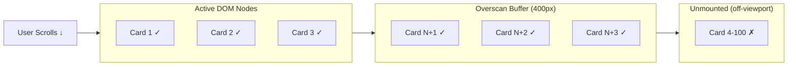
```mermaid
flowchart LR
    subgraph DOM["Active DOM Nodes"]
        V1["Card 1 ✓"]
        V2["Card 2 ✓"]
        V3["Card 3 ✓"]
    end
    
    subgraph Offscreen["Unmounted (off-viewport)"]
        X1["Card 4-100 ✗"]
    end

    subgraph Buffer["Overscan Buffer (400px)"]
        B1["Card N+1 ✓"]
        B2["Card N+2 ✓"]
        B3["Card N+3 ✓"]
    end

    User["User Scrolls ↓"] --> DOM
    DOM --> Buffer
    Buffer --> Offscreen
```

As the user scrolls:
- Cards entering viewport are **mounted** into DOM
- Cards leaving viewport (+ overscan zone) are **unmounted**
- Only ~12–18 cards exist in the DOM at any time regardless of total list size

##### 5.2.4.3 Stable DOM Node Preventing Scroll Jumps

A critical bug was discovered: swapping between a skeleton `<div>` and `<VirtuosoGrid>` caused the browser to reset scroll position to `0` on data arrival. The fix: **always render `VirtuosoGrid`**. Skeletons live inside its `Footer` slot, so the DOM node is never unmounted.

```jsx
// BEFORE (caused scroll jump on first load):
if (isLoading) return <div className="grid...">{skeletons}</div>;
return <VirtuosoGrid data={videos} .../>;

// AFTER (stable DOM, no scroll jump):
<VirtuosoGrid>
  data={videos}   // empty array [] during initial load
  components={{
    Footer: () => (
      showInitialSkeleton && <SkeletonGrid />   // skeletons in-place
    )
  }}
/>
```

---

#### 5.2.5 Frontend: TrendingSection State Machine

State is managed in `home-search-dashboard/index.jsx` and passed down as props:

```
State variables:
  trendingVideos    []       ← accumulated (never reset on load-more)
  trendingCursor    0        ← next cursor to request from backend
  hasMoreTrending   true     ← always true (truly infinite)
  isTrendingLoading false    ← initial load spinner
  isTrendingLoadingMore false ← pagination skeleton

Flow on load-more:
  handleLoadMoreTrending()
    → if isTrendingLoadingMore: return (guard)
    → if trendingCursor === -1: reset to 0 (error recovery)
    → loadTrendingVideos(activeCategory, isLoadMore=true)
        → GET /api/trending?cursor=N&limit=18
        → setTrendingVideos(prev => [...prev, ...newBatch])
        → setTrendingCursor(next_cursor)
```

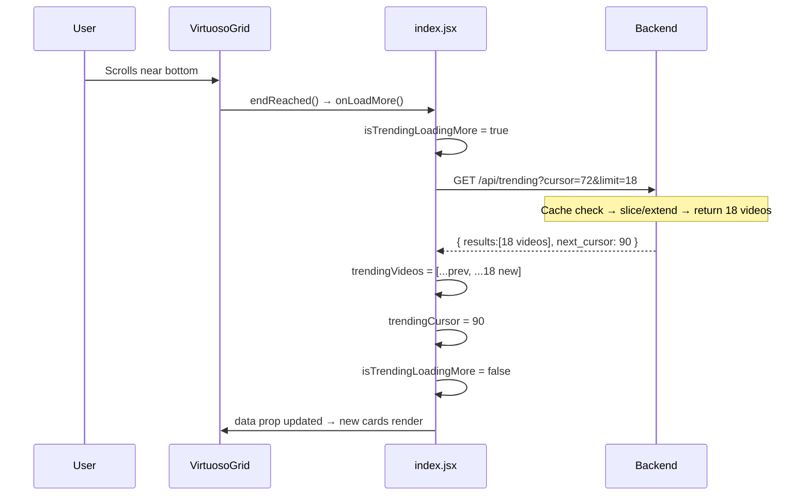
```mermaid
sequenceDiagram
    participant User
    participant VirtuosoGrid
    participant IndexJSX as index.jsx
    participant Backend

    User->>VirtuosoGrid: Scrolls near bottom
    VirtuosoGrid->>IndexJSX: endReached() → onLoadMore()
    IndexJSX->>IndexJSX: isTrendingLoadingMore = true
    IndexJSX->>Backend: GET /api/trending?cursor=72&limit=18
    Note over Backend: Cache check → slice/extend → return 18 videos
    Backend-->>IndexJSX: { results:[18 videos], next_cursor: 90 }
    IndexJSX->>IndexJSX: trendingVideos = [...prev, ...18 new]
    IndexJSX->>IndexJSX: trendingCursor = 90
    IndexJSX->>IndexJSX: isTrendingLoadingMore = false
    IndexJSX->>VirtuosoGrid: data prop updated → new cards render
```

---

#### 5.2.6 Frontend: SearchResults Loading Stage Machine

`SearchResults.jsx` uses a **2-stage loading state machine** unique from TrendingSection:

```
searchStage states:
  'idle'      → Normal (results visible)
  'searching' → Stage 1: WifiLoader (0–1500ms)
  'skeleton'  → Stage 2: Shimmer skeleton grid (1500ms → data arrives)
```

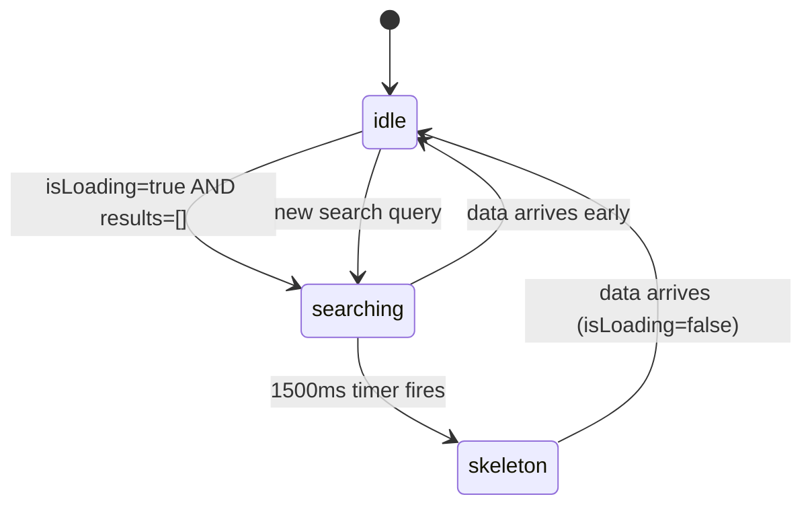
```mermaid
stateDiagram-v2
    [*] --> idle
    idle --> searching: isLoading=true AND results=[]
    searching --> skeleton: 1500ms timer fires
    searching --> idle: data arrives early
    skeleton --> idle: data arrives (isLoading=false)
    idle --> searching: new search query
```

```jsx
// Rendered by stage:
if (searchStage === 'searching') return <WifiLoader />;    // full-screen spinner
if (searchStage === 'skeleton')  return <SkeletonGrid />;  // 9 shimmer cards
// default: return <VirtuosoGrid data={results} ... />;
```

---

#### 5.2.7 Premium Skeleton Design System

All skeleton loaders across the app (TrendingSection, SearchResults, VideoDetailsDownload) follow a unified design token set:

| Token | Value | Purpose |
|---|---|---|
| `bg-muted` | CSS var (light: `#e5e7eb`, dark: `#1f2937`) | **Solid** skeleton block visible in both themes |
| `animate-shimmer` | Tailwind keyframe: `bgPosition 0%→200%` | Sweep animation |
| `via-white/50` | Light mode shimmer | High-contrast sweep |
| `dark:via-white/5` | Dark mode shimmer | Subtle sweep |
| `rounded-[24px]` | Card border radius | Matches `glass-card` |
| `overflow-hidden` + `relative` | Layout | Required for absolute shimmer overlay |
| `animationDuration: '2s'` | Inline style | Slow, premium feel |

##### 5.2.7.1 SkeletonCard Component (Shared Pattern)

```jsx
const SkeletonCard = () => (
  <div className="glass-card shadow-glass-md rounded-[24px] overflow-hidden relative bg-card/40">
    {/* Shimmer sweep positioned absolute, travels left-to-right */}
    <div className="absolute inset-0 z-10 bg-gradient-to-r
      from-transparent via-white/50 dark:via-white/5 to-transparent
      bg-[length:200%_100%] animate-shimmer pointer-events-none"
      style={{ animationDuration: '2s' }} />
    
    {/* Thumbnail placeholder */}
    <div className="w-full h-48 bg-muted" />
    
    {/* Metadata placeholders */}
    <div className="p-4 space-y-3">
      <div className="h-4 bg-muted rounded-lg w-3/4" />   {/* title */}
      <div className="h-3 bg-muted rounded-lg w-1/2" />   {/* subtitle */}
      <div className="flex items-center gap-2 mt-2">
        <div className="w-8 h-8 bg-muted rounded-full" /> {/* avatar */}
        <div className="h-3 bg-muted rounded-lg w-1/3" /> {/* channel */}
      </div>
      <div className="flex justify-between mt-1">
        <div className="h-3 bg-muted rounded-lg w-1/4" /> {/* views */}
        <div className="h-3 bg-muted rounded-lg w-1/4" /> {/* duration */}
      </div>
    </div>
  </div>
);
```

> **Key difference from old design:** Previously used `bg-muted/30` and `bg-muted/40` (semi-transparent), making skeletons invisible on light backgrounds. Changed to solid `bg-muted` visible in both themes.

---

#### 5.2.8 Search Bar Persistence (`initialValue` Prop)

When a user navigates from Home → Search Results page, the SearchBar component is re-mounted. Previously, the bar was always empty despite the URL containing `?q=phonk`.

**Fix:** `SearchBar` now accepts an `initialValue` prop and syncs its internal state:

```jsx
// SearchBar.jsx
const SearchBar = ({ ..., initialValue = '' }) => {
  const [searchQuery, setSearchQuery] = useState(initialValue);

  useEffect(() => {
    setSearchQuery(initialValue);   // sync on prop change (URL navigation)
  }, [initialValue]);
  ...
};

// search-results-page/index.jsx
<SearchBar
  onSearch={handleSearch}
  initialValue={query}    // query = searchParams.get('q')
  isSticky={isSearchSticky}
/>
```

---

#### 5.2.9 Complete Data Flow Search Infinite Scroll

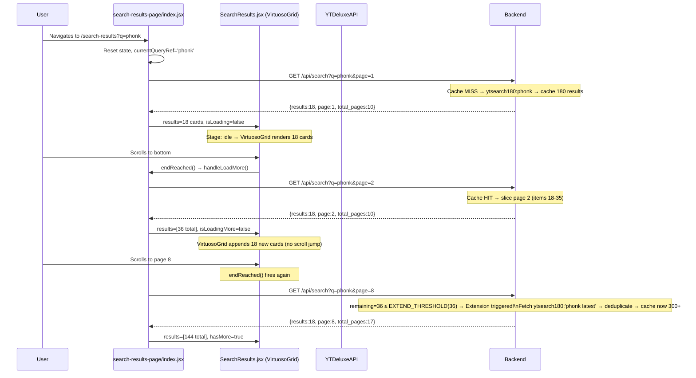
```mermaid
sequenceDiagram
    participant User
    participant SearchResultsPage as search-results-page/index.jsx
    participant SearchResults as SearchResults.jsx (VirtuosoGrid)
    participant API as YTDeluxeAPI
    participant Backend

    User->>SearchResultsPage: Navigates to /search-results?q=phonk
    SearchResultsPage->>SearchResultsPage: Reset state, currentQueryRef='phonk'
    SearchResultsPage->>Backend: GET /api/search?q=phonk&page=1
    Note over Backend: Cache MISS → ytsearch180:phonk → cache 180 results
    Backend-->>SearchResultsPage: {results:18, page:1, total_pages:10}
    SearchResultsPage->>SearchResults: results=18 cards, isLoading=false

    Note over SearchResults: Stage: idle → VirtuosoGrid renders 18 cards

    User->>SearchResults: Scrolls to bottom
    SearchResults->>SearchResultsPage: endReached() → handleLoadMore()
    SearchResultsPage->>Backend: GET /api/search?q=phonk&page=2
    Note over Backend: Cache HIT → slice page 2 (items 18-35)
    Backend-->>SearchResultsPage: {results:18, page:2, total_pages:10}
    SearchResultsPage->>SearchResults: results=[36 total], isLoadingMore=false

    Note over SearchResults: VirtuosoGrid appends 18 new cards (no scroll jump)

    User->>SearchResults: Scrolls to page 8
    Note over SearchResults: endReached() fires again
    SearchResultsPage->>Backend: GET /api/search?q=phonk&page=8
    Note over Backend: remaining=36 ≤ EXTEND_THRESHOLD(36) → Extension triggered!\nFetch ytsearch180:'phonk latest' → deduplicate → cache now 300+
    Backend-->>SearchResultsPage: {results:18, page:8, total_pages:17}
    SearchResultsPage->>SearchResults: results=[144 total], hasMore=true
```

---

#### 5.2.10 Complete Data Flow Trending Infinite Scroll

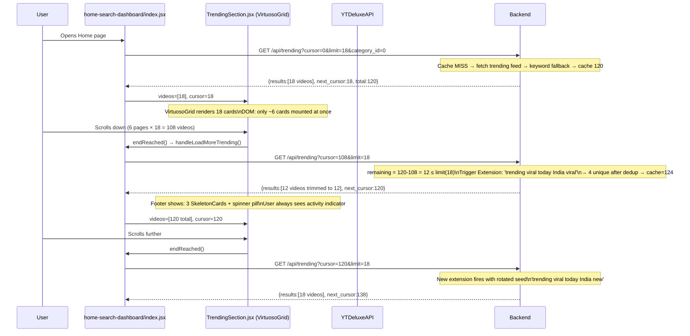
```mermaid
sequenceDiagram
    participant User
    participant Dashboard as home-search-dashboard/index.jsx
    participant TrendingSection as TrendingSection.jsx (VirtuosoGrid)
    participant API as YTDeluxeAPI
    participant Backend

    User->>Dashboard: Opens Home page
    Dashboard->>Backend: GET /api/trending?cursor=0&limit=18&category_id=0
    Note over Backend: Cache MISS → fetch trending feed → keyword fallback → cache 120
    Backend-->>Dashboard: {results:[18 videos], next_cursor:18, total:120}
    Dashboard->>TrendingSection: videos=[18], cursor=18

    Note over TrendingSection: VirtuosoGrid renders 18 cards\nDOM: only ~6 cards mounted at once

    User->>TrendingSection: Scrolls down (6 pages × 18 = 108 videos)
    TrendingSection->>Dashboard: endReached() → handleLoadMoreTrending()
    Dashboard->>Backend: GET /api/trending?cursor=108&limit=18
    Note over Backend: remaining = 120-108 = 12 ≤ limit(18)\nTrigger Extension: 'trending viral today India viral'\n→ 4 unique after dedup → cache=124
    Backend-->>Dashboard: {results:[12 videos trimmed to 12], next_cursor:120}

    Note over TrendingSection: Footer shows: 3 SkeletonCards + spinner pill\nUser always sees activity indicator

    Dashboard->>TrendingSection: videos=[120 total], cursor=120
    User->>TrendingSection: Scrolls further
    TrendingSection->>Dashboard: endReached()
    Dashboard->>Backend: GET /api/trending?cursor=120&limit=18
    Note over Backend: New extension fires with rotated seed\n'trending viral today India new'
    Backend-->>Dashboard: {results:[18 videos], next_cursor:138}
```

---

### 5.3 System Performance & Optimization Architecture

This section details the critical performance optimization layers implemented to ensure the application feels instantaneous, memory efficient, and reliably manages background desktop processes.

#### 5.3.1 Frontend Data Cache Architecture (Two-Layer Caching)
To eliminate redundant API calls and make page revisits instantaneous (0ms), a robust two-layer data caching strategy was implemented.

**Mechanism:**
1. **In-Memory (`Map`)**: Provides ultra-fast, immediate access during the current session lifecycle.
2. **`sessionStorage`**: Acts as a persistent fallback that survives page reloads (F5), ensuring data is not lost during transient refreshes. It automatically clears when the app/window is closed.
- **Time-To-Live (TTL)**: Each entry has a configurable lifespan (e.g., 5 mins for Video Details, 10 mins for Trending).
- **Stale-While-Revalidate**: On certain pages like History, cached data is shown instantly, while a silent background API request refreshes the cache.

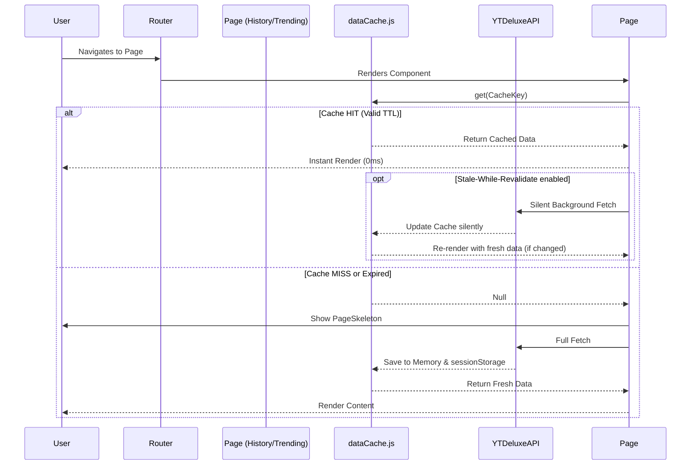
```mermaid
sequenceDiagram
    participant User
    participant Router
    participant Page (History/Trending)
    participant CacheManager as dataCache.js
    participant API as YTDeluxeAPI
    
    User->>Router: Navigates to Page
    Router->>Page: Renders Component
    Page->>CacheManager: get(CacheKey)
    alt Cache HIT (Valid TTL)
        CacheManager-->>Page: Return Cached Data
        Page-->>User: Instant Render (0ms)
        opt Stale-While-Revalidate enabled
            Page->>API: Silent Background Fetch
            API-->>CacheManager: Update Cache silently
            CacheManager-->>Page: Re-render with fresh data (if changed)
        end
    else Cache MISS or Expired
        CacheManager-->>Page: Null
        Page->>User: Show PageSkeleton
        Page->>API: Full Fetch
        API-->>CacheManager: Save to Memory & sessionStorage
        CacheManager-->>Page: Return Fresh Data
        Page-->>User: Render Content
    end
```

#### 5.3.2 History Page Performance Overhaul (VirtuosoGrid)
The History page was previously a massive bottleneck due to rendering hundreds of complex DOM nodes (video cards) simultaneously, freezing the main thread.

**Optimizations Applied:**
1. **DOM Virtualization (`react-virtuoso`)**: Replaced the static `.map()` loop with `VirtuosoGrid`. Only the cards currently visible in the viewport (plus a small buffer) are mounted to the DOM. As the user scrolls, nodes are dynamically swapped out, reducing rendering cost by >95%.
2. **Parallel Fetching**: Instead of sequential requests for History then Storage stats, `Promise.all` is used to fetch both simultaneously, cutting network wait time in half.
3. **Synchronous State Initialization**: `useState` utilizes a lazy initializer to synchronously read from the cache on the first render frame, eliminating the jarring "blank screen" layout shift that occurred before `useEffect` could fire.

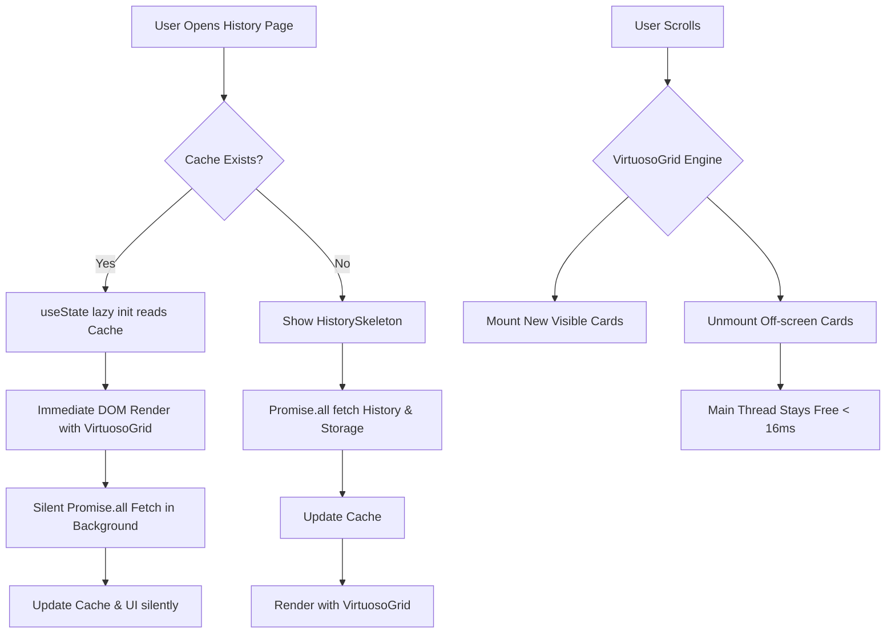
```mermaid
graph TD
    A[User Opens History Page] --> B{Cache Exists?}
    B -- Yes --> C[useState lazy init reads Cache]
    C --> D[Immediate DOM Render with VirtuosoGrid]
    D --> E[Silent Promise.all Fetch in Background]
    E --> F[Update Cache & UI silently]
    
    B -- No --> G[Show HistorySkeleton]
    G --> H[Promise.all fetch History & Storage]
    H --> I[Update Cache]
    I --> J[Render with VirtuosoGrid]
    
    K[User Scrolls] --> L{VirtuosoGrid Engine}
    L --> M[Mount New Visible Cards]
    L --> N[Unmount Off-screen Cards]
    N --> O[Main Thread Stays Free < 16ms]
```

#### 5.3.3 Lazy Load + Eager Preload Routing Architecture
To balance the initial application bundle size with navigation speed, a hybrid preloading architecture was implemented.

**Mechanism:**
- **Heavy Pages (`Search`, `Video Details`)**: Remain strictly lazy-loaded on demand.
- **High-Frequency Pages (`History`, `Settings`)**: Dynamically imported.
- **Eager Preloading**: 500ms after the application initially mounts (when the CPU is completely idle), a background process eagerly downloads the JS chunks for all other routes.
- By the time the user clicks a navigation link, the JavaScript chunk is already cached by the browser, resulting in zero network latency during navigation.

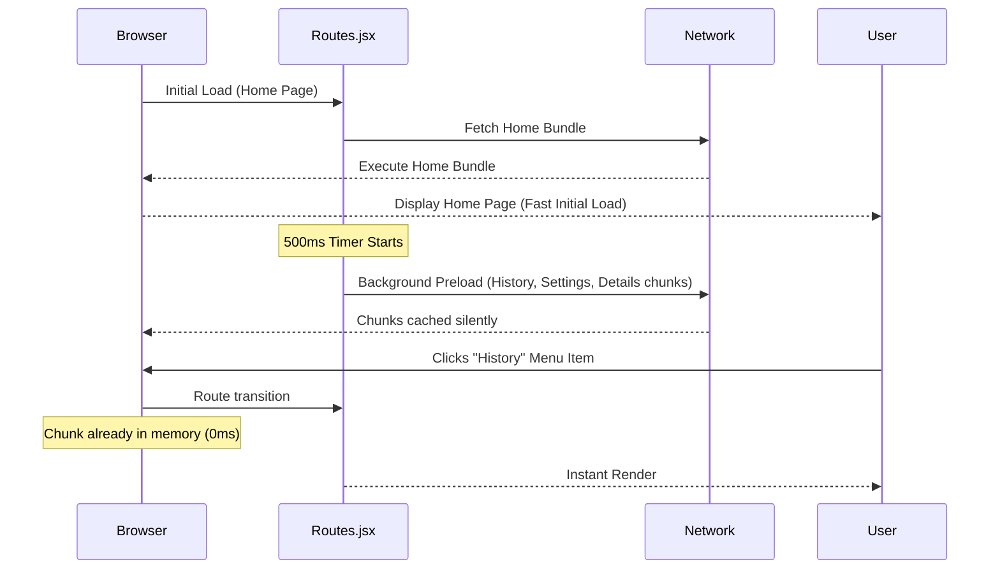
```mermaid
sequenceDiagram
    participant Browser
    participant Router as Routes.jsx
    participant Network
    
    Browser->>Router: Initial Load (Home Page)
    Router->>Network: Fetch Home Bundle
    Network-->>Browser: Execute Home Bundle
    Browser-->>User: Display Home Page (Fast Initial Load)
    
    note over Router: 500ms Timer Starts
    
    Router->>Network: Background Preload (History, Settings, Details chunks)
    Network-->>Browser: Chunks cached silently
    
    User->>Browser: Clicks "History" Menu Item
    Browser->>Router: Route transition
    note over Browser: Chunk already in memory (0ms)
    Router-->>User: Instant Render
```

#### 5.3.4 Desktop Process Lifecycle Fix (Ghost Processes)
Closing the WebView2 desktop application previously left `main.exe` and its heavy underlying sub-processes (`yt-dlp`, `ffmpeg`) running as orphaned "ghost" processes in the background, consuming CPU and RAM.

**Fix Details:**
The standard `process.terminate()` in Python only kills the parent wrapper. The launcher was updated to use a forceful Windows process tree kill command (`taskkill /F /T /PID`). This guarantees that when the frontend window closes, the backend API and all active child extraction/encoding threads are destroyed instantly. An `atexit` hook serves as an ultimate fallback if the window `on_closed` event fails.

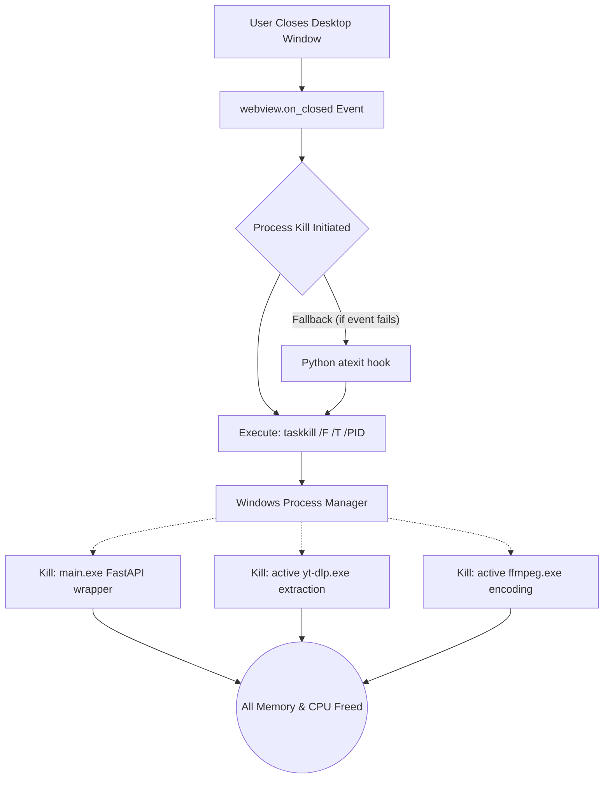
```mermaid
graph TD
    A[User Closes Desktop Window] --> B[webview.on_closed Event]
    B --> C{Process Kill Initiated}
    C --> D[Execute: taskkill /F /T /PID <Backend_PID>]
    
    D --> E[Windows Process Manager]
    E -.-> F[Kill: main.exe FastAPI wrapper]
    E -.-> G[Kill: active yt-dlp.exe extraction]
    E -.-> H[Kill: active ffmpeg.exe encoding]
    
    C -- "Fallback (if event fails)" --> I[Python atexit hook]
    I --> D
    
    F --> J((All Memory & CPU Freed))
    G --> J
    H --> J
```

#### 5.3.5 Download Architecture Refactoring (Flat vs Organized)

Previously, all desktop downloads were funnelled into a rigid `YT Deluxe Downloads/` wrapper with mandatory type subfolders (`Videos/`, `Music/`, `Thumbnails/`). This felt unnatural compared to how browsers save files directly into the system Downloads folder.

**New Behaviour:**
- **Flat mode (default):** Files save directly into the user's native Downloads folder (or a custom path), exactly like a browser download. No wrapper folder, no subfolders.
- **Organized mode (opt-in):** When the user enables "Separate files by type" in Settings (or checks it during installation), files are sorted into `Videos/`, `Music/`, and `Thumbnails/` subfolders.

**Path Resolution Priority Chain:**

The backend resolves the download destination through a layered priority system. The frontend always sends its current settings; the Windows registry is only consulted as a last resort (batch downloads, resume, or first run before the UI has been opened).

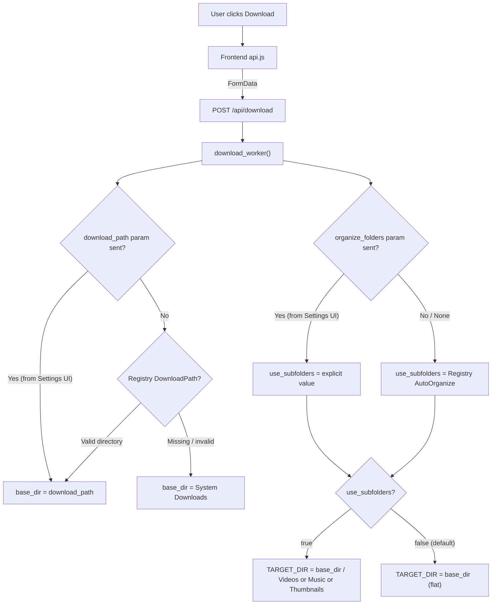
```mermaid
flowchart TD
    A["User clicks Download"] --> B["Frontend api.js"]
    B --> |"FormData"| C["POST /api/download"]
    C --> D["download_worker()"]

    D --> E{"download_path param sent?"}
    E --> |"Yes (from Settings UI)"| F["base_dir = download_path"]
    E --> |"No"| G{"Registry DownloadPath?"}
    G --> |"Valid directory"| F
    G --> |"Missing / invalid"| H["base_dir = System Downloads"]

    D --> I{"organize_folders param sent?"}
    I --> |"Yes (from Settings UI)"| J["use_subfolders = explicit value"]
    I --> |"No / None"| K["use_subfolders = Registry AutoOrganize"]

    J --> L{"use_subfolders?"}
    K --> L
    L --> |"true"| M["TARGET_DIR = base_dir / Videos or Music or Thumbnails"]
    L --> |"false (default)"| N["TARGET_DIR = base_dir  (flat)"]
```

**Critical Bug Fix Stale Registry Fallback:**

On first run after updating from an older installer (which set `AutoOrganize=1` in the registry), the frontend's `localStorage` key `ytdeluxe_organize_folders` didn't exist yet. The original code had:
```javascript
// BUG: if (organizeFolders !== null) key is null on first run → field omitted
```
This caused the backend to fall back to the registry → `AutoOrganize='1'` → subfolders were created despite the new flat default. The fix removes the null guard and **always** sends `organize_folders=false` as the default.

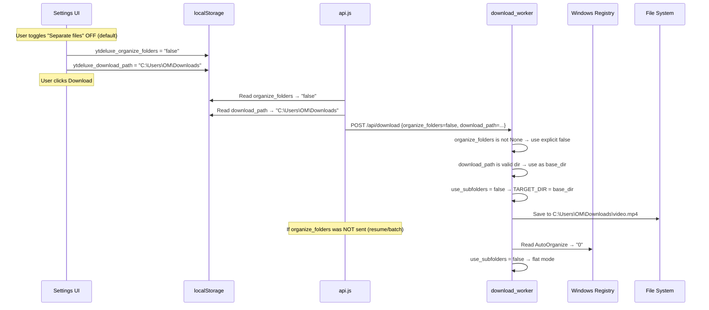
```mermaid
sequenceDiagram
    participant UI as Settings UI
    participant LS as localStorage
    participant API as api.js
    participant BE as download_worker
    participant REG as Windows Registry
    participant FS as File System

    Note over UI: User toggles "Separate files" OFF (default)
    UI->>LS: ytdeluxe_organize_folders = "false"
    UI->>LS: ytdeluxe_download_path = "C:\Users\OM\Downloads"

    Note over UI: User clicks Download
    API->>LS: Read organize_folders → "false"
    API->>LS: Read download_path → "C:\Users\OM\Downloads"
    API->>BE: POST /api/download {organize_folders=false, download_path=...}

    BE->>BE: organize_folders is not None → use explicit false
    BE->>BE: download_path is valid dir → use as base_dir
    BE->>BE: use_subfolders = false → TARGET_DIR = base_dir
    BE->>FS: Save to C:\Users\OM\Downloads\video.mp4

    Note over API: If organize_folders was NOT sent (resume/batch)
    BE->>REG: Read AutoOrganize → "0"
    BE->>BE: use_subfolders = false → flat mode
```

**Files involved:**
| File | Change |
|---|---|
| `backend/main.py` | New `get_desktop_registry_settings()` helper; refactored `download_worker()`, `/api/desktop/open-file`, `/api/desktop/open-folder` |
| `frontend/src/utils/api.js` | Always send `organize_folders=false` by default |
| `frontend/src/pages/.../DownloadPreferences.jsx` | Download path input + Browse button + "Separate files" toggle + live preview |
| `frontend/src/pages/.../index.jsx` | `organizeFolders: false` default; dual-write to `localStorage` and `YTDeluxeStorage` |
| `desktop/launcher.py` | New `pick_folder()` method via `webview.FOLDER_DIALOG` |
| `desktop/installer/setup.iss` | Unchecked by default; removed `YT Deluxe Downloads` wrapper from `GetDownloadFolder` |

#### 5.3.6 Desktop Stability Settings Persistence & Permission Suppression

Two critical desktop stability issues were resolved: settings resetting on every app restart, and intrusive native "localhost wants to..." WebView2 permission dialogs.

##### Settings Persistence (Dual-Write Strategy)

The `YTDeluxeStorage` utility implements a dual-write, dual-read strategy to ensure all user preferences (theme, accent color, language, download path, folder organization, regional settings) survive across WebView2 profile resets and app updates.

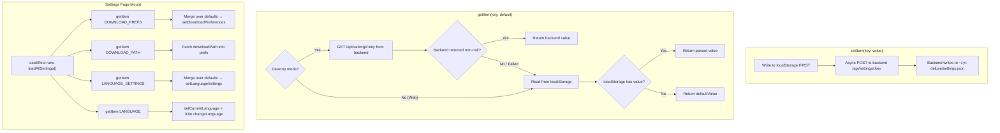
```mermaid
flowchart TD
    subgraph Write["setItem(key, value)"]
        W1["Write to localStorage FIRST"] --> W2["Async POST to backend /api/settings/:key"]
        W2 --> W3["Backend writes to ~/.yt-deluxe/settings.json"]
    end

    subgraph Read["getItem(key, default)"]
        R1{"Desktop mode?"} --> |"Yes"| R2["GET /api/settings/:key from backend"]
        R2 --> R3{"Backend returned non-null?"}
        R3 --> |"Yes"| R4["Return backend value"]
        R3 --> |"No / Failed"| R5["Read from localStorage"]
        R1 --> |"No (Web)"| R5
        R5 --> R6{"localStorage has value?"}
        R6 --> |"Yes"| R7["Return parsed value"]
        R6 --> |"No"| R8["Return defaultValue"]
    end

    subgraph Mount["Settings Page Mount"]
        M1["useEffect runs loadAllSettings()"] --> M2["getItem DOWNLOAD_PREFS"]
        M1 --> M3["getItem DOWNLOAD_PATH"]
        M1 --> M4["getItem LANGUAGE_SETTINGS"]
        M1 --> M5["getItem LANGUAGE"]
        M2 --> M6["Merge over defaults → setDownloadPreferences"]
        M3 --> M7["Patch downloadPath into prefs"]
        M4 --> M8["Merge over defaults → setLanguageSettings"]
        M5 --> M9["setCurrentLanguage + i18n.changeLanguage"]
    end
```

> **Key insight:** `localStorage` is written *first* (synchronous, instant) before the async backend call. This ensures the UI is immediately responsive and a reliable fallback is always available, even if the backend POST races or fails. On read, the backend is tried first (survives WebView2 resets), falling back to `localStorage` if the backend returns null (first run, network failure).

##### WebView2 Permission Auto-Grant

The desktop WebView2 runtime shows native OS-level "localhost:8000 wants to access your clipboard/microphone/notifications" popups. These were suppressed by hooking into `CoreWebView2.PermissionRequested` during the `on_loaded` event:

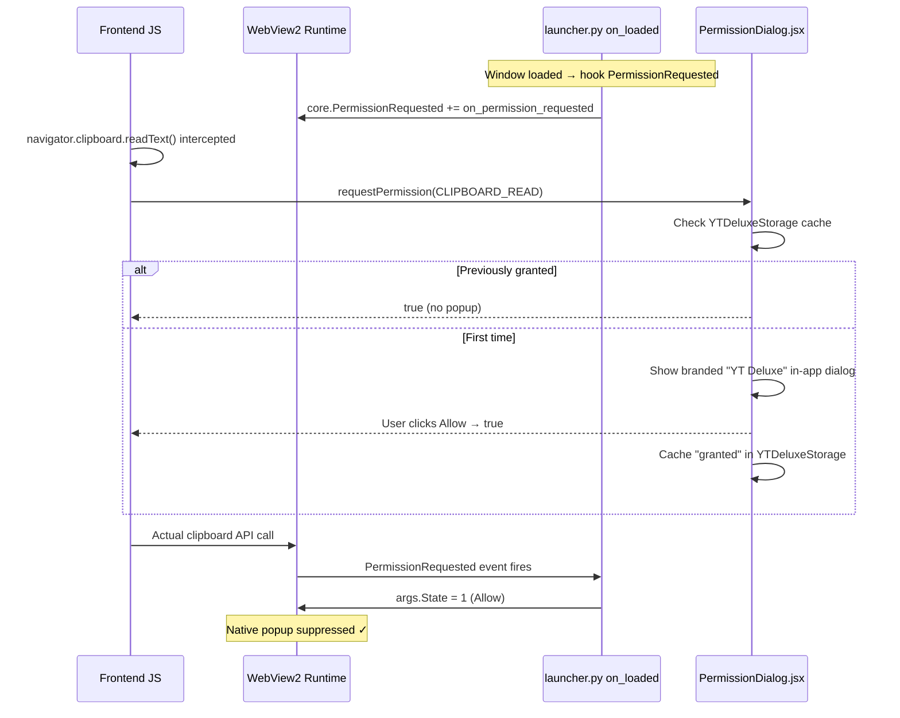
```mermaid
sequenceDiagram
    participant App as Frontend JS
    participant WV2 as WebView2 Runtime
    participant Hook as launcher.py on_loaded
    participant Dialog as PermissionDialog.jsx

    Note over Hook: Window loaded → hook PermissionRequested
    Hook->>WV2: core.PermissionRequested += on_permission_requested

    App->>App: navigator.clipboard.readText() intercepted
    App->>Dialog: requestPermission(CLIPBOARD_READ)
    Dialog->>Dialog: Check YTDeluxeStorage cache
    alt Previously granted
        Dialog-->>App: true (no popup)
    else First time
        Dialog->>Dialog: Show branded "YT Deluxe" in-app dialog
        Dialog-->>App: User clicks Allow → true
        Dialog->>Dialog: Cache "granted" in YTDeluxeStorage
    end

    App->>WV2: Actual clipboard API call
    WV2->>Hook: PermissionRequested event fires
    Hook->>WV2: args.State = 1 (Allow)
    Note over WV2: Native popup suppressed ✓
```

#### 5.3.7 Custom Permission System (Branded In-App Dialog)

A complete permission management layer replaces all native browser/WebView2 permission prompts with a branded "YT Deluxe" in-app dialog.

**Architecture:**

Three new files form the permission system:

| File | Role |
|---|---|
| `permissions.js` | Core utility grant/deny caching, dialog trigger registration, native API fallback |
| `PermissionDialog.jsx` | Branded modal UI registered globally in `App.jsx` |
| `index.jsx` (app entry) | Intercepts `navigator.clipboard`, `getUserMedia`, `Notification.requestPermission` |

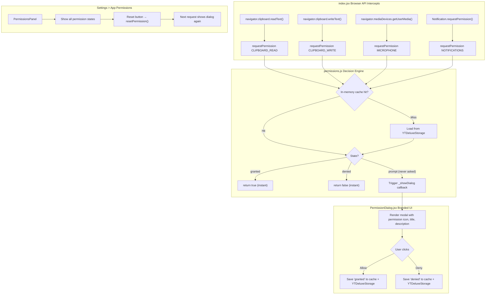
```mermaid
flowchart TD
    subgraph Intercept["index.jsx Browser API Intercepts"]
        I1["navigator.clipboard.readText()"] --> I2["requestPermission CLIPBOARD_READ"]
        I3["navigator.clipboard.writeText()"] --> I4["requestPermission CLIPBOARD_WRITE"]
        I5["navigator.mediaDevices.getUserMedia()"] --> I6["requestPermission MICROPHONE"]
        I7["Notification.requestPermission()"] --> I8["requestPermission NOTIFICATIONS"]
    end

    subgraph Core["permissions.js Decision Engine"]
        I2 --> C1{"In-memory cache hit?"}
        I4 --> C1
        I6 --> C1
        I8 --> C1
        C1 --> |"Miss"| C2["Load from YTDeluxeStorage"]
        C1 --> |"Hit"| C3{"State?"}
        C2 --> C3
        C3 --> |"granted"| C4["return true (instant)"]
        C3 --> |"denied"| C5["return false (instant)"]
        C3 --> |"prompt (never asked)"| C6["Trigger _showDialog callback"]
    end

    subgraph Dialog["PermissionDialog.jsx Branded UI"]
        C6 --> D1["Render modal with permission icon, title, description"]
        D1 --> D2{"User clicks"}
        D2 --> |"Allow"| D3["Save 'granted' to cache + YTDeluxeStorage"]
        D2 --> |"Deny"| D4["Save 'denied' to cache + YTDeluxeStorage"]
    end

    subgraph Settings["Settings > App Permissions"]
        S1["PermissionsPanel"] --> S2["Show all permission states"]
        S2 --> S3["Reset button → resetPermission()"]
        S3 --> S4["Next request shows dialog again"]
    end
```

**Permission Types & Metadata:**

| Key | Icon | Used For |
|---|---|---|
| `clipboard-read` | ClipboardPaste | Auto-paste YouTube links from clipboard |
| `clipboard-write` | Clipboard | Copy title, description, share link buttons |
| `notifications` | Bell | Desktop notifications when downloads complete |
| `microphone` | Mic | Voice search functionality |

**Persistence:** All permission decisions are stored via `YTDeluxeStorage` under the key `ytdeluxe_permissions`, which means they persist across app restarts (localStorage + backend JSON) and survive WebView2 profile resets.

#### 5.3.8 Regional Settings & File Naming Pipeline

A settings-aware formatting system ensures dates, times, and filenames across the entire application respect the user's regional preferences.

##### Regional Date/Time Formatting (`dateFormat.js`)

All components that display dates or times use centralized utility functions that **synchronously** read the user's preferences from `localStorage`. This avoids async overhead in render paths while still reflecting the latest settings (written by `LanguageSettings` via `YTDeluxeStorage`, which writes to `localStorage` first).

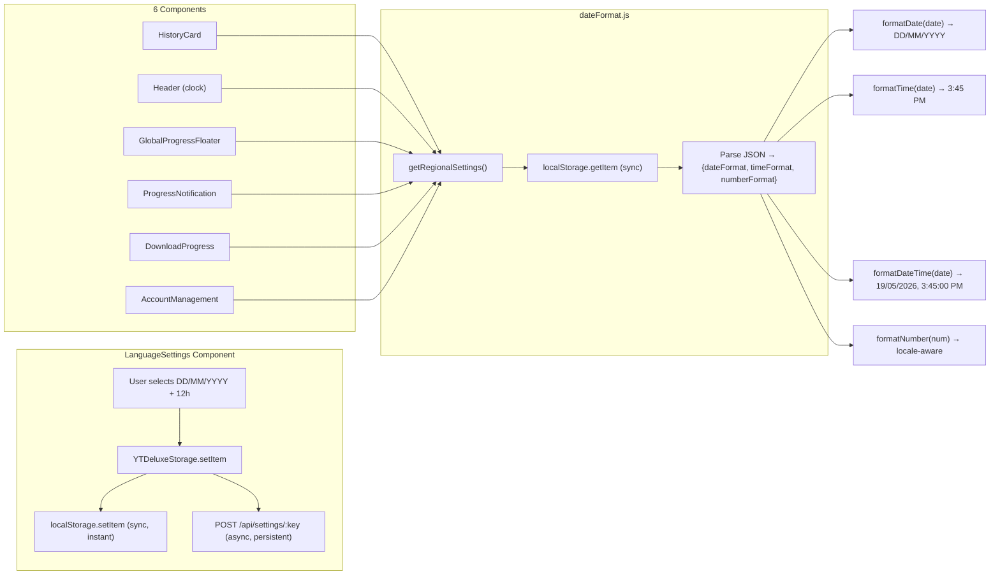
```mermaid
flowchart LR
    subgraph Settings["LanguageSettings Component"]
        S1["User selects DD/MM/YYYY + 12h"]
        S1 --> S2["YTDeluxeStorage.setItem"]
        S2 --> S3["localStorage.setItem (sync, instant)"]
        S2 --> S4["POST /api/settings/:key (async, persistent)"]
    end

    subgraph Utility["dateFormat.js"]
        U1["getRegionalSettings()"] --> U2["localStorage.getItem (sync)"]
        U2 --> U3["Parse JSON → {dateFormat, timeFormat, numberFormat}"]
    end

    subgraph Consumers["6 Components"]
        C1["HistoryCard"] --> U1
        C2["Header (clock)"] --> U1
        C3["GlobalProgressFloater"] --> U1
        C4["ProgressNotification"] --> U1
        C5["DownloadProgress"] --> U1
        C6["AccountManagement"] --> U1
    end

    U3 --> F1["formatDate(date) → DD/MM/YYYY"]
    U3 --> F2["formatTime(date) → 3:45 PM"]
    U3 --> F3["formatDateTime(date) → 19/05/2026, 3:45:00 PM"]
    U3 --> F4["formatNumber(num) → locale-aware"]
```

**Supported Formats:**

| Function | Formats | Default |
|---|---|---|
| `formatDate()` | `DD/MM/YYYY`, `MM/DD/YYYY`, `YYYY-MM-DD`, `DD MMM YYYY` | `DD/MM/YYYY` |
| `formatTime()` | `12h` (3:45 PM), `24h` (15:45) | `12h` |
| `formatNumber()` | Any `Intl.NumberFormat` locale | `en-US` |

##### File Naming Pipeline (`fileNaming.js`)

When the user triggers a download, the `DownloadContext.addDownload()` method calls `buildFilename()` to compute a processed filename before sending it to the backend as the `rename` parameter.

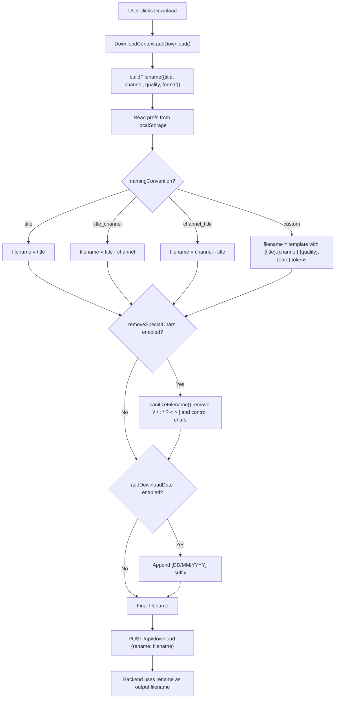
```mermaid
flowchart TD
    A["User clicks Download"] --> B["DownloadContext.addDownload()"]
    B --> C["buildFilename({title, channel, quality, format})"]

    C --> D["Read prefs from localStorage"]
    D --> E{"namingConvention?"}
    E --> |"title"| F["filename = title"]
    E --> |"title_channel"| G["filename = title - channel"]
    E --> |"channel_title"| H["filename = channel - title"]
    E --> |"custom"| I["filename = template with {title},{channel},{quality},{date} tokens"]

    F --> J{"removeSpecialChars enabled?"}
    G --> J
    H --> J
    I --> J

    J --> |"Yes"| K["sanitizeFilename() remove \\ / : * ? < > | and control chars"]
    J --> |"No"| L{"addDownloadDate enabled?"}
    K --> L

    L --> |"Yes"| M["Append [DD/MM/YYYY] suffix"]
    L --> |"No"| N["Final filename"]
    M --> N

    N --> O["POST /api/download {rename: filename}"]
    O --> P["Backend uses rename as output filename"]
```

**Sanitization rules** (`sanitizeFilename`):
- Removes Windows-illegal characters: `\ / : * ? " < > |`
- Strips control characters (`\x00`–`\x1F`)
- Collapses multiple spaces into one
- Trims leading/trailing dots and whitespace

---


### 5.3 Hybrid Video Player Architecture

*How YT-Deluxe plays video across three different contexts with zero unnecessary backend load and a seamless fallback when YouTube restricts embedding.*

#### 5.3.1 The Two-Layer Strategy

All three video surfaces in YT-Deluxe follow the same decision tree:

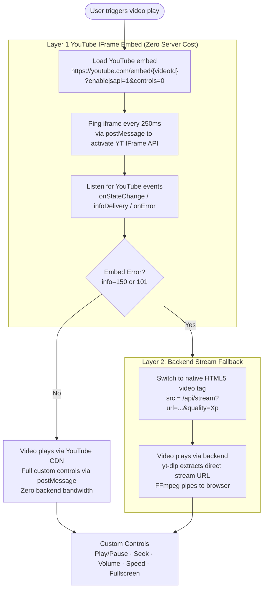
```mermaid
flowchart TD
    Start([User triggers video play]) --> IFrame

    subgraph Primary["Layer 1 YouTube IFrame Embed (Zero Server Cost)"]
        IFrame["Load YouTube embed\nhttps://youtube.com/embed/{videoId}\n?enablejsapi=1&controls=0"]
        IFrame --> Ping["Ping iframe every 250ms\nvia postMessage to activate YT IFrame API"]
        Ping --> Listen["Listen for YouTube events\nonStateChange / infoDelivery / onError"]
        Listen --> ErrCheck{"Embed Error?\ninfo=150 or 101"}
    end

    ErrCheck -- No --> Playing["Video plays via YouTube CDN\nFull custom controls via postMessage\nZero backend bandwidth"]

    ErrCheck -- Yes --> FallbackLayer

    subgraph FallbackLayer["Layer 2: Backend Stream Fallback"]
        FallbackNode["Switch to native HTML5 video tag\nsrc = /api/stream?url=...&quality=Xp"]
        FallbackNode --> Native["Video plays via backend\nyt-dlp extracts direct stream URL\nFFmpeg pipes to browser"]
    end

    Playing --> Controls["Custom Controls\nPlay/Pause · Seek · Volume · Speed · Fullscreen"]
    Native --> Controls
```

> **In plain words:** Every video that plays inside YT-Deluxe tries to use YouTube's own player first zero server cost, just like watching on youtube.com. If YouTube blocks embedding for that video (age-gate, copyright, etc.), the app silently switches to a backend stream without you noticing anything. You always get video, one way or another.

> **Layer 1** covers ~90% of cases. **Layer 2** is the silent safety net for age-gated, copyrighted, or embedding-disabled videos.

---

#### 5.3.2 Component-Level Breakdown

Each of the three player surfaces has a slightly different role and fallback behavior:

```mermaid
flowchart LR
    subgraph VideoCard["VideoCard: Search Grid Hover Preview"]
        VC1["Hover for 600ms\n\u2192 playVideo = true"]
        VC2["YouTube iframe loads\n(autoplay, muted=user state)"]
        VC3{"embedError?"}
        VC4["Native video\n/api/stream?quality=480p\nautoPlay, muted"]
        VC5["Custom mini-controls\nPlay \u00b7 Mute \u00b7 Seekbar\nvia postMessage"]
        VC1 --> VC2 --> VC3
        VC3 -- No --> VC5
        VC3 -- Yes --> VC4
    end

    subgraph PIP["GlobalPIPPlayer: Picture-in-Picture"]
        PIP1["openPip called\nwith video object"]
        PIP2["YouTube iframe\n(340px floating window)"]
        PIP3{"embedError?"}
        PIP4["Native video\n/api/stream?quality=480p"]
        PIP5["Controls: Play \u00b7 \u00b110s\nSeek \u00b7 Mute \u00b7 Fullscreen\nDownload redirect"]
        PIP1 --> PIP2 --> PIP3
        PIP3 -- No --> PIP5
        PIP3 -- Yes --> PIP4
    end

    subgraph VP["VideoPlayer: Details Page"]
        VP1["Page loads\nuseIframe = true"]
        VP2["YouTube iframe\nfull-width aspect-video"]
        VP3{"embedError?"}
        VP4["Native video\nvideoData.videoUrl\n/api/stream?quality=720p"]
        VP5["Full custom controls\nPlay \u00b7 \u00b110s skip \u00b7 Speed\nVolume \u00b7 Seek \u00b7 Fullscreen"]
        VP1 --> VP2 --> VP3
        VP3 -- No --> VP5
        VP3 -- Yes --> VP4
    end
```

> **In plain words:** There are three places video plays in the app: (1) the hover preview on search result cards, (2) the floating Picture-in-Picture mini-player, and (3) the full-size player on the video details page. All three follow the same rule YouTube embed first, server stream as backup. Each has a slightly different fallback timeout to balance speed against reliability.

---

#### 5.3.3 IFrame API Control Flow (Primary Mode)

When the YouTube iframe is active, all player controls go through the **YouTube IFrame PostMessage API** no direct DOM manipulation:

```mermaid
sequenceDiagram
    participant UI as React Controls
    participant Iframe as YouTube iframe
    participant YT as YouTube CDN

    UI->>Iframe: postMessage {event:'command', func:'playVideo'}
    Iframe->>YT: Resume CDN stream
    YT-->>Iframe: Video frames
    Iframe-->>UI: postMessage {event:'infoDelivery'}\n{currentTime, duration, volume, playerState}
    UI->>UI: Update state (currentTime, isPlaying, isMuted...)

    Note over UI,Iframe: Error path
    Iframe-->>UI: postMessage {event:'onError', info: 150}\nor info=101 (embed restricted)
    UI->>UI: setEmbedError(true)\nsetUseIframe(false)
    UI->>UI: Switch to native <video> fallback
```

> **In plain words:** When the YouTube player is active, your custom Play/Pause/Seek controls send invisible messages to the YouTube frame (like a remote control over browser messaging). YouTube replies with the current time and player state, and the app's buttons update to match. If YouTube signals an error at any point (blocked video), the app catches it and automatically switches to the backend stream.

---

#### 5.3.4 Fallback Badge & UX

When the backend stream fallback activates, a subtle pill badge appears on the player to inform the user:

| Badge | When shown | Context |
|---|---|---|
| `Stream Fallback` | `embedError = true` | VideoPlayer (details page) |
| `Fallback` | `embedError = true` | VideoCard hover & PIP player |

The badge is non-intrusive a small `bg-black/60 backdrop-blur` pill in the top-left corner so playback is uninterrupted.

---

#### 5.3.5 Quality by Context

| Surface | Iframe Resolution | Fallback Resolution | Rationale |
|---|---|---|---|
| **VideoCard Hover** | YouTube adaptive (auto) | `480p` | Small card, low bandwidth needed |
| **PIP Player** | YouTube adaptive (auto) | `480p` | Floating window, same rationale |
| **VideoPlayer** | YouTube adaptive (auto) | `720p` | Full-size player, higher quality expected |

---

#### 5.3.6 State Reset on Navigation

- **VideoCard**: When the user moves their cursor away (`onMouseLeave`), both `playVideo`, `videoReady`, and `nativeFallback` reset to `false`. Next hover starts fresh.
- **PIP Player**: When `closePip()` is called, `AnimatePresence` unmounts the iframe cleanly.
- **VideoPlayer**: `useIframe` and `embedError` are component-scoped reset automatically when navigating to a new video details page.

---

### 5.4 Format Fetch, Preset Display & Download System

This section documents exactly how formats become visible in the UI after a video is loaded, how each download surface works, and how a user's selection travels from click to a file on disk.

---

#### 5.4.1 Two-Phase Metadata Fetching Architecture

When a user navigates to the Video Details page, YT-Deluxe uses a **Two-Phase** parallel fetching architecture to eliminate loading waits.

**Phase 1: Quick Metadata (Multi-Source Parallel Fetch)**
A request is immediately sent to `GET /api/video/quick?id={video_id}`. Because community Piped instances are highly unreliable (often returning 500/502 errors from YouTube blocking), this endpoint runs a 3-source parallel race condition using `asyncio.gather`:

```mermaid
graph LR
    A["GET /api/video/quick"] --> B["Parallel Launch"]
    B --> C["Piped API (2 instances, 2s timeout)"]
    B --> D["YouTube Page Scrape (~3s)"]
    B --> E["Return YouTube Dislike API (~1.5s)"]
    C --> F{"Piped Success?"}
    F -->|Yes| G["Return Piped (Fastest & Richest)"]
    F -->|No| H{"Scrape Success?"}
    H -->|Yes| I["Merge Scrape + RYD Data"]
    H -->|No| J{"RYD Success?"}
    J -->|Yes| K["Return RYD only (likes/views)"]
    J -->|No| L["Return null (yt-dlp fallback)"]
```
*This guarantees partial or full metadata (Title, Avatar, Likes, Views, Upload Date, Channel) is returned within ~3 seconds, instantly hiding the loading skeleton.*

**Phase 2: Format Collection (`GET /api/video`)**
In parallel to Phase 1, `index.jsx` calls `YTDeluxeAPI.getVideoDetails(url)`. The backend endpoint `GET /api/video` runs `yt-dlp` with `skip_download: True` to extract the full stream list. This acts as both the format extractor and the ultimate failsafe fallback if all Phase 1 sources fail.

**Backend processing pipeline (`main.py: get_video_details`):**

```
yt-dlp extracts full info dict
          ↓
Loop through all raw formats:
  ├── Audio-only (vcodec == 'none'):
  │     Skip mhtml/vtt and 0-bitrate
  │     Append every valid stream to audio_formats[]
  └── Video streams (has height + vcodec):
        Collect ALL into all_video_formats_raw[]
        Keep BEST per height (by tbr/filesize) in seen_heights{}
          ↓
Deduplicate audio sort by ABR desc,
keep 1 representative per codec family (opus / m4a / other), max 3
          ↓
Build `formats` list (Recommended 1 best video per height + up to 3 audio)
Build `all_formats` list (Every stream all video heights × codecs + audio)
```

**Two distinct format lists returned:**

| Field | Purpose | Size |
|-------|---------|------|
| `formats` | Recommended list shown in Quick Download & Quality Grid | 1 per height + max 3 audio |
| `all_formats` | Raw stream list shown in "Show All Advanced Formats" | Every unique format_id |

**Key fields on each format entry:**

| Field | Video | Audio | Description |
|-------|-------|-------|-------------|
| `format_id` | Yes | Yes | yt-dlp's unique stream identifier |
| `quality` | `1080p` / `4K` | `High Quality` / `Medium Quality` | Human label |
| `ext` | `mp4` / `webm` | `webm` / `m4a` | Actual container extension |
| `native_ext` | - | `opus` / `m4a` | Real extension (never `mp3`) |
| `codec_family` | `avc1` / `vp9` / `av01` | - | For badge rendering |
| `codec_display` | - | `Opus` / `AAC` | Human-readable codec name |
| `tbr` / `abr` | Total bitrate | Audio bitrate | For size estimation |
| `filesize` | Yes | Yes | Approximate bytes |
| `type` | `video` | `audio` | For filtering in UI |

---

#### 5.4.2 Phase 2 Data Flow into the Page (`index.jsx`)

After the API responds, `index.jsx` maps the response into `videoData` state:

```js
videoInfo = {
  formats: response.video.formats,          // Recommended list → DownloadTabs
  all_formats: response.video.all_formats,  // Full stream list → Advanced Grid
  max_quality: bestQuality,                 // For Quick Actions badge
  ...
};
setVideoData(videoInfo);
```

`videoData` is passed as a prop to both `<DownloadTabs>` and `<VideoTrimmer>`. Any change (tab switch, quality click, advanced selection) calls `onSelect(config)` → `handleSelectConfig(config)` → `setSelectedConfig(config)` in the parent. This `selectedConfig` is the **single source of truth** for the current user selection.

---

#### 5.4.3 Quick Actions (Sidebar `index.jsx`)

The **Quick Actions** panel lives in the sidebar of `index.jsx`. It renders three hardcoded one-click buttons that bypass `DownloadTabs` entirely and call `handleDownload()` directly.

```mermaid
flowchart LR
    QA["Quick Actions Sidebar"]
    B1["Best Video (MP4)"]
    B2["Audio Only (MP3)"]
    B3["Thumbnail (JPG)"]
    DL["handleDownload()"]
    CTX["DownloadContext.addDownload()"]

    QA --> B1 & B2 & B3
    B1 & B2 & B3 --> DL --> CTX
```

> **In plain words:** Clicking "Show All Advanced Formats" opens a full list of every stream YouTube has for this video broken into Video Streams and Audio Streams sections. Each row shows the exact codec, resolution, bitrate, file size, and a unique stream ID. Clicking any row locks that precise stream for download. The backend will download exactly that stream no guessing, no auto-selection.

| Button | Payload sent |
|--------|-------------|
| **Best Video** | `{ type:'video', quality: max_quality, format:'mp4' }` no `format_id`, backend auto-selects |
| **Audio Only** | `{ type:'audio', quality:'High Quality', format:'mp3', convert_to_mp3:true }` |
| **Thumbnail** | `{ type:'thumbnail', quality:'Max Resolution', format:'jpg' }` |

> These buttons ignore any selection made in `DownloadTabs`. They are intentionally simple "one-click" shortcuts.

---

#### 5.4.4 Quick Download Section (`DownloadTabs.jsx` Preset Cards)

The **Quick Download** section renders 3 preset cards built from `getPresetButtons()`:

```js
// Always picks: first (Best), middle, last (Lowest)
const presets = [opts[0], opts[mid], opts[len-1]];
```

**Source of options by tab:**

| Tab | Source | Computed by |
|-----|--------|-------------|
| Video | `videoQualities` filtered from `videoData.formats` where `type === 'video'`, sorted height desc | `useMemo` |
| Audio | `audioQualities` filtered from `videoData.formats` where `type === 'audio'`, sorted by `quality_index` | `useMemo` |
| Thumbnail | `thumbnailOptions` static array of 3 fixed options | Constant |

Each preset card displays:

- Quality label (e.g., `4K`, `High Quality`)
- Format chip (e.g., `.webm`, `.m4a`)
- Approximate file size
- Codec badge with hover tooltip (`bestFor` string)
- Bitrate (audio only)

Clicking a preset card calls `handlePresetDownload(option)`:

```js
onDownload({
  type: option.type || activeTab,
  quality: option.quality,
  format: isAudio ? (option.native_ext || option.ext) : option.ext,
  format_id: isAudio ? null : option.format_id,
  audio_format_id: isAudio ? option.format_id : null,
  container: !isAudio ? selectedContainer : null,
  convert_to_mp3: false,
  filename: customFilename,
});
```

> If `advancedSelectedId` is set (user previously picked from advanced grid), it overrides the preset and the exact advanced stream is downloaded instead.

---

#### 5.4.5 Advanced Options Section (`DownloadTabs.jsx`)

The **Advanced Options** section (`id="advanced-options"`) is always visible below Quick Download. It contains:

1. **Type tab bar** duplicate Video / Audio / Thumbnail tabs (same `activeTab` state, sliding pill animation)
2. **Quality Grid** full list of recommended formats (not just 3 presets)
3. **HelpCircle Guide tooltips** Video Guide / Audio Guide
4. **MP3 Card** dedicated card always at the end of audio tab
5. **Show All Advanced Formats** collapsible dropdown grid
6. **Container Format dropdown** video tab only
7. **Custom Filename** input with live extension chip/dropdown
8. **Download Button** triggers `handleCustomDownload()`

**Quality Grid (`Change M` in code):**

Renders every entry from `activeOptions` (all `videoQualities` or `audioQualities`, not just 3). Each card:

- Highlights when selected with `ring-[1.5px] ring-{color}` + spring-animated gradient glow
- Shows: quality label, format chip, size, resolution, fps, bitrate, codec badge
- On click: sets `selectedQuality`, clears `advancedSelectedId`, calls `onSelect()`

**MP3 Dedicated Card (Audio Tab only):**

A visually distinct amber/gold card appended after all native audio cards. Uses the sentinel value `MP3_SENTINEL = 'mp3'` as `selectedQuality`.

```js
// On click:
setSelectedQuality(MP3_SENTINEL);  // 'mp3'
onSelect({ type:'audio', format:'mp3', convert_to_mp3: true, ... });
```

When selected, all download functions check `isMp3Selected = (selectedQuality === 'mp3')` and route to the MP3 transcode path (`convert_to_mp3: true`).

---

#### 5.4.6 Show All Advanced Formats Grid

The **"Show All Advanced Formats"** toggle uses a `CustomDropdown` component. Clicking the toggle button (`showAllFormats` state) expands a scrollable list sourced from `videoData.all_formats` (every raw yt-dlp stream, not just the recommended ones).

```mermaid
flowchart TD
    Toggle["Show All Advanced Formats (23 Available)"]
    Toggle -->|expand| Grid["Floating CustomDropdown Panel"]
    Grid --> VS["Video Streams header"]
    Grid --> AS["Audio Streams header"]
    VS --> VR["Each row: .ext | quality | resolution | CodecBadge | TBR | Size | id:xxx"]
    AS --> AR["Each row: .ext | quality | CodecBadge | ABR | Size | id:xxx"]
    VR -->|click| SEL["setAdvancedSelectedId(format_id)"]
    AR -->|click| SEL
    SEL --> CLOSE["setShowAllFormats(false)"]
    SEL --> ONSEL["onSelect({ format_id, ... })"]
```

> **In plain words:** When you click Download, everything you picked (quality, format, filename, trim range) is packaged and sent to the server. The server figures out the best way to fetch your file, downloads it from YouTube using the appropriate path (exact stream, audio, or quality-label), runs FFmpeg to merge or trim if needed, identifies the output file, then delivers it to you either streaming it to your browser or saving it directly to your hard drive.

**When `advancedSelectedId` is set:**

- The dropdown trigger button shows the selected stream's info (ext, quality, resolution, codec badge, size, id)
- An amber/blue indicator bar shows: `Custom format selected (id: 303) ✕`
- All download paths (`handlePresetDownload`, `handleCustomDownload`) detect this and override everything with the exact advanced stream

**Clearing the selection:**

- Clicking the `✕` on the indicator bar calls `setAdvancedSelectedId(null)`
- Clicking a quality grid card also clears `advancedSelectedId`

---

#### 5.4.7 Container Format Dropdown (Video Tab Only)

The **Container Format** dropdown (video tab only) controls `selectedContainer` state (default: `'auto'`).

| Option | Value | Effect |
|--------|-------|--------|
| Auto Native Stream (Recommended!) | `auto` | Backend skips FFmpeg re-mux; stream saved in its native container |
| MP4 Universal | `mp4` | Forces MP4 container via `merge_output_format = 'mp4'` |
| MKV Lossless merge | `mkv` | Forces MKV container |
| WebM Web optimized | `webm` | Forces WebM container |
| MOV Apple compatible | `mov` | Forces MOV container |

**Container Compatibility Warning:** When `selectedContainer === 'mp4'` and the selected stream uses VP9 or AV1, an animated amber warning banner appears with a "Switch to MKV instead" action link.

---

#### 5.4.8 Download Data Flow Full End-to-End

```mermaid
flowchart TD
    A["User clicks Download\n(preset card / custom button / Quick Actions)"]
    A --> B["handlePresetDownload / handleCustomDownload\n(DownloadTabs.jsx)"]
    B --> C["Builds config object:\n{ type, quality, format, format_id,\n  audio_format_id, container,\n  convert_to_mp3, filename }"]
    C --> D["onDownload(config) → index.jsx handleDownload()"]
    D --> E["addDownload(config, videoData)\n(DownloadContext.jsx)"]
    E --> F["Maps to apiConfig:\nformat_id, audio_format_id,\ncontainer, convert_to_mp3,\nrename, trim_start, trim_end"]
    F --> G["api.js downloadVideo()\nBuilds FormData → POST /api/download"]
    G --> H["Backend: download_video endpoint\nCreates task_id, spawns download_worker()"]
    H --> I{Which path?}

    I -->|"format_id + type=video\n(exact stream selected)"| J["FORMAT_ID PATH\nDerives safe_container from native ext\nBuilds codec-compatible audio spec\nSets merge_output_format if needed"]
    I -->|"type=audio OR convert_to_mp3"| K["AUDIO PATH\nMP3: FFmpegExtractAudio + EmbedThumbnail\nM4A native: writethumbnail + EmbedThumbnail\nOpus/WebM native: FFmpegMetadata only"]
    I -->|"quality label only\n(Quick Actions / preset no format_id)"| L["QUALITY PATH\nformat_spec = bestvideo[height<=N]+bestaudio\nOptional merge_output_format"]

    J & K & L --> M["yt-dlp downloads streams\nFFmpeg merges if needed"]
    M --> N["File Detection:\nTrimmed? → find _ytd_{task_id} prefix\nNot trimmed? → new_files diff → fallback A/B"]
    N --> O["If trim requested:\nFFmpeg -ss START -t DUR -c copy\nRename clean base_filename"]
    O --> P["task status → 'completed'\nFrontend polls /api/progress/{task_id}\nTriggers file download or Desktop save"]
```

> **In plain words:** You drag the timeline handles to pick a start and end point. When you hit Download, the app first downloads the entire video (YouTube doesn't allow mid-video downloads). Then FFmpeg cuts exactly the segment you chose trying a fast no-quality-loss cut first, falling back to a re-encode only if necessary. The final file is saved with a clean original title, never with ugly temp-file prefixes.

**FormData fields sent to backend:**

| Field | Type | Description |
|-------|------|-------------|
| `url` | string | YouTube video URL |
| `quality` | string | e.g., `1080p`, `High Quality` |
| `format` | string | e.g., `mp4`, `webm`, `m4a`, `opus`, `mp3` |
| `format_id` | string | Exact yt-dlp stream ID (video) or null |
| `audio_format_id` | string | Exact yt-dlp stream ID (audio) or null |
| `container` | string | `auto`, `mp4`, `mkv`, `webm`, `mov` or null |
| `convert_to_mp3` | bool | `true` = transcode to MP3 |
| `rename` | string | Custom filename (no extension) |
| `trim_start` | float | Trim start in seconds (optional) |
| `trim_end` | float | Trim end in seconds (optional) |
| `type` | string | `video`, `audio`, or `thumbnail` |
| `channel` | string | Channel name (for history) |
| `thumbnail` | string | Thumbnail URL (for history) |

---

#### 5.4.9 Backend Download Worker Three Paths

**Path 1: format_id Video (Exact Stream)**

- Triggered when `format_id` is set and `type != 'audio'`
- Looks up the stream in `info['formats']` to get its native `ext`
- If `container == 'auto'` → derives `safe_container` from stream's native `ext` (VP9 stays `.webm`, H264 stays `.mp4`)
- Audio spec is codec-compatible: WebM container → Opus audio; MP4/MKV → M4A audio
- Only sets `merge_output_format` when `safe_container` is explicitly known

**Path 2: Audio Download**

- Triggered when `type == 'audio'` or `convert_to_mp3 == True`
- **MP3 path:** `FFmpegExtractAudio` + `EmbedThumbnail` + `FFmpegMetadata` (re-encodes to 192kbps MP3, embedded album art)
- **M4A native path:** `writethumbnail: True` + `EmbedThumbnail` + `FFmpegMetadata` (thumbnail embeds natively)
- **Opus/WebM native path:** `FFmpegMetadata` only (WebM container does not support embedded thumbnails)
- Format spec is built per-format: `bestaudio[ext=m4a]/...` for M4A, `bestaudio[ext=webm][acodec=opus]/...` for Opus

**Path 3: Quality-Label Video (No format_id)**

- Triggered by Quick Actions or preset cards without explicit `format_id`
- Uses height-constrained format spec: `bestvideo[height<=N][ext=mp4]+bestaudio[ext=m4a]/bestvideo[height<=N]+bestaudio/best`
- Applies `merge_output_format` only when an explicit container is selected (not `auto`)

---

#### 5.4.10 Session-Safe File Detection

After `yt-dlp.download()` completes, the backend must locate the downloaded file:

```
Trimmed request?
  YES → find files with _ytd_{task_id[:12]} in name (100% unique per task)
  NO  →
    PRIMARY:   new_files = current_dir_listing - pre_download_snapshot
               → match by title prefix → most likely candidate
    FALLBACK A: files modified in last 90s matching title prefix (covers in-place overwrite)
    FALLBACK B: most recently modified file in last 60s (last resort)
```

> **Why this matters:** Previously, the backend used a simple `startswith(title)` match. If you downloaded the same video twice in the same session (different quality/format), the old file would be returned instead of the newly downloaded one. The snapshot-diff method prevents this entirely.

**Trimmed downloads use task_id-prefixed `outtmpl`:**

```python
# Inserted before download:
ydl_opts['outtmpl'] = '.../{base_filename}_ytd_{task_id[:12]}.%(ext)s'
# After trim completes:
os.rename(trimmed_file, clean_base_filename)  # Clean name for user
```

---

### 5.5 Precision Trimming Architecture

*How the end-to-end trimming pipeline works from UI range selection to the final trimmed file on disk.*

#### 5.5.1 Trimming Flow Overview

```mermaid
flowchart TD
    A["User sets trim range\n(handles / presets / time input)"] --> B["Clicks Download"]
    B --> C["Frontend sends POST /api/download\nwith trim_start & trim_end"]
    C --> D["yt-dlp downloads full file\nto tempfiles/ directory"]
    D --> E{"trim params\npresent?"}
    E -->|No| H["File ready as-is"]
    E -->|Yes| F["FFmpeg trims:\n-ss START -t DURATION -c copy"]
    F -->|Success| G["Rename temp → original filename"]
    F -->|Fail| F2["FFmpeg re-encode fallback:\nlibx264 + aac"]
    F2 --> G
    G --> H
    H --> I{"isDesktop?"}
    I -->|Desktop| J["File saved to\nYT Deluxe Downloads/Videos or Music"]
    I -->|Web| K["Browser triggers download\n+ auto-cleanup after 10min"]
```

> **In plain words:** On the desktop app, your trimmed file is saved permanently to your YT Deluxe folder on your hard drive and you can open it in Explorer with one click. On the web version, the server processes and trims the file, streams it to your browser's Downloads folder, then automatically deletes the server copy after 10 minutes to save disk space.

#### 5.5.2 FFmpeg Trim Pipeline (Backend)

The trimming engine in `main.py` uses a **two-pass strategy** for maximum compatibility:

**Pass 1 Stream Copy (Fast, ~0.5s):**

```bash
ffmpeg -y -ss 30 -i input.mp4 -t 90 -c copy -avoid_negative_ts make_zero _tmp_trim_abc123.mp4
```

- `-ss` before `-i` = fast input-side seeking (no full decode)
- `-c copy` = no re-encoding, preserves original quality
- `-avoid_negative_ts make_zero` = fixes timestamp discontinuities

**Pass 2 Re-encode Fallback (Slower, always works):**

```bash
ffmpeg -y -ss 30 -i input.mp4 -t 90 -c:v libx264 -preset fast -c:a aac _tmp_trim_abc123.mp4
```

- Only triggered if Pass 1 fails (certain codecs don't support stream copy)
- Uses `libx264` (video) + `aac` (audio) for broad compatibility

**Clean Rename Strategy:**

```python
# Temp file → Original filename (no ugly prefixes)
temp_trimmed = f"_tmp_trim_{uuid.uuid4().hex[:8]}{file_ext}"
# After FFmpeg completes:
os.remove(filepath)              # delete original
os.rename(temp_trimmed, filepath) # rename temp → original name
```

> **Result:** User always gets the clean original title (e.g., `MONTAGEM ALQUIMIA (SLOWED).mp4`), never `trimmed_36a5caca_...`.

#### 5.5.3 Trimming Desktop vs Web Storage

```mermaid
flowchart LR
    subgraph "Desktop Mode"
        D1["yt-dlp downloads to\nYT Deluxe Downloads/Videos/"] --> D2["FFmpeg trims in-place\n(same directory)"]
        D2 --> D3["File stays permanently\non user's disk"]
        D3 --> D4["'Open in Explorer' button\nhighlights the file"]
    end

    subgraph "Web Mode"
        W1["yt-dlp downloads to\nbackend/tempfiles/"] --> W2["FFmpeg trims in-place\n(same directory)"]
        W2 --> W3["FileResponse streams\nto browser"]
        W3 --> W4["Browser saves to\ndefault Downloads folder"]
        W4 --> W5["Auto-cleanup daemon\ndeletes after 10 min"]
    end
```

> **In plain words:** Before committing to a download, you can hit Preview and the app plays exactly the segment you trimmed. For most videos, your browser simply jumps to the start point and plays until the end point. For protected or DASH-only videos where direct seeking doesn't work, the server quickly generates a short clip and streams just that portion back to you.

| Aspect | Desktop | Web |
|--------|---------|-----|
| **Download location** | `~/Downloads/YT Deluxe Downloads/Videos/` (or Music/) | `backend/tempfiles/` → browser Downloads |
| **File persistence** | Permanent stays on user's disk | Ephemeral auto-deleted after 10 minutes |
| **Trim execution** | Same as Web (server-side FFmpeg) | Server-side FFmpeg |
| **History storage** | `~/.yt-deluxe/download_history.json` (JSON file) | `localStorage` (browser) |
| **File access** | "Open in Explorer" button via `/api/desktop/open-file` | Standard browser download |

#### 5.5.4 Preview Before Download

Users can preview the trimmed range before committing to a download:

```mermaid
flowchart TD
    P1["User clicks Preview"] --> P2{"Stream type?"}
    P2 -->|"Direct Stream\n(most videos)"| P3["Browser seeks to startTime\nvideo.currentTime = startTime"]
    P3 --> P4["Plays until endTime\nthen loops back to startTime"]
    
    P2 -->|"DASH/Protected\n(stream copy fails)"| P5["Backend generates clip:\n/api/preview-clip?start=X&duration=Y"]
    P5 --> P6["FFmpeg extracts short clip\nstreams back as video/mp4"]
    P6 --> P4
```

> **In plain words:** All download settings which tab you're on, what quality, which format live in one central "brain" object called `selectedConfig` in the parent page. Both the DownloadTabs panel and the VideoTrimmer read from and write back to this same object. This means if you switch from Video to Audio in DownloadTabs, the Trimmer automatically switches too. There is no way for the two panels to get out of sync.

**Smart Resume:** Pausing and resuming continues from the paused position it only jumps to `startTime` if the playhead is outside the trim range.

#### 5.5.5 Audio Trimming & Embedded Thumbnails

When downloading audio (MP3), the backend automatically:

1. Downloads the best audio stream via yt-dlp
2. Embeds the YouTube video's thumbnail as album art (`EmbedThumbnail` postprocessor)
3. Trims with FFmpeg if a range was specified
4. Final output: `.mp3` file with embedded cover art

---

### 5.6 Trimmer Component Architecture

*How the frontend VideoTrimmer component manages state, syncs with DownloadTabs, and communicates with the backend.*

#### 5.6.1 Component Hierarchy & Props

```mermaid
graph TD
    subgraph "index.jsx Parent Page"
        SC["selectedConfig\n{type, quality, format}"]
        TS["trimSettings\n{startTime, endTime}"]
        DL["downloads[]\n(active tasks)"]
    end
    
    subgraph "DownloadTabs"
        AT["activeTab\n(local, synced via useEffect)"]
        QG["Quality Grid"]
    end
    
    subgraph "VideoTrimmer"
        TL["Timeline\n(drag handles)"]
        PR["Presets"]
        PV["Preview Player"]
        TG["Trim as Toggle"]
        OV["Thumbnail Overlay"]
    end
    
    SC -->|"selectedConfig prop"| AT
    SC -->|"selectedConfig prop"| TG
    AT -->|"onSelect(config)"| SC
    TG -->|"onSelectConfig(config)"| SC
    OV -->|"onSelectConfig(config)"| SC
    TL -->|"onTrimChange(start, end)"| TS
    DL -->|"downloads prop"| PV
```

> **In plain words:** The trimmer's mini-player has exactly three faces it can show at once: a loading spinner while the stream warms up, a circular download progress ring while your clip is being processed, and the normal play/pause controls when it's ready to play. Only one of these three states can be visible at a time they never overlap.

#### 5.6.2 Three-Way Toggle Sync

Three separate UI elements all reflect the same download type (Video/Audio/Thumbnail):

| Toggle Location | Purpose | How it Syncs |
|----------------|---------|--------------|
| **DownloadTabs** (main tabs) | Primary type selector | `useEffect` watches `selectedConfig.type` → updates local `activeTab` |
| **"Trim as" toggle** (inside VideoTrimmer) | Quick switch within trimmer | Calls `onSelectConfig()` → updates parent → propagates everywhere |
| **Warning overlay buttons** (glassmorphism card) | Exit thumbnail mode | Calls `onSelectConfig()` → dismisses overlay + updates tabs |

**Single Source of Truth:** `selectedConfig` in `index.jsx` is the only state that matters. All three toggles derive from it and write back to it.

#### 5.6.3 Player Visual States

The preview player has 3 mutually exclusive visual states:

```mermaid
stateDiagram-v2
    [*] --> Fetching: streamUrl loads
    Fetching --> Ready: canplay event fires
    Ready --> Playing: user clicks Play
    Playing --> Buffering: waiting event (slow network)
    Buffering --> Playing: playing event (buffer filled)
    Playing --> Ready: user clicks Pause
    Ready --> Trimming: user clicks Download
    Trimming --> Ready: download completes at 100%
```

> **In plain words:** The trimmer does not fetch any video from the server until you actually interact with the trim controls. Until then, it shows a static thumbnail as a placeholder. The instant you drag a handle, type a time, click a preset chip, or hit Play it starts loading the stream. This means no wasted server calls if you're just browsing, reading the video description, or haven't decided to trim yet.

| State | Trigger | Visual Indicator |
|-------|---------|-----------------|
| **Fetching / Buffering** | `isMediaLoading \|\| isBuffering \|\| clipLoading` | Triple-layer spinner (ping + spin + pulse icon) |
| **Trimming / Processing** | `activeDownload` found in `downloads[]` | Circular SVG progress ring + percentage + bottom glow bar |
| **Ready / Playing** | None of above | Hover-aware Play/Pause button with glassmorphism overlay |

#### 5.6.4 Estimated File Size Calculation

The trimmer estimates output file size based on quality bitrate:

| Quality | Bitrate (kbps) | Example: 2 min trim |
|---------|---------------|-------------------|
| 8K | 80,000 | ~1.2 GB |
| 4K | 40,000 | ~600 MB |
| 1080p | 8,000 | ~120 MB |
| 720p | 4,000 | ~60 MB |
| 480p | 2,000 | ~30 MB |
| Audio (MP3) | 192 | ~2.9 MB |

**Formula:** `estimatedBytes = (bitrate × 1000 / 8) × trimmedDuration`

---

#### 5.6.5 Lazy Stream Loading `previewEnabled` Gate

*How the VideoTrimmer avoids unnecessary backend API calls until the user actually engages with the trim controls.*

`previewEnabled` is a boolean gate that controls whether the `<video>` element receives a `src` at all:

```jsx
// VideoTrimmer.jsx
const [previewEnabled, setPreviewEnabled] = useState(false); // false = no stream fetch

// Only feed src to the video element when the gate is open
const videoSrc = previewEnabled ? streamUrl : null;

<video ref={videoRef} src={videoSrc} ... />
```

The `<video>` tag is always rendered (so the DOM ref stays stable), but `src` is `null` until the user explicitly interacts meaning **zero HTTP requests to the backend** until the user is ready.

##### When `previewEnabled` Becomes `true`

```mermaid
flowchart TD
    A([Trimmer opens\npreviewEnabled = false]) --> B{User action?}

    B -- Drags start/end handle --> C["onHandleDown()\nsetPreviewEnabled(true)"]
    B -- Types in start input --> D["handleStartInput()\nsetPreviewEnabled(true)"]
    B -- Types in end input --> E["handleEndInput()\nsetPreviewEnabled(true)"]
    B -- Clicks a preset chip --> F["applyPreset()\nsetPreviewEnabled(true)"]
    B -- Clicks Play / Preview --> G["togglePreview()\nsetPreviewEnabled(true)"]
    B -- No action --> H["Placeholder thumbnail\nshown zero API calls"]

    C & D & E & F & G --> I["streamUrl assigned to video.src\nBrowser fetches /api/stream\nPreview ready to play"]
```

##### State Comparison

| State | `previewEnabled` | `video.src` | Backend request |
|---|---|---|---|
| Trimmer just expanded | `false` | `null` | None |
| User drags a handle | `true` | `/api/stream?quality=720p` | Fetched |
| User types a time | `true` | `/api/stream?quality=720p` | Fetched |
| User clicks a preset | `true` | `/api/stream?quality=720p` | Fetched |
| User clicks Play | `true` | `/api/stream?quality=720p` | Fetched |

##### Placeholder Before Unlock

While `previewEnabled = false`, the player area shows a **static thumbnail** of the video with an overlay prompt ("Drag handles or select a preset to enable preview"), making it immediately clear to the user how to activate the preview without any spinner or false loading state.

Once `previewEnabled` becomes `true`, the placeholder fades out and the actual stream seamlessly takes over.

##### Stream Quality in Preview

| Mode | Stream URL | Quality | Rationale |
|---|---|---|---|
| **Video preview** | `/api/stream?quality=720p` | 720p | Sufficient to judge trim points; low cost |
| **Audio preview** | `/api/stream?quality=audio` | Best audio | No video needed for audio trim |
| **Clip fallback** | `/api/preview-clip?start=X&clip_duration=Y` | Server-cut | When direct stream seek fails |

---

### 5.7 Hosted Web Application Architecture

*How the platform operates when hosted on cloud servers.*

```mermaid
flowchart LR
    subgraph Client Browser
        UI[React Frontend]
        Local[localStorage / History]
    end
    
    subgraph Cloud Server Infrastructure
        API[FastAPI Backend]
        Temp[Volatile tempfiles/ Dir]
        YTDLP[yt-dlp + FFmpeg Core]
    end
    
    UI --> |"API Requests"| API
    API --> |"Responses / File Stream"| UI
    API --> YTDLP
    YTDLP --> Temp
    Temp -- Final Media Stream --> UI
    UI -- Log Action --> Local
```

> **In plain words:** When you install the Windows app, double-clicking the EXE opens a mini Chrome-like browser window (powered by PyWebView) alongside a hidden background server both running on your own PC. No cloud involved. The server saves files directly to your hard drive, your download history is a plain JSON file in your home folder, and everything runs locally at full speed without any internet dependency beyond fetching from YouTube itself.

**Web Deployment Workflow:**

- **Client Layer**: The React frontend is served as static assets. It uses `localStorage` for local persistence of history and settings, ensuring that user data stays private and localized to their browser.
- **API Layer**: The FastAPI backend handles heavy lifting. It must be hosted on a service that supports persistent or scale-to-zero compute with `FFmpeg` installed.
- **Volatile Storage**: The `tempfiles/` directory acts as a high-speed workspace for stream merging. Files here are ephemeral and auto-deleted after 10 minutes to maintain server health.
- **Streaming**: The final file is streamed back to the user via an HTTP `FileResponse`, allowing the browser to handle the bitstream as a standard file download.

---

### 5.8 Native Windows Desktop Architecture

*How the platform operates when installed locally as an .exe via the Launcher.*

```mermaid
flowchart TD
    subgraph User PC
        Exe[YT-Deluxe-Setup.exe]
        Launcher[launcher.py Spawns Processes]
        WebView[PyWebView Chromium Window]
        API["Locally Bundled Backend server\n(also serves Frontend via HTTP)"]
        
        Disk[(YT Deluxe Downloads / \n Videos, Music, Thumbnails)]
        Hist[(~/.yt-deluxe/download_history.json)]
    end
    
    Exe --> |Installs| Launcher
    Launcher --> |Starts Background| API
    Launcher --> |"Opens http://127.0.0.1:8000"| WebView
    WebView <--> |"HTTP Requests (same origin)"| API
    API -- Saves Raw Files --> Disk
    API -- Read/Writes --> Hist
```

> **In plain words:** When you install YT-Deluxe as a Windows app, everything runs on your own computer. The installer sets up a mini server quietly in the background, opens a browser-like window pointing to it, and your downloads go straight to your Downloads folder. No cloud, no internet dependency for the app itself only for fetching YouTube content.

**Desktop Integration Workflow:**

- **HTTP-Based Frontend Serving**: In packaged mode, the backend statically serves the React build at `http://127.0.0.1:8000`. The PyWebView wrapper loads this URL instead of a `file:///` path. This provides a valid HTTP origin, which is **critical** for YouTube iframe embeds (fixes Error 153: Video player configuration) and enables standard `BrowserRouter` routing.
- **Dynamic Path Resolution (YTDELUXE_FRONTEND_DIR)**: `launcher.py` safely evaluates the bundled frontend location at runtime and proxies it to the isolated `--onefile` backend via standard environment variables (`os.environ.get('YTDELUXE_FRONTEND_DIR')`). This fundamentally replaces hardcoded or `sys._MEIPASS` dependency checking, enabling modular pyinstaller build strategies.
- **Port Conflict Awareness**: If a developer launches the `YT-Deluxe.exe` application while their local Uvicorn dev server is active on `port 8000`, the bundled backend silently crashes (`winerror 10048 address already in use`), and the UI inadvertently communicates with the uncompiled dev server (resulting in a blank `{"detail":"Not Found"}` SPA fallback). Users must close dev shells before executing native wrapper tests.
- **Desktop Detection**: The frontend detects desktop mode natively via the `window.pywebview` object (injected by the compiled GUI framework), disregarding archaic `file:` protocol checks. This ensures reliable native download triggers.
- **Deep OS Access**:
  - **Native Downloads**: The backend has direct permission to write to the user's `Downloads/YT Deluxe Downloads` folder.
  - **Persistent History**: Instead of browser storage, the app writes to a standard JSON database located in the user's home directory (`~/.yt-deluxe/`).
- **One-Click Launch**: The `launcher.py` entry point ensures that both the server and the UI window open and close together gracefully.

#### 5.8.1 Native Permissions Architecture

YT Deluxe implements a custom, unified permissions system that bridges web APIs and native desktop capabilities, ensuring a seamless, premium UX without unbranded OS dialogs.

- **Frontend Intercepts (`index.jsx`)**: Global overrides intercept browser APIs (`navigator.mediaDevices.getUserMedia`, `Notification.requestPermission`). Instead of showing the native browser prompt, they pause execution and trigger the custom React `PermissionDialog`.
- **System Bridge Bypasses (`pywebview`)**: For specific APIs like Clipboard, the frontend detects if the desktop bridge is available. If present, it bypasses browser APIs entirely (which require permissions) and uses PowerShell commands via `window.pywebview.api` to read/write the clipboard silently.
- **Backend Auto-Grant (`launcher.py`)**: To prevent the underlying Edge Chromium runtime from displaying fallback prompts (e.g., "localhost:8000 wants to use your microphone"), the backend hooks into `CoreWebView2.PermissionRequested` at the GUI-thread level (`webview.start(func=...)`). It silently auto-grants all requests since user consent is already collected by the React dialog.
- **Persistent State (`permissions.js`)**: Decisions are cached in `YTDeluxeStorage`. Bridge-handled permissions (like Clipboard) are proactively marked as "System Managed" so the Settings UI accurately reflects their status without ever prompting the user.

---

### 5.9 System Architecture & Workflows

YT Deluxe operates on a highly integrated mono-repo architecture. The entire lifecyclerom coding to building, packaging, and web distributions fully automated and synchronized.

#### 5.9.1 Mono-Repo Deployment Architecture
How the codebase is structured and distributed.

```mermaid
graph TD
    subgraph Mono-Repo [YT-Deluxe GitHub Repository]
        A[Frontend / React Vite]
        B[Backend / FastAPI Python]
        C[Desktop / PyInstaller & Inno Setup]
        D[Website / Static Landing Page]
    end

    subgraph CI/CD & Build
        A -->|NPM Build| Bundled_UI
        B -->|PyInstaller| Executable_Engine
        Bundled_UI & Executable_Engine --> C
        C -->|ISCC compiler| Setup_EXE[YT-Deluxe-Setup.exe]
        D -->|Auto-Sync| Vercel[Vercel Edge Network]
    end

    Setup_EXE -->|Manual Upload| GHR[GitHub Releases]
    Vercel -->|Hosts| Web[yt-deluxe.vercel.app]
```

**How it works:**
- **Single Source of Truth:** The entire project (React Frontend, Python Backend, Windows Installer script, and the Static Website) lives in one repository. 
- **Desktop Build:** The React UI is bundled via NPM, the Python backend is compiled via PyInstaller, and both are packaged into a native `.exe` using Inno Setup.
- **Web Deployment:** The `website/` directory is an ultra-fast, static landing page connected directly to Vercel. Any push to the repository automatically deploys the website to the edge network without requiring complex CI/CD YAML files.

#### 5.9.2 Version Synchronization Pipeline
How version numbers stay perfectly synced across React, the Windows Registry, and the Installer.

```mermaid
sequenceDiagram
    participant Dev as Developer
    participant PKG as package.json
    participant VITE as Vite Config
    participant SYNC as sync-version.js
    participant ISS as setup.iss
    
    Dev->>PKG: Runs `npm version [bump]`
    PKG->>VITE: Build-time injection
    VITE->>ReactApp: import.meta.env.VITE_APP_VERSION
    PKG->>SYNC: Triggers `postversion` hook
    SYNC->>ISS: Patches `#define MyAppVersion`
    SYNC->>ISS: Renames OutputBaseFilename
    Note over ISS,ReactApp: 100% Synchronized Source of Truth
```

**How it works:**
- **The Problem:** Hardcoding versions (e.g., `v1.0.0-beta`) across React components, HTML files, and PascalScript installer files is prone to human error.
- **The Solution:** We established `frontend/package.json` as the master version controller.
- **The Flow:** When the developer bumps the version, Vite automatically injects it into the React application environment (`import.meta.env.VITE_APP_VERSION`). Simultaneously, an NPM `postversion` hook triggers a custom Node script (`sync-version.js`) that physically rewrites the Inno Setup (`setup.iss`) variables to ensure the final `.exe` is perfectly version-matched.

#### 5.9.3 Dynamic App Updates & API Rate Limiting
How the Desktop App and Website fetch the latest `.exe` without hitting GitHub API limits.

```mermaid
graph TD
    User((User)) -->|Visits Web / Opens App| Cache{Check LocalStorage<br>Cache TTL}
    
    Cache -->|Valid / Fresh| DOM[Render cached UI & Download Link]
    Cache -->|Expired / None| API[Fetch api.github.com/releases/latest]
    
    API -->|Save to Storage| Cache
    API --> Parse[Parse Markdown & Extract .exe Asset]
    Parse --> DOM
    
    subgraph Cache Strategy
        W[Web: 1-Hour Cache]
        A[App: 24-Hour Cache]
    end
    
    Note over Cache,API: Protects against DDoS<br>and GitHub 60 req/hr limits
```

**How it works:**
- **API Rate Limiting Defense:** The GitHub Releases API heavily restricts unauthenticated requests (max 60 per hour per IP). To prevent the app or website from crashing during high traffic, we implemented a strict dual-cache strategy.
- **Web Cache (1 Hour):** The landing page caches the API response in `localStorage`. If 10,000 users visit the site in an hour, only 1 request goes to GitHub.
- **Desktop Cache (24 Hours):** The installed app checks for updates in the background. To save massive bandwidth and preserve API quotas, the app only pings GitHub once every 24 hours.
- **Markdown Parsing:** The JavaScript engine natively intercepts GitHub's raw markdown changelog, parses `**bold**` and `` `code` `` tags, and dynamically renders fluid, collapsible UI accordions without any server-side rendering.

---

## 6. Installation and Setup (Local Development)

Follow this setup to run both servers (React + FastAPI) locally on any development machine.

### 6.1 Frontend Dependencies

| Package | Version | Purpose |
|---|---|---|
| react | `^18.2.0` | UI library |
| react-router-dom | `^6.30.3` | Client-side routing |
| @reduxjs/toolkit | `^2.6.1` | State management |
| tailwindcss | `3.4.6` | Utility-first CSS |
| framer-motion | `^10.16.4` | UI animations |
| vitest | `^4.1.7` | Unit testing framework |
| @vitejs/plugin-react | `^6.0.2` | Vite React plugin (Vite 8 compatible, uses oxc transformer) |
| vite-tsconfig-paths | `3.6.0` | TypeScript path alias resolution (`components/X`, `pages/X`) |

### 6.2 Backend Dependencies

| Package | Version | Purpose |
|---|---|---|
| fastapi | `0.133.0` | High-performance async API |
| uvicorn[standard] | `0.41.0` | ASGI server |
| yt-dlp | `>=2026.3.17` | YouTube video/audio extraction |
| ffmpeg | `>=16.04.2026` | Video merging and MP3 conversion |
| bgutil-pot-provider | `latest` | Automatic PO token generation |
| requests | `2.32.5` | HTTP requests & Streaming |
| python-multipart | `0.0.22` | Form-data parsing for FastAPI |
| aiofiles | `25.1.0` | Async file operations |

### 6.3 Desktop Dependencies

| Package | Version | Purpose |
|---|---|---|
| pywebview | `>=4.4.1` | Native OS window encapsulation (Chromium Edge) |
| pyinstaller | `>=6.4.0` | Bundling Python application to `.exe` |

### 6.4 Prerequisites

- **Node.js**: `v18 or LTS`
- **Python**: `3.10+ (Tested on 3.13)`
- **yt-dlp** `>=2026.3.17 (keep as soon as possible updated)` *for YouTube Downloads*

- **FFmpeg**: `>=16.04.2026 (keep as soon as possible updated)` *for Merging Videos*

### 6.5 Frontend Setup (Local)

Open your first terminal window:

```bash
cd frontend
npm install
npm run dev     # Starts Vite Server on http://localhost:5848
npm test        # Run 83 unit tests (Vitest)
```

#### Frontend Files Structure

```text
frontend/
├── index.html                  # HTML entry point
├── package.json                # NPM dependencies & scripts
├── vite.config.mjs             # Vite build configuration
├── tailwind.config.js          # TailwindCSS theme & plugins
├── postcss.config.js           # PostCSS pipeline config
├── jsconfig.json               # JS path aliases
├── sync-version.js             # Syncs version across package files
├── vercel.json                 # Vercel deployment config (Web)
├── public/
│   ├── assets/                 # Images, logos, icons
│   ├── fonts/                  # Self-hosted web fonts
│   ├── manifest.json           # PWA manifest
│   ├── robots.txt              # SEO crawl rules
│   ├── completed.mp3           # Download complete sound
│   ├── started.mp3             # Download started sound
│   └── error.mp3               # Download error sound
└── src/
    ├── index.jsx               # React DOM entry point
    ├── App.jsx                 # Root App component
    ├── Routes.jsx              # Client-side routing definitions
    ├── pages/
    │   ├── home-search-dashboard/
    │   ├── search-results-page/
    │   ├── video-details-download/
    │   ├── download-history-management/
    │   ├── user-settings-preferences/
    │   └── NotFound.jsx
    ├── components/
    │   ├── ui/                 # Core UI primitives (Header, PIP, Dropdown, etc.)
    │   ├── AppIcon.jsx
    │   ├── AppImage.jsx
    │   ├── ErrorBoundary.jsx
    │   ├── PageSkeleton.jsx
    │   └── ScrollToTop.jsx
    ├── context/
    │   ├── DownloadContext.jsx  # Global download queue & state
    │   └── PIPContext.jsx
    ├── styles/
    │   ├── index.css
    │   └── tailwind.css
    ├── locales/
    │   ├── en.json  ├── hi.json  ├── de.json  └── hg.json
    └── utils/
        ├── api.js              # Backend communication client
        ├── dataCache.js        # In-memory cache for API results
        ├── storage.js          # localStorage abstraction
        ├── dateFormat.js       # Date formatting helpers
        ├── fileNaming.js       # Download filename sanitizer
        ├── permissions.js      # Desktop permission utilities
        ├── i18n.js             # i18next initialization
        ├── cn.js               # clsx/tailwind-merge helper
        └── ThemeContext.jsx    # Theme provider & hook
    └── __tests__/              # Vitest unit tests (83 tests)
        ├── api.test.js         # API helper tests (extractVideoId, formatDuration, etc.)
        ├── dataCache.test.js   # Cache get/set/TTL/invalidation tests
        ├── dateFormat.test.js  # Date/time/number formatting tests
        └── fileNaming.test.js  # Filename sanitization & naming convention tests
```

### 6.6 Backend Setup (Local)

Open a second terminal window:

```bash
cd backend
python -m venv .venv

# Activate the venv:
# Windows:
.venv\Scripts\activate
# macOS/Linux:
source .venv/bin/activate

pip install -r requirements.txt

# Make sure FFmpeg is installed and added to your System's Environment Variables PATH
# Install FFmpeg:
# Windows: Download from https://ffmpeg.org/download.html OR
# https://www.gyan.dev/ffmpeg/builds/
# macOS: brew install ffmpeg
# Ubuntu/Debian: sudo apt install ffmpeg

# Starts FastAPI Dev server on http://localhost:8000
uvicorn main:app --reload  # Dev mode

# Check the API documentation at /docs
http://localhost:8000/docs

# for production:
uvicorn main:app --host 0.0.0.0 --port 8000
```

### Backend Files Structure

```text
backend/
├── main.py                       # All routes, background tasks & logic
├── requirements.txt              # Python package dependencies
├── Dockerfile                    # Docker container definition
├── export_cookies.py             # Browser cookie extraction utility
├── ffmpeg.exe                    # Bundled FFmpeg binary (Windows)
├── bgutil-ytdlp-pot-provider/    # PO Token provider plugin for yt-dlp
├── secrets_runtime/              # Runtime secrets & session cookie storage
└── tempfiles/                    # Ephemeral download processing directory
```

*By default, the frontend expects the backend at `localhost:8000`. Set `VITE_API_BASE_URL` in your `.env` if this differs.*

### Desktop Files Structure

```text
desktop/
├── launcher.py             # Spawns FastAPI backend & opens PyWebView window
├── build.spec              # PyInstaller .exe bundle configuration
├── requirements.txt        # Desktop-only Python dependencies (pywebview)
├── assets/
│   └── icon.ico            # Application window & taskbar icon
└── installer/              # Inno Setup 6 distribution package
    ├── setup.iss           # Inno Setup installer script (.exe builder)
    └── MicrosoftEdgeWebview2Setup.exe  # Bundled WebView2 runtime installer
```

---

## 7. API Reference

| Endpoint                           | Method | Description                                      |
|------------------------------------|--------|--------------------------------------------------|
| `/api/search`                      | GET    | Search YouTube by keyword                        |
| `/api/video`                       | GET    | Get video details and available formats          |
| `/api/stream`                      | GET    | Stream video/audio content with range support    |
| `/api/preview-clip`                | GET    | Generate a short FFmpeg clip for trim preview    |
| `/api/download`                    | POST   | Download video/audio with quality & trim options |
| `/api/batch-download`              | POST   | Download multiple videos simultaneously          |
| `/api/progress/{id}`               | GET    | Get real-time download progress and ETA          |
| `/api/history`                     | GET    | List local download history                      |
| `/api/history/{id}`                | DELETE | Delete a single history tracking item            |
| `/api/history/delete`              | POST   | Batch delete multiple history tracking items     |
| `/api/desktop/open-file`           | POST   | Natively open Windows Explorer highlighting file |
| `/api/desktop/open-folder`         | POST   | Natively open Windows Explorer at folder         |
| `/api/system/storage`              | POST   | Get local disk usage statistics                  |
| `/api/feedback`                    | POST   | Submit user feedback via application forms       |

---

## 8. Usage Guide

### 8.1 Search and Discovery

- Enter keywords in the search bar to fetch top YouTube results including thumbnails, durations, and channel metadata.
- **REST API**: `GET /api/search?q=search_term`

### 8.2 Download & Trimming Management

- Configure your download with quality options (144p to 8K), format selection (MP4, WebM, MKV, M4A, Opus, MP3), and precision trimming.
- **Trimming Workflow:**
  1. Select your desired quality in the **Download Options** tab (Video/Audio)
  2. Use the **Video Trimmer** below to select a range drag the blue handles, type exact times (M:SS), or click quick presets (First 30s, Last 5m, etc.)
  3. Click **Preview** to verify your selection plays the correct segment
  4. Click **Download** the backend downloads the full file, then FFmpeg trims it to your exact range
- The trimmer shows estimated file size based on quality bitrate and selected duration
- Integrated automatic PO Token negotiation ensures your IP remains safe from 403 blocks.
- **REST API**: `POST /api/download` with optional `trim_start` and `trim_end` parameters (in seconds)

### 8.3 Batch Processing

- Paste multiple YouTube URLs into the Batch Manager to download entire playlists or series simultaneously.
- **REST API**: `POST /api/batch-download`

### 8.4 Real-time Performance Tracking

- Monitor download speed (MB/s), percentage completed, and estimated time remaining (ETA) via a circular or linear visual progress bar.
- **REST API**: `GET /api/progress/{task_id}`

### 8.5 History and Storage Management

- Access your download history to re-download files, delete single entries, or clear multiple items at once. You can also monitor your local disk usage statistics.
- **REST API**: `GET /api/history` (List all), `DELETE /api/history/{id}` (Remove single entry), `POST /api/history/delete` (Batch remove), and `POST /api/system/storage` (Check disk availability).

### 8.6 Native Desktop Integrations

- For users on the Windows Desktop App, file exploration is deeply integrated. You can click to open specific files or their parent folders seamlessly inside Windows Explorer.
- **REST API**: `POST /api/desktop/open-file` and `POST /api/desktop/open-folder`

### 8.7 User Feedback

YT Deluxe features a centralized **Report a Problem** dashboard inside the Settings view (`ReportAProblem.jsx`).

#### 8.7.1 Logging Infrastructure (Windows Desktop)
The application initiates two distinct file-logging threads:
- **UI Launcher Logs:** Written at `%APPDATA%\YT Deluxe\logs\launcher.log` (monitors WebView2 window rendering, PyWebView events, and initial port bindings).
- **FastAPI Backend Logs:** Written at `%APPDATA%\YT Deluxe\logs\backend.log` (monitors HTTP controller endpoints, `yt-dlp` download executions, and FFmpeg command executions).

#### 8.7.2 Automated GitHub Issue Integration
Users can fill out a bug report form that dynamically bundles:
1. **System Environment Info:** Automatically parses App version, OS type, User Agent, and timestamp.
2. **Local Logs Preview:** Users can select their log file via a local HTML5 file-picker. The component previews the last 20 lines in the UI and appends the last 100 lines to the generated GitHub report.
3. **Redirection:** Dynamically compiles a URL using `URLSearchParams` for the `Utsavstack/YT-Deluxe` repository issue builder and redirects the user with all fields pre-filled.

#### 8.7.3 Troubleshooting & Self-Service
- **Logs Folder Access:** Integrates with the backend controller via `GET /api/desktop/open-file` to open the logs directory in Windows Explorer.
- **Pre-Known Accordion:** Embeds a curated list of common issues (Edge WebView2 runtime, PO Token expiration, port 8000 conflict, FFmpeg binaries, antivirus false positives) inside an animated `AnimatePresence` accordion to help users debug instantly without filing tickets.

---

### 8.8 API Usage Examples (CLI/cURL)

#### Search for Videos

```bash
curl "http://localhost:8000/api/search?q=python+tutorial"
```

#### Download Video

```bash
curl -X POST "http://localhost:8000/api/download" \
 -F "url=https://www.youtube.com/watch?v=VIDEO_ID" \
 -F "quality=720" \
 -F "format=mp4"
```

#### Download Trimmed Video (30s to 2:00)

```bash
curl -X POST "http://localhost:8000/api/download" \
 -F "url=https://www.youtube.com/watch?v=VIDEO_ID" \
 -F "quality=1080" \
 -F "format=mp4" \
 -F "trim_start=30" \
 -F "trim_end=120"
```

#### Download Progress

```bash
curl "http://localhost:8000/api/progress/{task_id}"
```

---

## 9. Building & Deploying the Web App

To host YT Deluxe publicly on the internet (Vercel, Render, Heroku):

### 9.1 Backend (Cloud Web Service)

- Deploy the `backend/` directory as a standard Python Web Service.
- **Critical Build Logic**: The server *must* install FFmpeg alongside Python.
  - Build Command: `pip install -r requirements.txt && apt-get update && apt-get install -y ffmpeg`
- **Start Command**: `uvicorn main:app --host 0.0.0.0 --port $PORT`
                        OR

- **Use `Dockerfile` in backend folder to build and deploy.**
`yt-deluxe\backend\Dockerfile`

### 9.2 Frontend (Static Hosted App)

- Deploy the `frontend/` directory to any static hosting provider.
- **Build Command**: `npm run build`
- **Environment Variable**: Ensure you add `VITE_API_BASE_URL` pointing to your automatically deployed Backend URL (e.g., `https://my-backend-domain.com`).

### 9.3 Connecting Frontend & Backend

- By default, the frontend expects the backend API at `http://localhost:8000`.
- CORS is enabled for local development.
- Adjust API endpoints in the frontend if your backend runs on a different host/port.

---

## 10. Building for Desktop (Windows .exe)

To bundle the entire project into a completely standalone Windows application, follow this exact sequential pipeline. Each step fundamentally depends on the compiled output of the previous step.

### 10.1 Environment Preparation (Crucial)

Before building, **both** backend and desktop dependencies must be installed into the **backend's isolated `.venv`**. This ensures PyInstaller bundles everything cohesively without `ModuleNotFoundError` crashes.

```powershell
cd backend
python -m venv .venv
.venv\Scripts\activate
pip install -r requirements.txt
pip install pyinstaller

# Critical: Install desktop dependencies into the SAME backend .venv
cd ..\desktop
..\backend\.venv\Scripts\pip.exe install -r requirements.txt
```

### 10.1.1 Bundled FFmpeg Binary Integrity

Before building (or before replacing `backend/ffmpeg.exe` with a newer version), verify the binary hash matches the expected value. This guards against accidental or malicious binary replacement in the supply chain.

| Property | Value |
|----------|-------|
| **File** | `backend/ffmpeg.exe` |
| **Version** | `2026-04-16-git-5abc240a27-essentials_build` |
| **Source** | [gyan.dev/ffmpeg/builds](https://www.gyan.dev/ffmpeg/builds/) (essentials build) |
| **SHA-256** | `EB911926E6A4F1A6887BDB4E64F9951BCD46CE8D9A2266CA5DBFE3BC9306A0E7` |
| **Size** | ~96.8 MB (101,469,184 bytes) |

**Verify before building:**
```powershell
# Run from repo root — must match hash above exactly
Get-FileHash "backend\ffmpeg.exe" -Algorithm SHA256 | Select-Object Hash
```

> [!CAUTION]
> If the hash does not match, **do not build the installer**. Re-download ffmpeg from the official source above and replace the binary.

**Updating FFmpeg:** When upgrading to a newer ffmpeg build:
1. Download the new `ffmpeg.exe` from gyan.dev essentials build
2. Compute: `Get-FileHash backend\ffmpeg.exe -Algorithm SHA256`
3. Update this table with the new hash, version, and size
4. Commit the updated `ARCHITECTURE.md` alongside the new binary

---

### 10.2 Build Static Frontend

```powershell
cd frontend
npm run build 
```

*(Packages React into optimized HTML/JS inside `frontend/build`. The desktop `build.spec` copies this folder into the final bundle).*

### 10.3 Bundle Backend via PyInstaller

```powershell
cd backend
.venv\Scripts\pyinstaller.exe main.spec --clean -y
```

*(Packages Python, FastAPI, and `ffmpeg.exe` into a headless `backend/dist/main.exe`).* **Note:** You must re-run this step anytime `main.py` is edited so changes are included in the bundle.

### 10.4 Build UI Launcher via PyInstaller

```powershell
cd desktop
# MUST use the backend's PyInstaller to guarantee pywebview dependency inclusion
..\backend\.venv\Scripts\pyinstaller.exe build.spec --clean -y
```

*(Creates the massive `desktop/dist/YT-Deluxe` application folder containing the PyWebView edge browser, the copied backend server, and the static frontend assets).*

### 10.5 Post-Build Testing (Port 8000 Conflict Awareness)

Before distributing your app, you should manually run the generated wrapper at `desktop/dist/YT-Deluxe/YT-Deluxe.exe`.

**CRITICAL WARNING:** You **MUST CLOSE** any running local development servers (`uvicorn main:app --reload`) before double-clicking the generated `.exe`.
If a dev server is active, it occupies `port 8000`. The bundled `.exe` will launch, silently crash in the background due to `winerror 10048 address already in use`, and the UI window will mistakenly hit your uncompiled Dev server resulting in a blank `{"detail":"Not Found"}` SPA response.

### 10.6 Create the Final Setup Installer (Inno Setup)

To generate the distribution `.exe` that users can install on any Windows machine:

1. **Install Compiler**: Download and install [Inno Setup 6 (Unicode)](https://jrsoftware.org/isinfo.php).
2. **Dependency Prep**: Download the **Microsoft Edge WebView2 Evergreen Bootstrapper** (`MicrosoftEdgeWebview2Setup.exe`) from Microsoft and place it inside the `desktop/installer/` directory.
3. **Compile via GUI**:
   - Open Inno Setup Compiler.
   - Open the file `desktop/installer/setup.iss`.
   - Click **Build > Compile** (or press `Ctrl+F9`).

4. **Compile via CLI / One-Shot Full Rebuild Command**:

   ```powershell
   # Automate the entire 4-step build from terminal root:
   cd "d:\MyProject Reserve\30-9-25_Experimental\yt-deluxe"
   
   cd frontend && npm run build && cd ..
   cd backend && .venv\Scripts\pyinstaller.exe main.spec --clean -y && cd ..
   cd desktop && ..\backend\.venv\Scripts\pyinstaller.exe build.spec --clean -y && cd ..
   & "C:\Program Files (x86)\Inno Setup 6\ISCC.exe" "desktop/installer/setup.iss"
   ```

**What `setup.iss` does (Deep-Dive):**

- **UAC Elevation**: Requests Administrator privileges to install into `C:\Program Files\YT Deluxe\`.
- **WebView2 Silent Fix**: Automatically checks the Windows Registry. If the runtime is missing, it triggers a silent installation of the bundled bootstrapper (`/silent /install`) before the app first launches, preventing `.NET/WinForms` dependency crashes.
- **Path Verification**: Bundles the `backend/dist/main` and `desktop/dist/YT-Deluxe` assets into a single compressed package (~84MB).
- **Permission Hardening**: Configures the app to redirect all write operations (temp files and history) to the user's `%TEMP%` and `%USERPROFILE%` directories, dodging `WinError 5: Access Denied` errors common in installed apps.
- **Standardized Deployment**: Creates Start Menu and Desktop shortcuts with the high-res app icon, and includes a clean uninstaller.

### 10.7 Distribution Integrity & SHA-256 Verification

To guarantee that the distributed installer has not been tampered with or corrupted during distribution, every release follows a strict integrity pipeline based on three core operations: **Build**, **Run**, and **Check**.

#### 10.7.1 The "Build, Run, Check" Release Integrity Pipeline

```mermaid
flowchart TD
    Build[Phase 1: Build\nCompile Desktop Installer] --> Run[Phase 2: Run\nGenerate SHA-256 Checksum]
    Run --> Check[Phase 3: Check\nVerify Download Integrity]
```

##### 🛠️ Phase 1: Build (Compile Desktop Installer)
The installer is built using Inno Setup 6 compiler by packaging the React frontend, FastAPI backend, and desktop UI wrapper.

1. Open a PowerShell terminal in the project root directory.
2. Run the compiler tool command to compile and generate `YT-Deluxe-Setup-v2.0.0.exe` under the `desktop/installer/Output/` folder:
   ```powershell
   & "C:\Program Files (x86)\Inno Setup 6\ISCC.exe" "desktop/installer/setup.iss"
   ```

##### 🏃 Phase 2: Run (Generate SHA-256 Checksum)
Once the build is complete, calculate the cryptographic hash value of the installer on the build machine.

1. Compute the SHA-256 hash using the following native command in PowerShell:
   ```powershell
   Get-FileHash "D:\MyProject Reserve\30-9-25_Experimental\yt-deluxe\desktop\installer\Output\YT-Deluxe-Setup-v2.0.0.exe" -Algorithm SHA256 | Select-Object Hash
   ```
2. The output lists the cryptographic fingerprint. For the official release v2.0.0, this is:
   ```text
   F03055B6ED82662FA73E4803931F6CD853F75E79736D3EC36581271A3B94FCCC
   ```

##### 🔍 Phase 3: Check (Verify Download Integrity)
Before running the executable installer on any target machine, users can perform a security sanity check to guarantee the file was not altered.

1. Open PowerShell and run this check command:
   ```powershell
   Get-FileHash "YT-Deluxe-Setup-v2.0.0.exe" -Algorithm SHA256
   ```
2. Compare the output hash with the official publication hash:
   - **Official Hash**: `F03055B6ED82662FA73E4803931F6CD853F75E79736D3EC36581271A3B94FCCC`
   - If the hashes match, the installer is verified safe and intact.
   - If they do not match, **do not execute** the installer, as it is corrupt or compromised.

---

## 11. Contributing

1. Fork the repository
2. Create a feature branch
3. Make your changes
4. Test thoroughly
5. Submit a pull request

---

## 12. Legal

> This section documents the legal framework governing YT Deluxe. For the full user-facing version, see [README.md - Section 12](./README.md#12-legal) and the [LICENSE](./LICENSE) file.

### 12.1 License

This project is licensed under the **GNU General Public License v3.0 (GPL-3.0)**.

**Community Intent - Personal & Non-Commercial Use:** While the GPL-3.0 license guarantees your right to use, modify, and distribute the code, the primary intent of this project is for **personal, educational, and non-commercial use**. We strongly discourage commercial monetization, selling, or hiding it behind paywalls.

You are free to:
- Use this software for personal or educational purposes
- Study and inspect the source code
- Modify it for your own use
- Distribute your modifications, provided they remain under GPL-3.0

You may **not**:
- Distribute this software under a different license
- Use this in a closed-source/proprietary product without complying with GPL terms
- Remove copyright or license notices
- Use the "YT Deluxe" name or branding for unofficial forks without permission

**Read the full license in [LICENSE](./LICENSE).**

> All third-party libraries retain their own licenses. See [Credits & Acknowledgments](./README.md#11-credits--acknowledgments).

---

### 12.2 Privacy Policy

**YT Deluxe does not collect, store, or sell any personal data.**

**What We Do Not Collect:**
- No user accounts, no sign-in, no profile data
- No analytics or telemetry
- No crash reporting sent to external services
- No cookies set by this application
- No IP address logging

**What Is Stored Locally:**
- Download history: `~/.yt-deluxe/history.json` (Desktop) or browser `localStorage` (Web)
- User preferences stored locally on device
- No data synced to any cloud or remote server

**Third-Party Services:**
- **YouTube / Google**: Requests go through the backend via yt-dlp. YouTube's own [Privacy Policy](https://policies.google.com/privacy) applies.
- **Piped API**: Trending and search metadata requests are routed through public [Piped](https://github.com/TeamPiped/Piped) API instances. No user-identifiable data is sent only search queries and region codes.
- Temporary download files are **auto-deleted** from the server after 10 minutes (Web mode)

**Application Permissions:**
YT Deluxe implements a local permissions framework to request client-side access. Users can view and revoke these permissions at any time via **Settings > App Permissions**:
- **Clipboard Access (Read):** Auto-detects YouTube video URLs copied to the device clipboard for quick pasting. No other clipboard context is ever read or transmitted.
- **Clipboard Copy (Write):** Copies metadata (titles, descriptions) or sharing URLs to the clipboard upon user command.
- **Desktop Notifications:** Fires background desktop notifications when async download, conversion, or trimming processes complete.
- **Microphone Access:** Records local audio inputs for the hands-free search bar. All voice data is processed entirely on-device.

---

### 12.3 Terms & Conditions

By using YT Deluxe, you agree to the following:

1. **Personal Use Only**: Strictly for personal, non-commercial use. No commercial products, resale, or paid services.
2. **Copyright Compliance**: You are solely responsible for ensuring downloaded content does not violate copyright law or YouTube ToS.
3. **No Warranty**: Provided as-is. No guarantees of uptime, accuracy, or continued functionality.
4. **Limitation of Liability**: Developers are not liable for any damages, data loss, or legal consequences from use.
5. **Responsible Use**: Do not use to circumvent DRM, enable piracy, or violate any law.
6. **Age Restriction**: Intended for users aged 13 and above.

> YT Deluxe is an open-source, educational project. It does not host, cache, or redistribute any YouTube content.

---

### 12.4 Disclaimer

**No Affiliation**: YT Deluxe is not affiliated with, endorsed by, or sponsored by YouTube, Google LLC, or any of their subsidiaries.

**No Legal Responsibility**: Developers take no responsibility for misuse of this software, any legal consequences, or content downloaded using this tool.

**Stability**: YT Deluxe depends on yt-dlp and YouTube's internal APIs. These may break without notice due to changes on YouTube's end.

**Use at Your Own Risk**: Downloading copyrighted content without permission may be illegal in your country.

---

## 14. Support & Maintenance

For issues and questions:

1. Check the API documentation at `/docs`
2. Review the error logs
3. Ensure FFmpeg is properly installed
4. Update yt-dlp to the latest version & documentations
5. Update PO token provider
6. Rotate Cookies file if needed.

---

### Built with as a Free & Open Source Project.

**Developer:** Utsav Parmar  
**LinkedIn:** [www.linkedin.com/in/utsavparmar-full-stack-dev](https://www.linkedin.com/in/utsavparmar-full-stack-dev)  
**GitHub:** [https://github.com/Utsavstack](https://github.com/Utsavstack)  

**Made With❤️UP7**

*Last Updated: May 2026*
