# YT Deluxe

[](https://react.dev)
[](https://vitejs.dev)
[](https://www.python.org)
[](https://fastapi.tiangolo.com)
[](https://pywebview.flowrl.com)
[](https://github.com/yt-dlp/yt-dlp)
[](https://ffmpeg.org)
[](https://github.com/Brainicism/bgutil-ytdlp-pot-provider)

**YT Deluxe** is a *Free & OpenSource, Full-stack, Feature-rich* **YouTube Downloader and Media Management Hybrid (Web & Desktop) Application** with a **"Premium Liquid Glass"** UI. Built with a React frontend and a robust FastAPI backend, **YT Deluxe** empowers users to **Search**, **Preview**, and **Download** YouTube Videos and Audio with a streamlined, premium experience.

---

## 1. Why YT Deluxe?

### 1.1 The Problem

In today’s digital-first world, YouTube is one of the largest sources of video and audio content. However, YouTube itself does not allow direct downloading for offline use, creating significant inconvenience for learners, creators, and researchers. Most existing third-party downloaders are plagued with intrusive ads, malware risks, confusing interfaces, and limited format options.

### 1.2 The Solution

**YT-Deluxe** is envisioned as a clean, ad-free, free and and open source feature-rich media management system. It provides a secure environment for users to preserve digital content in multiple qualities and formats. By leveraging a state-of-the-art **"Liquid Glass"** interface and a robust backend architecture, it bridges the gap between raw technical power and premium user experience.

---

## 2. Features Overview

### 2.1 Frontend (Modern UI)

- **React 18 & Vite**: Ultra-fast, responsive UI leveraging modern concurrent rendering and hooks.
- **Liquid Glass Design Language**: Premium, high-blur, and transparent styling via TailwindCSS with **`rounded-xl`** geometry for consistent modern aesthetics.
- **Multilingual & Hinglish Support**: Native support for English, Hindi, German, and conversational **Hinglish** (Hindi-English) with persistent state synchronization.
- **Dynamic Mode Detection**: React automatically switches UI features (like local paths) based on the `isDesktop` environment flag.
- **Framer Motion**: Smooth, high-performance UI animations, including premium 'Sliding Pill' tab transitions and entrance effects.
- **Integrated Legal Hub**: Dedicated informational sections for About, Privacy Policy, and Terms & Conditions directly inside the app.
- **Lucide Icons**: Clean, light-weight, and professional-grade icon library.

### 2.2 Backend (Advanced Engine)

- **FastAPI Core**: Blazing fast asynchronous processing with comprehensive endpoint management.
- **Advanced yt-dlp Extractor**: Robust video/audio fetching with **PO Token** (Proof of Origin) support to bypass bot detection.
- **Integrated FFmpeg Merge**: Seamlessly merges high-res (1080p+) DASH video/audio streams into a single high-quality file.
- **Unified Download Engine**: On Windows Desktop, files are natively routed to your `Downloads` folder, with an "Open Folder" feature.
- **Thumbnail API Proxy**: Bypasses CORS and environment restrictions in desktop mode by routing image downloads through a secure backend proxy.
- **Precision Trimming**: Trim specific segments from your downloads with no quality re-encoding loss, featuring **MM:SS** time formatting.
- **Streamlined Preferences**: Removed technical "Advanced" overhead to focus on a cleaner, simplified user experience.
- **Progress Tracking**: Real-time download speed, percentage, and ETA polling.
- **History Persistence**: User downloads are logged and persist across sessions (JSON on Desktop, LocalStorage on Web).
- **Auto-Cleanup Daemon**: Server-side temp files are wiped after delivery to ensure data privacy and prevent bloating.
- **CORS Enabled**: Secure communication between frontend and backend.

---

## 3. Demo

> *Add screenshots or a GIF here to showcase the UI and features!*

---

## 4. Project Structure

```text
yt-deluxe/
├── .env            # Environment variables
├── .gitignore         # Git ignore rules
├── README.md          # This file
│
├── frontend/          # React app (Vite + TailwindCSS)
│  ├── package.json      # NPM dependencies & scripts
│  ├── vite.config.mjs     # Vite build config
│  └── src/
│    ├── pages/       # Core UI (Search, Details, History, Settings)
│    ├── components/     # Reusable UI parts
│    └── utils/api.js    # Backend communication client
│
├── backend/          # FastAPI application
│  ├── main.py         # Routes, FFmpeg execution, Background Tasks
│  ├── requirements.txt    # Python module dependencies
│  └── tempfiles/       # Ephemeral processing directory
│
└── desktop/          # Native Windows Wrappers
   ├── launcher.py       # Spawns Backend & PyWebView window
   ├── build.spec       # PyInstaller build config
   └── installer/       # Inno Setup 6 Distribution Scripts
       └── setup.iss     # Builds the final .exe Windows Installer
```

---

## 5. Architecture & Workflows

### 5.1 Complete User Lifecycle

*The full step-by-step journey from URL/keyword input to a saved media file on your device.*

```mermaid
flowchart TD
    A["User enters URL or keyword\n(Search page)"] --> B["GET /api/search\nyt-dlp / YouTube search API\nReturns title, thumbnail, duration, channel"]
    B --> C["VideoCard rendered in search grid"]
    C --> D{"User hover > 600ms?"}
    D -- Yes --> E["YouTube iframe loads\n(Hybrid Player Layer 1)\nor backend stream fallback"]
    D -- No --> F["User clicks card"]
    E --> F
    F --> G["Navigate to VideoDetailsDownload\nGET /api/video?url=...\nyt-dlp extracts full format list"]
    G --> H["Backend builds formats + all_formats\n(recommended + every raw stream)"]
    H --> I["videoData set in index.jsx\nDownloadTabs + VideoTrimmer receive props"]
    I --> J["User sees:\nQuick Actions sidebar\nQuick Download preset cards\nAdvanced Options quality grid"]
    J --> K{"User action?"}
    K -- "Quick Actions\n(1-click)" --> L["handleDownload direct\nno format_id\nbackend auto-selects"]
    K -- "Preset card\nor quality grid" --> M["handlePresetDownload /\nhandleCustomDownload\nformat_id + container resolved"]
    K -- "Advanced Grid\n(Show All Formats)" --> N["advancedSelectedId set\nexact stream format_id locked"]
    L & M & N --> O["POST /api/download\nFormData: url, quality, format, format_id,\naudio_format_id, container, convert_to_mp3,\nrename, trim_start, trim_end"]
    O --> P["download_worker() spawned\nas background task"]
    P --> Q{"Which backend path?"}
    Q -- "format_id set\n(Exact stream)" --> R["FORMAT_ID PATH\nDerives native container\nCodec-compatible audio spec"]
    Q -- "type=audio or\nconvert_to_mp3" --> S["AUDIO PATH\nMP3 transcode or\nNative M4A / Opus"]
    Q -- "Quality label only\n(no format_id)" --> T["QUALITY PATH\nbestvideo height<=N\n+bestaudio"]
    R & S & T --> U["yt-dlp downloads streams\nFFmpeg merges if needed"]
    U --> V{"Trim requested?"}
    V -- Yes --> W["Unique _ytd_taskid prefix\nFFmpeg -ss START -t DUR -c copy\nRename to clean filename"]
    V -- No --> X["Snapshot diff file detection\nNew file identified"]
    W & X --> Y{"isDesktop?"}
    Y -- Desktop --> Z["File saved to\nYT Deluxe Downloads/\nVideos or Music folder"]
    Y -- Web --> AA["FileResponse streamed\nto browser\nAuto-cleanup after 10 min"]
    Z & AA --> AB["History logged\ntask status = completed\nFrontend progress reaches 100%"]
```

> **In plain words:** Think of this as the master map of the entire app. You type a song or video name, the app searches YouTube, shows you results with a tiny preview on hover. You click one, the app quietly fetches every quality option YouTube has for that video. You pick what you want or let the app decide click Download, and the file lands in your folder. Everything between those two actions (search and saved file) is what this diagram shows.

### Step-by-step breakdown

---

#### Step 1: Search or URL Entry

**Component:** `SearchPage` | **API:** `GET /api/search?q=...`

The user types a keyword (e.g., "lofi beats") or pastes a direct YouTube URL into the search bar and presses Enter. The frontend calls `GET /api/search?q=<query>`. The backend runs `yt-dlp` with `ytsearch10:<query>` to get the top 10 results from YouTube, returning for each: title, channel name, duration, view count, publish date, and thumbnail URL. If a direct URL is pasted, the search is skipped and the user is routed straight to the details page.

> The app never talks to the YouTube website directly from your browser all YouTube communication goes through the backend, which also handles cookies and PO Token negotiation invisibly.

---

#### Step 2: Search Results Grid

**Component:** `VideoCard`

The 10 results are rendered as a responsive card grid. Each card shows the thumbnail image, video title, channel name, duration badge, and view count. Cards are lazy-loaded so images only fetch when they scroll into view. No video data or stream URLs are fetched at this point only the lightweight metadata from Step 1:.

---

#### Step 3: Hover Preview (Hybrid Player)

**Component:** `VideoCard` | **API:** `GET /api/stream` (fallback only)

When the user hovers over a card for more than 600ms, a video preview activates inside the card thumbnail area. The app first tries to load a YouTube iframe embed (`youtube.com/embed/{videoId}?autoplay=1&muted=1`). If YouTube allows it, the preview plays from YouTube's CDN zero backend cost. If YouTube blocks embedding (age-gate, copyright restriction), the app silently switches to `GET /api/stream?url=...&quality=360p` and plays via a native `<video>` tag. Moving the cursor away resets the state; the next hover starts fresh.

> The 600ms delay is intentional it prevents accidental previews when the user is just scanning through results.

---

#### Step 4: User Clicks a Card

**Component:** React Router

Clicking a card triggers a client-side navigation to `/video?url=<youtube_url>`. No page reload happens React Router mounts the `VideoDetailsDownload` page component and passes the URL as a query parameter.

---

#### Step 5: Video Details Page & Format Fetch

**Component:** `index.jsx` | **API:** `GET /api/video?url=...`

As soon as `VideoDetailsDownload` mounts, `index.jsx` calls `YTDeluxeAPI.getVideoDetails(url)`. The backend runs `yt-dlp` with `skip_download: True` to extract the full stream manifest without downloading anything. It processes every format in the manifest:

- **Audio streams** filtered by codec, sorted by bitrate, deduplicated to one per codec family (Opus, AAC, other), max 3 total
- **Video streams** the single best stream per resolution height (by `tbr` then `filesize`) is kept for `formats`; every raw stream is kept for `all_formats`

The response returns two lists: `formats` (recommended, 5–8 entries) and `all_formats` (every unique stream, often 20–40 entries).

---

#### Step 6: Formats Populate the UI

**Component:** `DownloadTabs`, `VideoTrimmer`

`index.jsx` stores the API response in `videoData` state and passes it as props to both `<DownloadTabs>` and `<VideoTrimmer>`. Inside `DownloadTabs`, `useMemo` hooks filter `videoData.formats` into `videoQualities` (type=video, sorted by height desc) and `audioQualities` (type=audio, sorted by quality index). These power the Quick Download preset cards and the full quality grid. `videoData.all_formats` powers the "Show All Advanced Formats" dropdown.

---

#### Step 7: User Selects Quality / Format / Container

**Component:** `DownloadTabs`

The user has three download surfaces to choose from:

| Surface | What it does |
|---------|-------------|
| **Quick Actions** (sidebar) | Three hardcoded 1-click buttons Best Video, Audio Only, Thumbnail. No configuration, no format_id. Backend auto-selects. |
| **Quick Download** (preset cards) | Three auto-picked cards: best, middle, lowest quality. Clicking one sets `selectedQuality` and resolves `format_id`. |
| **Advanced Options** (quality grid + dropdown) | Full quality grid from all `videoQualities`/`audioQualities`. "Show All Advanced Formats" exposes every raw stream by `format_id`. Container dropdown selects MP4/MKV/WebM/MOV or Auto (native). |

Any selection calls `onSelect(config)` which updates `selectedConfig` in `index.jsx` the single source of truth for the current download configuration.

---

#### Step 8: Optional: VideoTrimmer Engagement

**Component:** `VideoTrimmer` | **API:** `GET /api/stream`

The `VideoTrimmer` is rendered below `DownloadTabs` but starts in a dormant state no network requests, just a static thumbnail placeholder. It only fetches a stream URL when the user explicitly interacts: drags a handle, types a time, clicks a preset chip (First 30s, Last 5m, etc.), or clicks the Preview button.

Once unlocked (`previewEnabled = true`), the trimmer loads the backend stream URL into a `<video>` tag and enables the seek/preview controls. The user sets `trimStart` and `trimEnd` values which are stored in `selectedConfig.trim_start` and `selectedConfig.trim_end`.

> Lazy loading means opening the details page costs zero extra server requests for users who don't need trimming.

---

#### Step 9: User Clicks Download

**Component:** `DownloadContext` | **API:** `POST /api/download`

Clicking Download calls `addDownload(config, videoData)` in `DownloadContext`. This maps `selectedConfig` to an API payload and builds a `FormData` object with all fields:

```
url, quality, format, format_id, audio_format_id,
container, convert_to_mp3, rename, trim_start, trim_end,
type, channel, thumbnail
```

`POST /api/download` is sent. The backend immediately returns a `task_id` (UUID) and spawns `download_worker()` as a FastAPI `BackgroundTask`. The frontend begins polling `GET /api/progress/{task_id}` every second to update the progress bar.

---

#### Step 10: Backend Download Worker

**Component:** `main.py: download_worker()` | **API:** internal

The worker takes one of three paths based on the payload:

| Path | Triggered when | Strategy |
|------|---------------|----------|
| **FORMAT_ID** | `format_id` is set and `type != 'audio'` | Looks up stream native ext, derives safe container, builds codec-compatible audio spec, sets `merge_output_format` only if needed |
| **AUDIO** | `type == 'audio'` or `convert_to_mp3 == True` | MP3: `FFmpegExtractAudio` + `EmbedThumbnail`. M4A: `writethumbnail` + `EmbedThumbnail`. Opus/WebM: `FFmpegMetadata` only |
| **QUALITY LABEL** | No `format_id`, quality string only | `bestvideo[height<=N][ext=mp4]+bestaudio[ext=m4a]/bestvideo[height<=N]+bestaudio/best` |

`yt-dlp.download([url])` runs and streams progress events back to the task status store. FFmpeg merges audio+video streams if they were downloaded separately (DASH format).

---

#### Step 11: File Detection & Trim

**Component:** `main.py` (post-download logic)

After `yt-dlp` completes, the backend must locate the output file:

- **Trimmed requests** `outtmpl` was prefixed with `_ytd_{task_id[:12]}` before download. The backend finds the file by scanning for that unique prefix 100% deterministic.
- **Normal requests** uses a snapshot diff: directory listing before download vs after. New files are matched by title prefix. Two fallbacks exist: files modified in the last 90s matching the title (covers in-place overwrite), then the most-recently-modified file in the last 60s.

If `trim_start`/`trim_end` were set, FFmpeg runs: `ffmpeg -ss START -t DURATION -c copy output.ext`. Stream copy (`-c copy`) preserves 100% quality. If copy fails, it re-encodes. The temp prefixed file is then renamed to the clean user-facing filename.

---

#### Step 12: File Delivery

**Component:** `DownloadProgress` | **API:** `GET /api/progress/{task_id}`, `GET /api/download-file/{task_id}`

The frontend's polling detects `status: completed`. Depending on environment:

| Mode | Delivery |
|------|---------|
| **Desktop (isDesktop = true)** | File was already written directly to `~/YT Deluxe Downloads/Videos/` or `Music/`. Frontend shows "Open File" and "Open Folder" buttons that call `POST /api/desktop/open-file`. |
| **Web (isDesktop = false)** | `FileResponse` streams the file to the browser. The browser's native download dialog triggers and saves to the user's Downloads folder. |

---

#### Step 13: History & Cleanup

**Component:** `DownloadContext`, `main.py` | **API:** `GET /api/history`

A history entry is written to `~/.yt-deluxe/history.json` containing: title, channel, thumbnail URL, file path, file size, format, quality, and timestamp. On Web mode, a background cleanup task auto-deletes the temp server file after 10 minutes. The frontend's history panel reads `GET /api/history` and shows all past downloads with re-download and delete options.

---

### 5.2 Hybrid Video Player Architecture

*How YT-Deluxe plays video across three different contexts with zero unnecessary backend load and a seamless fallback when YouTube restricts embedding.*

#### 5.2.1 The Two-Layer Strategy

All three video surfaces in YT-Deluxe follow the same decision tree:

```mermaid
flowchart TD
    Start([User triggers video play]) --> IFrame

    subgraph Primary["Layer 1 YouTube IFrame Embed (Zero Server Cost)"]
        IFrame["Load YouTube embed\nhttps://youtube.com/embed/{videoId}\n?enablejsapi=1&controls=0"]
        IFrame --> Ping["Ping iframe every 250ms\nvia postMessage to activate YT IFrame API"]
        Ping --> Listen["Listen for YouTube events\nonStateChange / infoDelivery / onError"]
        Listen --> ErrCheck{Embed Error?\ninfo=150 or 101}
    end

    ErrCheck -- No --> Playing["Video plays via YouTube CDN\nFull custom controls via postMessage\nZero backend bandwidth"]

    ErrCheck -- Yes --> Fallback

    subgraph Fallback["Layer 2 Backend Stream Fallback"]
        Fallback["Switch to native HTML5 video tag\nsrc = /api/stream?url=...&quality=Xp"]
        Fallback --> Native["Video plays via backend\nyt-dlp extracts direct stream URL\nFFmpeg pipes to browser"]
    end

    Playing --> Controls["Custom Controls\nPlay/Pause · Seek · Volume · Speed · Fullscreen"]
    Native --> Controls
```

> **In plain words:** Every video that plays inside YT-Deluxe tries to use YouTube's own player first zero server cost, just like watching on youtube.com. If YouTube blocks embedding for that video (age-gate, copyright, etc.), the app silently switches to a backend stream without you noticing anything. You always get video, one way or another.

> **Layer 1** covers ~90% of cases. **Layer 2** is the silent safety net for age-gated, copyrighted, or embedding-disabled videos.

---

#### 5.2.2 Component-Level Breakdown

Each of the three player surfaces has a slightly different role and fallback behavior:

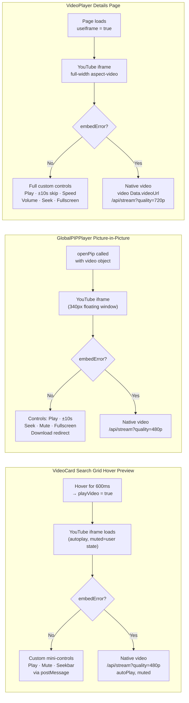

> **In plain words:** There are three places video plays in the app: (1) the hover preview on search result cards, (2) the floating Picture-in-Picture mini-player, and (3) the full-size player on the video details page. All three follow the same rule YouTube embed first, server stream as backup. Each has a slightly different fallback timeout to balance speed against reliability.

---

#### 5.2.3 IFrame API Control Flow (Primary Mode)

When the YouTube iframe is active, all player controls go through the **YouTube IFrame PostMessage API** no direct DOM manipulation:

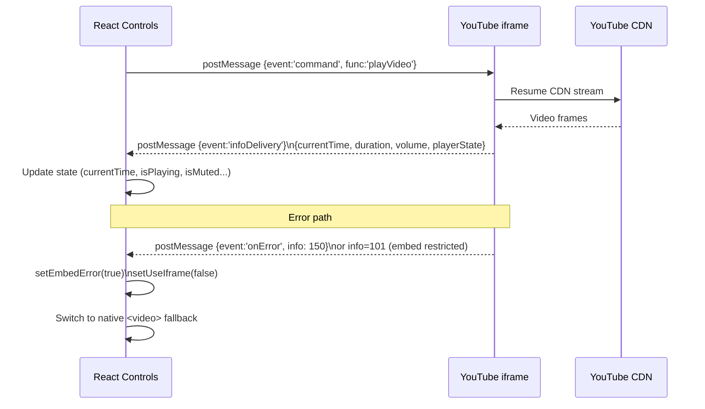

> **In plain words:** When the YouTube player is active, your custom Play/Pause/Seek controls send invisible messages to the YouTube frame (like a remote control over browser messaging). YouTube replies with the current time and player state, and the app's buttons update to match. If YouTube signals an error at any point (blocked video), the app catches it and automatically switches to the backend stream.

---

#### 5.2.4 Fallback Badge & UX

When the backend stream fallback activates, a subtle pill badge appears on the player to inform the user:

| Badge | When shown | Context |
|---|---|---|
| `Stream Fallback` | `embedError = true` | VideoPlayer (details page) |
| `Fallback` | `embedError = true` | VideoCard hover & PIP player |

The badge is non-intrusive a small `bg-black/60 backdrop-blur` pill in the top-left corner so playback is uninterrupted.

---

#### 5.2.5 Quality by Context

| Surface | Iframe Resolution | Fallback Resolution | Rationale |
|---|---|---|---|
| **VideoCard Hover** | YouTube adaptive (auto) | `480p` | Small card, low bandwidth needed |
| **PIP Player** | YouTube adaptive (auto) | `480p` | Floating window, same rationale |
| **VideoPlayer** | YouTube adaptive (auto) | `720p` | Full-size player, higher quality expected |

---

#### 5.2.6 State Reset on Navigation

- **VideoCard**: When the user moves their cursor away (`onMouseLeave`), both `playVideo`, `videoReady`, and `nativeFallback` reset to `false`. Next hover starts fresh.
- **PIP Player**: When `closePip()` is called, `AnimatePresence` unmounts the iframe cleanly.
- **VideoPlayer**: `useIframe` and `embedError` are component-scoped reset automatically when navigating to a new video details page.

---

### 5.3 Format Fetch, Preset Display & Download System

This section documents exactly how formats become visible in the UI after a video is loaded, how each download surface works, and how a user's selection travels from click to a file on disk.

---

#### 5.3.1 Phase 1 Video Fetch & Format Collection (`GET /api/video`)

When a user navigates to the Video Details page, `index.jsx` immediately calls `YTDeluxeAPI.getVideoDetails(url)`. The backend endpoint `GET /api/video` runs `yt-dlp` with `skip_download: True` to extract the full stream list without downloading anything.

**Backend processing pipeline (`main.py: get_video_details`):**

```
yt-dlp extracts full info dict
          ↓
Loop through all raw formats:
  ├── Audio-only (vcodec == 'none'):
  │     Skip mhtml/vtt and 0-bitrate
  │     Append every valid stream to audio_formats[]
  └── Video streams (has height + vcodec):
        Collect ALL into all_video_formats_raw[]
        Keep BEST per height (by tbr/filesize) in seen_heights{}
          ↓
Deduplicate audio sort by ABR desc,
keep 1 representative per codec family (opus / m4a / other), max 3
          ↓
Build `formats` list (Recommended 1 best video per height + up to 3 audio)
Build `all_formats` list (Every stream all video heights × codecs + audio)
```

**Two distinct format lists returned:**

| Field | Purpose | Size |
|-------|---------|------|
| `formats` | Recommended list shown in Quick Download & Quality Grid | 1 per height + max 3 audio |
| `all_formats` | Raw stream list shown in "Show All Advanced Formats" | Every unique format_id |

**Key fields on each format entry:**

| Field | Video | Audio | Description |
|-------|-------|-------|-------------|
| `format_id` | Yes | Yes | yt-dlp's unique stream identifier |
| `quality` | `1080p` / `4K` | `High Quality` / `Medium Quality` | Human label |
| `ext` | `mp4` / `webm` | `webm` / `m4a` | Actual container extension |
| `native_ext` | - | `opus` / `m4a` | Real extension (never `mp3`) |
| `codec_family` | `avc1` / `vp9` / `av01` | - | For badge rendering |
| `codec_display` | - | `Opus` / `AAC` | Human-readable codec name |
| `tbr` / `abr` | Total bitrate | Audio bitrate | For size estimation |
| `filesize` | Yes | Yes | Approximate bytes |
| `type` | `video` | `audio` | For filtering in UI |

---

#### 5.3.2 Phase 2 Data Flow into the Page (`index.jsx`)

After the API responds, `index.jsx` maps the response into `videoData` state:

```js
videoInfo = {
  formats: response.video.formats,          // Recommended list → DownloadTabs
  all_formats: response.video.all_formats,  // Full stream list → Advanced Grid
  max_quality: bestQuality,                 // For Quick Actions badge
  ...
};
setVideoData(videoInfo);
```

`videoData` is passed as a prop to both `<DownloadTabs>` and `<VideoTrimmer>`. Any change (tab switch, quality click, advanced selection) calls `onSelect(config)` → `handleSelectConfig(config)` → `setSelectedConfig(config)` in the parent. This `selectedConfig` is the **single source of truth** for the current user selection.

---

#### 5.3.3 Quick Actions (Sidebar `index.jsx`)

The **Quick Actions** panel lives in the sidebar of `index.jsx`. It renders three hardcoded one-click buttons that bypass `DownloadTabs` entirely and call `handleDownload()` directly.

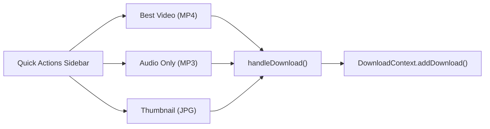

> **In plain words:** Clicking "Show All Advanced Formats" opens a full list of every stream YouTube has for this video broken into Video Streams and Audio Streams sections. Each row shows the exact codec, resolution, bitrate, file size, and a unique stream ID. Clicking any row locks that precise stream for download. The backend will download exactly that stream no guessing, no auto-selection.

| Button | Payload sent |
|--------|-------------|
| **Best Video** | `{ type:'video', quality: max_quality, format:'mp4' }` no `format_id`, backend auto-selects |
| **Audio Only** | `{ type:'audio', quality:'High Quality', format:'mp3', convert_to_mp3:true }` |
| **Thumbnail** | `{ type:'thumbnail', quality:'Max Resolution', format:'jpg' }` |

> These buttons ignore any selection made in `DownloadTabs`. They are intentionally simple "one-click" shortcuts.

---

#### 5.3.4 Quick Download Section (`DownloadTabs.jsx` Preset Cards)

The **Quick Download** section renders 3 preset cards built from `getPresetButtons()`:

```js
// Always picks: first (Best), middle, last (Lowest)
const presets = [opts[0], opts[mid], opts[len-1]];
```

**Source of options by tab:**

| Tab | Source | Computed by |
|-----|--------|-------------|
| Video | `videoQualities` filtered from `videoData.formats` where `type === 'video'`, sorted height desc | `useMemo` |
| Audio | `audioQualities` filtered from `videoData.formats` where `type === 'audio'`, sorted by `quality_index` | `useMemo` |
| Thumbnail | `thumbnailOptions` static array of 3 fixed options | Constant |

Each preset card displays:

- Quality label (e.g., `4K`, `High Quality`)
- Format chip (e.g., `.webm`, `.m4a`)
- Approximate file size
- Codec badge with hover tooltip (`bestFor` string)
- Bitrate (audio only)

Clicking a preset card calls `handlePresetDownload(option)`:

```js
onDownload({
  type: option.type || activeTab,
  quality: option.quality,
  format: isAudio ? (option.native_ext || option.ext) : option.ext,
  format_id: isAudio ? null : option.format_id,
  audio_format_id: isAudio ? option.format_id : null,
  container: !isAudio ? selectedContainer : null,
  convert_to_mp3: false,
  filename: customFilename,
});
```

> If `advancedSelectedId` is set (user previously picked from advanced grid), it overrides the preset and the exact advanced stream is downloaded instead.

---

#### 5.3.5 Advanced Options Section (`DownloadTabs.jsx`)

The **Advanced Options** section (`id="advanced-options"`) is always visible below Quick Download. It contains:

1. **Type tab bar** duplicate Video / Audio / Thumbnail tabs (same `activeTab` state, sliding pill animation)
2. **Quality Grid** full list of recommended formats (not just 3 presets)
3. **HelpCircle Guide tooltips** Video Guide / Audio Guide
4. **MP3 Card** dedicated card always at the end of audio tab
5. **Show All Advanced Formats** collapsible dropdown grid
6. **Container Format dropdown** video tab only
7. **Custom Filename** input with live extension chip/dropdown
8. **Download Button** triggers `handleCustomDownload()`

**Quality Grid (`Change M` in code):**

Renders every entry from `activeOptions` (all `videoQualities` or `audioQualities`, not just 3). Each card:

- Highlights when selected with `ring-[1.5px] ring-{color}` + spring-animated gradient glow
- Shows: quality label, format chip, size, resolution, fps, bitrate, codec badge
- On click: sets `selectedQuality`, clears `advancedSelectedId`, calls `onSelect()`

**MP3 Dedicated Card (Audio Tab only):**

A visually distinct amber/gold card appended after all native audio cards. Uses the sentinel value `MP3_SENTINEL = 'mp3'` as `selectedQuality`.

```js
// On click:
setSelectedQuality(MP3_SENTINEL);  // 'mp3'
onSelect({ type:'audio', format:'mp3', convert_to_mp3: true, ... });
```

When selected, all download functions check `isMp3Selected = (selectedQuality === 'mp3')` and route to the MP3 transcode path (`convert_to_mp3: true`).

---

#### 5.3.6 Show All Advanced Formats Grid

The **"Show All Advanced Formats"** toggle uses a `CustomDropdown` component. Clicking the toggle button (`showAllFormats` state) expands a scrollable list sourced from `videoData.all_formats` (every raw yt-dlp stream, not just the recommended ones).

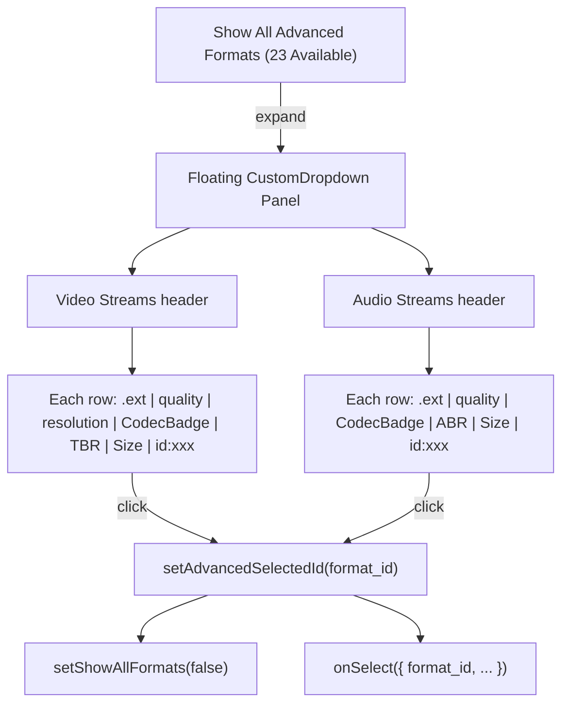

> **In plain words:** When you click Download, everything you picked (quality, format, filename, trim range) is packaged and sent to the server. The server figures out the best way to fetch your file, downloads it from YouTube using the appropriate path (exact stream, audio, or quality-label), runs FFmpeg to merge or trim if needed, identifies the output file, then delivers it to you either streaming it to your browser or saving it directly to your hard drive.

**When `advancedSelectedId` is set:**

- The dropdown trigger button shows the selected stream's info (ext, quality, resolution, codec badge, size, id)
- An amber/blue indicator bar shows: `Custom format selected (id: 303) ✕`
- All download paths (`handlePresetDownload`, `handleCustomDownload`) detect this and override everything with the exact advanced stream

**Clearing the selection:**

- Clicking the `✕` on the indicator bar calls `setAdvancedSelectedId(null)`
- Clicking a quality grid card also clears `advancedSelectedId`

---

#### 5.3.7 Container Format Dropdown (Video Tab Only)

The **Container Format** dropdown (video tab only) controls `selectedContainer` state (default: `'auto'`).

| Option | Value | Effect |
|--------|-------|--------|
| Auto Native Stream (Recommended!) | `auto` | Backend skips FFmpeg re-mux; stream saved in its native container |
| MP4 Universal | `mp4` | Forces MP4 container via `merge_output_format = 'mp4'` |
| MKV Lossless merge | `mkv` | Forces MKV container |
| WebM Web optimized | `webm` | Forces WebM container |
| MOV Apple compatible | `mov` | Forces MOV container |

**Container Compatibility Warning:** When `selectedContainer === 'mp4'` and the selected stream uses VP9 or AV1, an animated amber warning banner appears with a "Switch to MKV instead" action link.

---

#### 5.3.8 Download Data Flow Full End-to-End

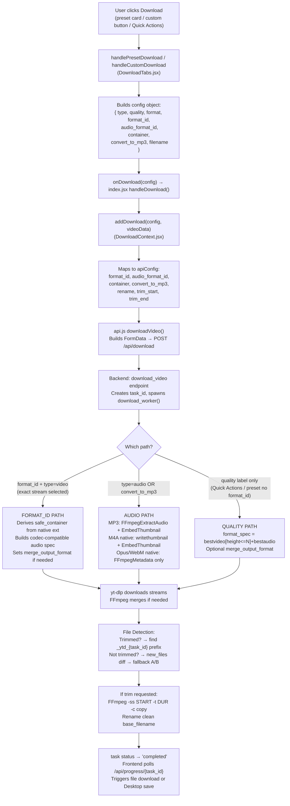

> **In plain words:** You drag the timeline handles to pick a start and end point. When you hit Download, the app first downloads the entire video (YouTube doesn't allow mid-video downloads). Then FFmpeg cuts exactly the segment you chose trying a fast no-quality-loss cut first, falling back to a re-encode only if necessary. The final file is saved with a clean original title, never with ugly temp-file prefixes.

**FormData fields sent to backend:**

| Field | Type | Description |
|-------|------|-------------|
| `url` | string | YouTube video URL |
| `quality` | string | e.g., `1080p`, `High Quality` |
| `format` | string | e.g., `mp4`, `webm`, `m4a`, `opus`, `mp3` |
| `format_id` | string | Exact yt-dlp stream ID (video) or null |
| `audio_format_id` | string | Exact yt-dlp stream ID (audio) or null |
| `container` | string | `auto`, `mp4`, `mkv`, `webm`, `mov` or null |
| `convert_to_mp3` | bool | `true` = transcode to MP3 |
| `rename` | string | Custom filename (no extension) |
| `trim_start` | float | Trim start in seconds (optional) |
| `trim_end` | float | Trim end in seconds (optional) |
| `type` | string | `video`, `audio`, or `thumbnail` |
| `channel` | string | Channel name (for history) |
| `thumbnail` | string | Thumbnail URL (for history) |

---

#### 5.3.9 Backend Download Worker Three Paths

**Path 1: format_id Video (Exact Stream)**

- Triggered when `format_id` is set and `type != 'audio'`
- Looks up the stream in `info['formats']` to get its native `ext`
- If `container == 'auto'` → derives `safe_container` from stream's native `ext` (VP9 stays `.webm`, H264 stays `.mp4`)
- Audio spec is codec-compatible: WebM container → Opus audio; MP4/MKV → M4A audio
- Only sets `merge_output_format` when `safe_container` is explicitly known

**Path 2: Audio Download**

- Triggered when `type == 'audio'` or `convert_to_mp3 == True`
- **MP3 path:** `FFmpegExtractAudio` + `EmbedThumbnail` + `FFmpegMetadata` (re-encodes to 192kbps MP3, embedded album art)
- **M4A native path:** `writethumbnail: True` + `EmbedThumbnail` + `FFmpegMetadata` (thumbnail embeds natively)
- **Opus/WebM native path:** `FFmpegMetadata` only (WebM container does not support embedded thumbnails)
- Format spec is built per-format: `bestaudio[ext=m4a]/...` for M4A, `bestaudio[ext=webm][acodec=opus]/...` for Opus

**Path 3: Quality-Label Video (No format_id)**

- Triggered by Quick Actions or preset cards without explicit `format_id`
- Uses height-constrained format spec: `bestvideo[height<=N][ext=mp4]+bestaudio[ext=m4a]/bestvideo[height<=N]+bestaudio/best`
- Applies `merge_output_format` only when an explicit container is selected (not `auto`)

---

#### 5.3.10 Session-Safe File Detection

After `yt-dlp.download()` completes, the backend must locate the downloaded file:

```
Trimmed request?
  YES → find files with _ytd_{task_id[:12]} in name (100% unique per task)
  NO  →
    PRIMARY:   new_files = current_dir_listing - pre_download_snapshot
               → match by title prefix → most likely candidate
    FALLBACK A: files modified in last 90s matching title prefix (covers in-place overwrite)
    FALLBACK B: most recently modified file in last 60s (last resort)
```

> **Why this matters:** Previously, the backend used a simple `startswith(title)` match. If you downloaded the same video twice in the same session (different quality/format), the old file would be returned instead of the newly downloaded one. The snapshot-diff method prevents this entirely.

**Trimmed downloads use task_id-prefixed `outtmpl`:**

```python
# Inserted before download:
ydl_opts['outtmpl'] = '.../{base_filename}_ytd_{task_id[:12]}.%(ext)s'
# After trim completes:
os.rename(trimmed_file, clean_base_filename)  # Clean name for user
```

---

### 5.4 Precision Trimming Architecture

*How the end-to-end trimming pipeline works from UI range selection to the final trimmed file on disk.*

#### 5.4.1 Trimming Flow Overview

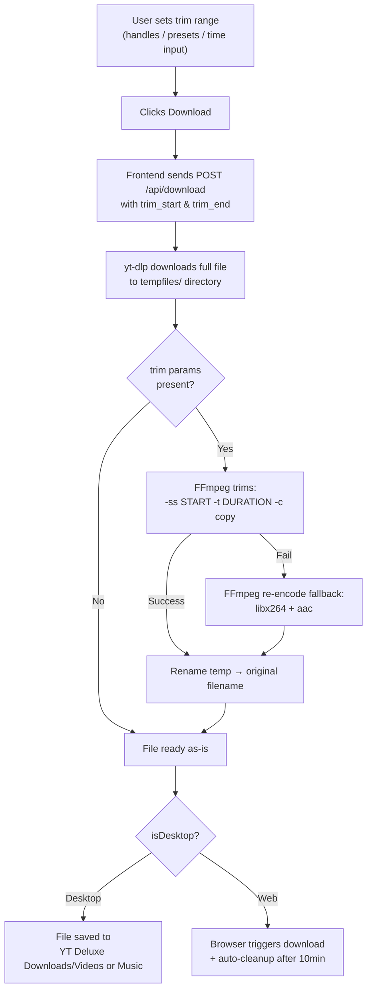

> **In plain words:** On the desktop app, your trimmed file is saved permanently to your YT Deluxe folder on your hard drive and you can open it in Explorer with one click. On the web version, the server processes and trims the file, streams it to your browser's Downloads folder, then automatically deletes the server copy after 10 minutes to save disk space.

#### 5.4.2 FFmpeg Trim Pipeline (Backend)

The trimming engine in `main.py` uses a **two-pass strategy** for maximum compatibility:

**Pass 1 Stream Copy (Fast, ~0.5s):**

```bash
ffmpeg -y -ss 30 -i input.mp4 -t 90 -c copy -avoid_negative_ts make_zero _tmp_trim_abc123.mp4
```

- `-ss` before `-i` = fast input-side seeking (no full decode)
- `-c copy` = no re-encoding, preserves original quality
- `-avoid_negative_ts make_zero` = fixes timestamp discontinuities

**Pass 2 Re-encode Fallback (Slower, always works):**

```bash
ffmpeg -y -ss 30 -i input.mp4 -t 90 -c:v libx264 -preset fast -c:a aac _tmp_trim_abc123.mp4
```

- Only triggered if Pass 1 fails (certain codecs don't support stream copy)
- Uses `libx264` (video) + `aac` (audio) for broad compatibility

**Clean Rename Strategy:**

```python
# Temp file → Original filename (no ugly prefixes)
temp_trimmed = f"_tmp_trim_{uuid.uuid4().hex[:8]}{file_ext}"
# After FFmpeg completes:
os.remove(filepath)              # delete original
os.rename(temp_trimmed, filepath) # rename temp → original name
```

> **Result:** User always gets the clean original title (e.g., `MONTAGEM ALQUIMIA (SLOWED).mp4`), never `trimmed_36a5caca_...`.

#### 5.4.3 Trimming Desktop vs Web Storage

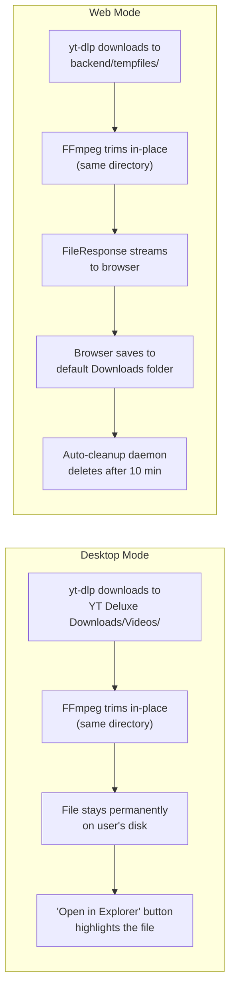

> **In plain words:** Before committing to a download, you can hit Preview and the app plays exactly the segment you trimmed. For most videos, your browser simply jumps to the start point and plays until the end point. For protected or DASH-only videos where direct seeking doesn't work, the server quickly generates a short clip and streams just that portion back to you.

| Aspect | Desktop | Web |
|--------|---------|-----|
| **Download location** | `~/Downloads/YT Deluxe Downloads/Videos/` (or Music/) | `backend/tempfiles/` → browser Downloads |
| **File persistence** | Permanent stays on user's disk | Ephemeral auto-deleted after 10 minutes |
| **Trim execution** | Same as Web (server-side FFmpeg) | Server-side FFmpeg |
| **History storage** | `~/.yt-deluxe/download_history.json` (JSON file) | `localStorage` (browser) |
| **File access** | "Open in Explorer" button via `/api/desktop/open-file` | Standard browser download |

#### 5.4.4 Preview Before Download

Users can preview the trimmed range before committing to a download:

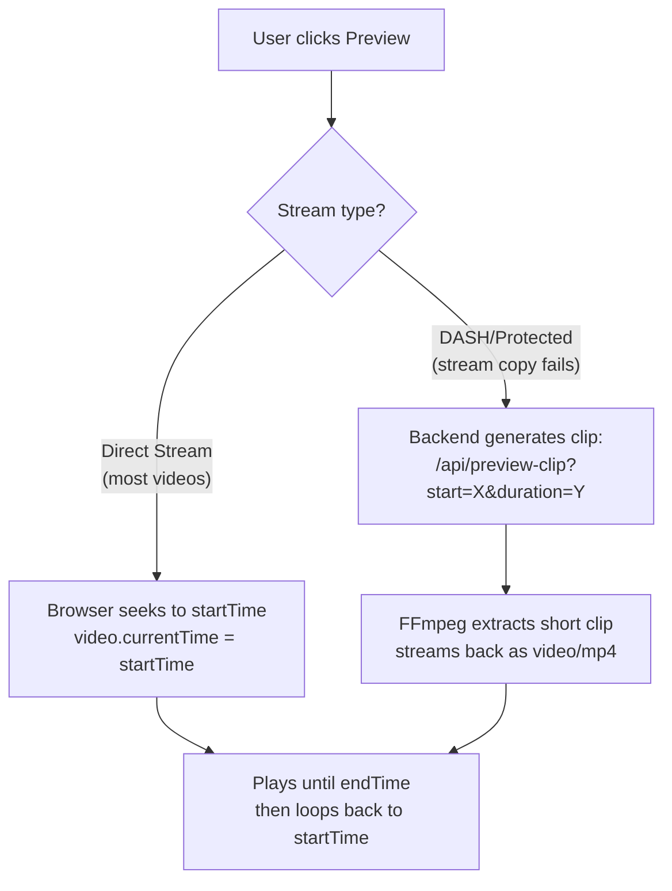

> **In plain words:** All download settings which tab you're on, what quality, which format live in one central "brain" object called `selectedConfig` in the parent page. Both the DownloadTabs panel and the VideoTrimmer read from and write back to this same object. This means if you switch from Video to Audio in DownloadTabs, the Trimmer automatically switches too. There is no way for the two panels to get out of sync.

**Smart Resume:** Pausing and resuming continues from the paused position it only jumps to `startTime` if the playhead is outside the trim range.

#### 5.4.5 Audio Trimming & Embedded Thumbnails

When downloading audio (MP3), the backend automatically:

1. Downloads the best audio stream via yt-dlp
2. Embeds the YouTube video's thumbnail as album art (`EmbedThumbnail` postprocessor)
3. Trims with FFmpeg if a range was specified
4. Final output: `.mp3` file with embedded cover art

---

### 5.5 Trimmer Component Architecture

*How the frontend VideoTrimmer component manages state, syncs with DownloadTabs, and communicates with the backend.*

#### 5.5.1 Component Hierarchy & Props

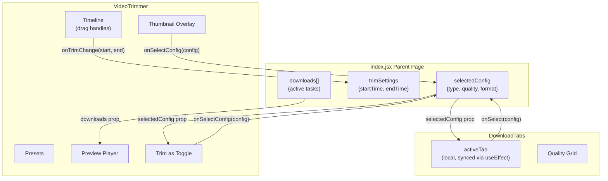

> **In plain words:** The trimmer's mini-player has exactly three faces it can show at once: a loading spinner while the stream warms up, a circular download progress ring while your clip is being processed, and the normal play/pause controls when it's ready to play. Only one of these three states can be visible at a time they never overlap.

#### 5.5.2 Three-Way Toggle Sync

Three separate UI elements all reflect the same download type (Video/Audio/Thumbnail):

| Toggle Location | Purpose | How it Syncs |
|----------------|---------|--------------|
| **DownloadTabs** (main tabs) | Primary type selector | `useEffect` watches `selectedConfig.type` → updates local `activeTab` |
| **"Trim as" toggle** (inside VideoTrimmer) | Quick switch within trimmer | Calls `onSelectConfig()` → updates parent → propagates everywhere |
| **Warning overlay buttons** (glassmorphism card) | Exit thumbnail mode | Calls `onSelectConfig()` → dismisses overlay + updates tabs |

**Single Source of Truth:** `selectedConfig` in `index.jsx` is the only state that matters. All three toggles derive from it and write back to it.

#### 5.5.3 Player Visual States

The preview player has 3 mutually exclusive visual states:

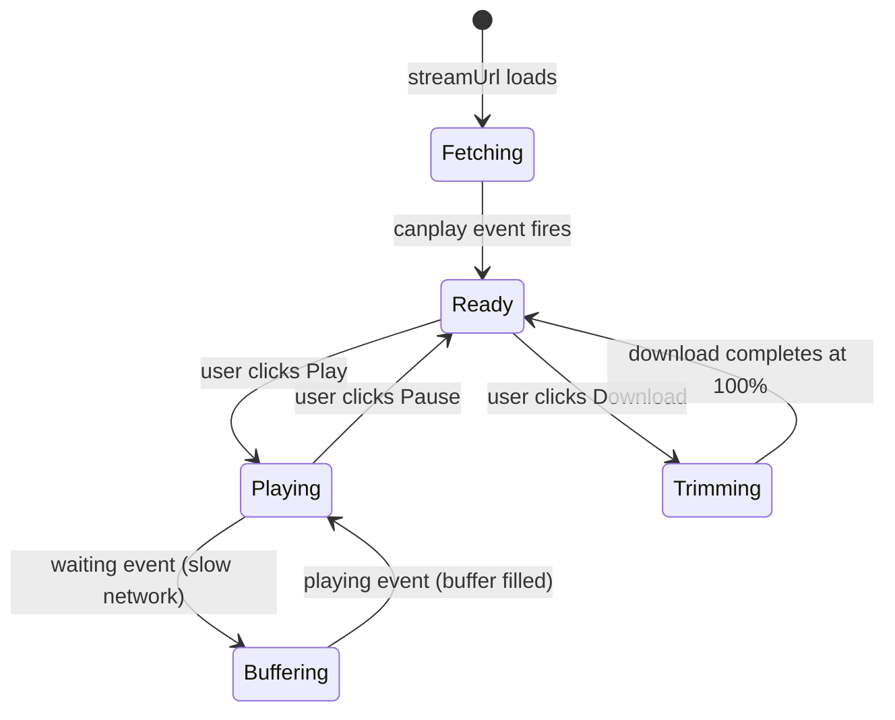

> **In plain words:** The trimmer does not fetch any video from the server until you actually interact with the trim controls. Until then, it shows a static thumbnail as a placeholder. The instant you drag a handle, type a time, click a preset chip, or hit Play it starts loading the stream. This means no wasted server calls if you're just browsing, reading the video description, or haven't decided to trim yet.

| State | Trigger | Visual Indicator |
|-------|---------|-----------------|
| **Fetching / Buffering** | `isMediaLoading \|\| isBuffering \|\| clipLoading` | Triple-layer spinner (ping + spin + pulse icon) |
| **Trimming / Processing** | `activeDownload` found in `downloads[]` | Circular SVG progress ring + percentage + bottom glow bar |
| **Ready / Playing** | None of above | Hover-aware Play/Pause button with glassmorphism overlay |

#### 5.5.4 Estimated File Size Calculation

The trimmer estimates output file size based on quality bitrate:

| Quality | Bitrate (kbps) | Example: 2 min trim |
|---------|---------------|-------------------|
| 8K | 80,000 | ~1.2 GB |
| 4K | 40,000 | ~600 MB |
| 1080p | 8,000 | ~120 MB |
| 720p | 4,000 | ~60 MB |
| 480p | 2,000 | ~30 MB |
| Audio (MP3) | 192 | ~2.9 MB |

**Formula:** `estimatedBytes = (bitrate × 1000 / 8) × trimmedDuration`

---

#### 5.5.5 Lazy Stream Loading `previewEnabled` Gate

*How the VideoTrimmer avoids unnecessary backend API calls until the user actually engages with the trim controls.*

`previewEnabled` is a boolean gate that controls whether the `<video>` element receives a `src` at all:

```jsx
// VideoTrimmer.jsx
const [previewEnabled, setPreviewEnabled] = useState(false); // false = no stream fetch

// Only feed src to the video element when the gate is open
const videoSrc = previewEnabled ? streamUrl : null;

<video ref={videoRef} src={videoSrc} ... />
```

The `<video>` tag is always rendered (so the DOM ref stays stable), but `src` is `null` until the user explicitly interacts meaning **zero HTTP requests to the backend** until the user is ready.

##### When `previewEnabled` Becomes `true`

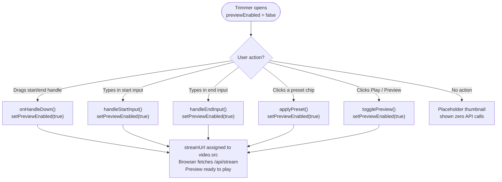

##### State Comparison

| State | `previewEnabled` | `video.src` | Backend request |
|---|---|---|---|
| Trimmer just expanded | `false` | `null` | None |
| User drags a handle | `true` | `/api/stream?quality=720p` | Fetched |
| User types a time | `true` | `/api/stream?quality=720p` | Fetched |
| User clicks a preset | `true` | `/api/stream?quality=720p` | Fetched |
| User clicks Play | `true` | `/api/stream?quality=720p` | Fetched |

##### Placeholder Before Unlock

While `previewEnabled = false`, the player area shows a **static thumbnail** of the video with an overlay prompt ("Drag handles or select a preset to enable preview"), making it immediately clear to the user how to activate the preview without any spinner or false loading state.

Once `previewEnabled` becomes `true`, the placeholder fades out and the actual stream seamlessly takes over.

##### Stream Quality in Preview

| Mode | Stream URL | Quality | Rationale |
|---|---|---|---|
| **Video preview** | `/api/stream?quality=720p` | 720p | Sufficient to judge trim points; low cost |
| **Audio preview** | `/api/stream?quality=audio` | Best audio | No video needed for audio trim |
| **Clip fallback** | `/api/preview-clip?start=X&clip_duration=Y` | Server-cut | When direct stream seek fails |

---

### 5.6 Hosted Web Application Architecture

*How the platform operates when hosted on cloud servers.*

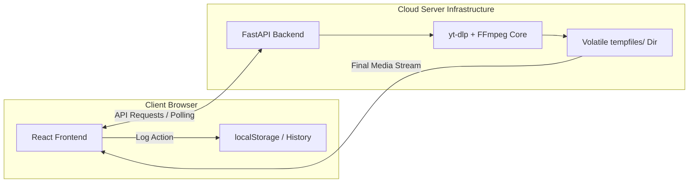

> **In plain words:** When you install the Windows app, double-clicking the EXE opens a mini Chrome-like browser window (powered by PyWebView) alongside a hidden background server both running on your own PC. No cloud involved. The server saves files directly to your hard drive, your download history is a plain JSON file in your home folder, and everything runs locally at full speed without any internet dependency beyond fetching from YouTube itself.

**Web Deployment Workflow:**

- **Client Layer**: The React frontend is served as static assets. It uses `localStorage` for local persistence of history and settings, ensuring that user data stays private and localized to their browser.
- **API Layer**: The FastAPI backend handles heavy lifting. It must be hosted on a service that supports persistent or scale-to-zero compute with `FFmpeg` installed.
- **Volatile Storage**: The `tempfiles/` directory acts as a high-speed workspace for stream merging. Files here are ephemeral and auto-deleted after 10 minutes to maintain server health.
- **Streaming**: The final file is streamed back to the user via an HTTP `FileResponse`, allowing the browser to handle the bitstream as a standard file download.

---

### 5.7 Native Windows Desktop Architecture

*How the platform operates when installed locally as an .exe via the Launcher.*

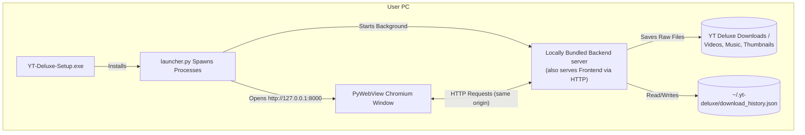

> **In plain words:** When you install YT-Deluxe as a Windows app, everything runs on your own computer. The installer sets up a mini server quietly in the background, opens a browser-like window pointing to it, and your downloads go straight to your Downloads folder. No cloud, no internet dependency for the app itself only for fetching YouTube content.

**Desktop Integration Workflow:**

- **HTTP-Based Frontend Serving**: In packaged mode, the backend statically serves the React build at `http://127.0.0.1:8000`. The PyWebView wrapper loads this URL instead of a `file:///` path. This provides a valid HTTP origin, which is **critical** for YouTube iframe embeds (fixes Error 153: Video player configuration) and enables standard `BrowserRouter` routing.
- **Dynamic Path Resolution (YTDELUXE_FRONTEND_DIR)**: `launcher.py` safely evaluates the bundled frontend location at runtime and proxies it to the isolated `--onefile` backend via standard environment variables (`os.environ.get('YTDELUXE_FRONTEND_DIR')`). This fundamentally replaces hardcoded or `sys._MEIPASS` dependency checking, enabling modular pyinstaller build strategies.
- **Port Conflict Awareness**: If a developer launches the `YT-Deluxe.exe` application while their local Uvicorn dev server is active on `port 8000`, the bundled backend silently crashes (`winerror 10048 address already in use`), and the UI inadvertently communicates with the uncompiled dev server (resulting in a blank `{"detail":"Not Found"}` SPA fallback). Users must close dev shells before executing native wrapper tests.
- **Desktop Detection**: The frontend detects desktop mode natively via the `window.pywebview` object (injected by the compiled GUI framework), disregarding archaic `file:` protocol checks. This ensures reliable native download triggers.
- **Deep OS Access**:
  - **Native Downloads**: The backend has direct permission to write to the user's `Downloads/YT Deluxe Downloads` folder.
  - **Persistent History**: Instead of browser storage, the app writes to a standard JSON database located in the user's home directory (`~/.yt-deluxe/`).
- **One-Click Launch**: The `launcher.py` entry point ensures that both the server and the UI window open and close together gracefully.

---

## 6. Installation and Setup (Local Development)

Follow this setup to run both servers (React + FastAPI) locally on any development machine.

### 6.1 Frontend Dependencies

| Package | Version | Purpose |
|---|---|---|
| react | `^18.2.0` | UI library |
| react-router-dom | `6.0.2` | Client-side routing |
| @reduxjs/toolkit | `^2.6.1` | State management |
| tailwindcss | `3.4.6` | Utility-first CSS |
| framer-motion | `^10.16.4` | UI animations |
| axios | `^1.8.4` | Backend API communication |

### 6.2 Backend Dependencies

| Package | Version | Purpose |
|---|---|---|
| fastapi | `0.133.0` | High-performance async API |
| uvicorn[standard] | `0.41.0` | ASGI server |
| yt-dlp | `>=2026.3.17` | YouTube video/audio extraction |
| ffmpeg | `>=16.04.2026` | Video merging and MP3 conversion |
| bgutil-pot-provider | `latest` | Automatic PO token generation |
| requests | `2.32.5` | HTTP requests & Streaming |
| python-multipart | `0.0.22` | Form-data parsing for FastAPI |
| aiofiles | `25.1.0` | Async file operations |

### 6.3 Desktop Dependencies

| Package | Version | Purpose |
|---|---|---|
| pywebview | `>=4.4.1` | Native OS window encapsulation (Chromium Edge) |
| pyinstaller | `>=6.4.0` | Bundling Python application to `.exe` |

### 6.4 Prerequisites

- **Node.js**: `v18 or LTS`
- **Python**: `3.10+ (Tested on 3.13)`
- **yt-dlp** `>=2026.3.17 (keep as soon as possible updated)` *for YouTube Downloads*

- **FFmpeg**: `>=16.04.2026 (keep as soon as possible updated)` *for Merging Videos*

### 6.5 Frontend Setup (Local)

Open your first terminal window:

```bash
cd frontend
npm install
npm run dev     # Starts Vite Server on http://localhost:5848
```

#### Frontend Files Structure

```text
├── frontend/          # React app (Vite + TailwindCSS)
│  ├── package.json      # NPM dependencies & scripts
│  ├── vite.config.mjs     # Vite build config
│  └── src/
│    ├── pages/       # Core UI (Search, Details, History, Settings)
│    ├── components/     # Reusable UI parts
│    └── utils/api.js    # Backend communication client
```

### 6.6 Backend Setup (Local)

Open a second terminal window:

```bash
cd backend
python -m venv .venv

# Activate the venv:
# Windows:
.venv\Scripts\activate
# macOS/Linux:
source .venv/bin/activate

pip install -r requirements.txt

# Make sure FFmpeg is installed and added to your System's Environment Variables PATH
# Install FFmpeg:
# Windows: Download from https://ffmpeg.org/download.html OR
# https://www.gyan.dev/ffmpeg/builds/
# macOS: brew install ffmpeg
# Ubuntu/Debian: sudo apt install ffmpeg

# Starts FastAPI Dev server on http://localhost:8000
uvicorn main:app --reload  # Dev mode

# Check the API documentation at /docs
http://localhost:8000/docs

# for production:
uvicorn main:app --host 0.0.0.0 --port 8000
```

### Backend Files Structure

```text
├── backend/          # FastAPI application
│  ├── main.py         # Routes, FFmpeg execution, Background Tasks
│  ├── requirements.txt    # Python module dependencies
│  └── tempfiles/       # Ephemeral processing directory
```

*By default, the frontend expects the backend at `localhost:8000`. Set `VITE_API_BASE_URL` in your `.env` if this differs.*

---

## 7. API Reference

| Endpoint                           | Method | Description                                      |
|------------------------------------|--------|--------------------------------------------------|
| `/api/search`                      | GET    | Search YouTube by keyword                        |
| `/api/video`                       | GET    | Get video details and available formats          |
| `/api/stream`                      | GET    | Stream video/audio content with range support    |
| `/api/preview-clip`                | GET    | Generate a short FFmpeg clip for trim preview    |
| `/api/download`                    | POST   | Download video/audio with quality & trim options |
| `/api/batch-download`              | POST   | Download multiple videos simultaneously          |
| `/api/progress/{id}`               | GET    | Get real-time download progress and ETA          |
| `/api/history`                     | GET    | List local download history                      |
| `/api/history/{id}`                | DELETE | Delete a single history tracking item            |
| `/api/history/delete`              | POST   | Batch delete multiple history tracking items     |
| `/api/desktop/open-file`           | POST   | Natively open Windows Explorer highlighting file |
| `/api/desktop/open-folder`         | POST   | Natively open Windows Explorer at folder         |
| `/api/system/storage`              | POST   | Get local disk usage statistics                  |
| `/api/feedback`                    | POST   | Submit user feedback via application forms       |

---

## 8. Usage Guide

### 8.1 Search and Discovery

- Enter keywords in the search bar to fetch top YouTube results including thumbnails, durations, and channel metadata.
- **REST API**: `GET /api/search?q=search_term`

### 8.2 Download & Trimming Management

- Configure your download with quality options (144p to 8K), format selection (MP4, WebM, MKV, M4A, Opus, MP3), and precision trimming.
- **Trimming Workflow:**
  1. Select your desired quality in the **Download Options** tab (Video/Audio)
  2. Use the **Video Trimmer** below to select a range drag the blue handles, type exact times (M:SS), or click quick presets (First 30s, Last 5m, etc.)
  3. Click **Preview** to verify your selection plays the correct segment
  4. Click **Download** the backend downloads the full file, then FFmpeg trims it to your exact range
- The trimmer shows estimated file size based on quality bitrate and selected duration
- Integrated automatic PO Token negotiation ensures your IP remains safe from 403 blocks.
- **REST API**: `POST /api/download` with optional `trim_start` and `trim_end` parameters (in seconds)

### 8.3 Batch Processing

- Paste multiple YouTube URLs into the Batch Manager to download entire playlists or series simultaneously.
- **REST API**: `POST /api/batch-download`

### 8.4 Real-time Performance Tracking

- Monitor download speed (MB/s), percentage completed, and estimated time remaining (ETA) via a circular or linear visual progress bar.
- **REST API**: `GET /api/progress/{task_id}`

### 8.5 History and Storage Management

- Access your download history to re-download files, delete single entries, or clear multiple items at once. You can also monitor your local disk usage statistics.
- **REST API**: `GET /api/history` (List all), `DELETE /api/history/{id}` (Remove single entry), `POST /api/history/delete` (Batch remove), and `POST /api/system/storage` (Check disk availability).

### 8.6 Native Desktop Integrations

- For users on the Windows Desktop App, file exploration is deeply integrated. You can click to open specific files or their parent folders seamlessly inside Windows Explorer.
- **REST API**: `POST /api/desktop/open-file` and `POST /api/desktop/open-folder`

### 8.7 User Feedback

- Submit bug reports or suggestions directly from the application UI.
- **REST API**: `POST /api/feedback`

---

### 8.8 API Usage Examples (CLI/cURL)

#### Search for Videos

```bash
curl "http://localhost:8000/api/search?q=python+tutorial"
```

#### Download Video

```bash
curl -X POST "http://localhost:8000/api/download" \
 -F "url=https://www.youtube.com/watch?v=VIDEO_ID" \
 -F "quality=720" \
 -F "format=mp4"
```

#### Download Trimmed Video (30s to 2:00)

```bash
curl -X POST "http://localhost:8000/api/download" \
 -F "url=https://www.youtube.com/watch?v=VIDEO_ID" \
 -F "quality=1080" \
 -F "format=mp4" \
 -F "trim_start=30" \
 -F "trim_end=120"
```

#### Download Progress

```bash
curl "http://localhost:8000/api/progress/{task_id}"
```

---

## 9. Building & Deploying the Web App

To host YT Deluxe publicly on the internet (Vercel, Render, Heroku):

### 9.1 Backend (Cloud Web Service)

- Deploy the `backend/` directory as a standard Python Web Service.
- **Critical Build Logic**: The server *must* install FFmpeg alongside Python.
  - Build Command: `pip install -r requirements.txt && apt-get update && apt-get install -y ffmpeg`
- **Start Command**: `uvicorn main:app --host 0.0.0.0 --port $PORT`
                        OR

- **Use `Dockerfile` in backend folder to build and deploy.**
`yt-deluxe\backend\Dockerfile`

### 9.2 Frontend (Static Hosted App)

- Deploy the `frontend/` directory to any static hosting provider.
- **Build Command**: `npm run build`
- **Environment Variable**: Ensure you add `VITE_API_BASE_URL` pointing to your automatically deployed Backend URL (e.g., `https://my-backend-domain.com`).

### 9.3 Connecting Frontend & Backend

- By default, the frontend expects the backend API at `http://localhost:8000`.
- CORS is enabled for local development.
- Adjust API endpoints in the frontend if your backend runs on a different host/port.

---

## 10. Building for Desktop (Windows .exe)

To bundle the entire project into a completely standalone Windows application, follow this exact sequential pipeline. Each step fundamentally depends on the compiled output of the previous step.

### 10.1 Environment Preparation (Crucial)

Before building, **both** backend and desktop dependencies must be installed into the **backend's isolated `.venv`**. This ensures PyInstaller bundles everything cohesively without `ModuleNotFoundError` crashes.

```powershell
cd backend
python -m venv .venv
.venv\Scripts\activate
pip install -r requirements.txt
pip install pyinstaller

# Critical: Install desktop dependencies into the SAME backend .venv
cd ..\desktop
..\backend\.venv\Scripts\pip.exe install -r requirements.txt
```

### 10.2 Build Static Frontend

```powershell
cd frontend
npm run build 
```

*(Packages React into optimized HTML/JS inside `frontend/build`. The desktop `build.spec` copies this folder into the final bundle).*

### 10.3 Bundle Backend via PyInstaller

```powershell
cd backend
.venv\Scripts\pyinstaller.exe main.spec --clean -y
```

*(Packages Python, FastAPI, and `ffmpeg.exe` into a headless `backend/dist/main.exe`).* **Note:** You must re-run this step anytime `main.py` is edited so changes are included in the bundle.

### 10.4 Build UI Launcher via PyInstaller

```powershell
cd desktop
# MUST use the backend's PyInstaller to guarantee pywebview dependency inclusion
..\backend\.venv\Scripts\pyinstaller.exe build.spec --clean -y
```

*(Creates the massive `desktop/dist/YT-Deluxe` application folder containing the PyWebView edge browser, the copied backend server, and the static frontend assets).*

### 10.5 Post-Build Testing (Port 8000 Conflict Awareness)

Before distributing your app, you should manually run the generated wrapper at `desktop/dist/YT-Deluxe/YT-Deluxe.exe`.

**CRITICAL WARNING:** You **MUST CLOSE** any running local development servers (`uvicorn main:app --reload`) before double-clicking the generated `.exe`.
If a dev server is active, it occupies `port 8000`. The bundled `.exe` will launch, silently crash in the background due to `winerror 10048 address already in use`, and the UI window will mistakenly hit your uncompiled Dev server resulting in a blank `{"detail":"Not Found"}` SPA response.

### 10.6 Create the Final Setup Installer (Inno Setup)

To generate the distribution `.exe` that users can install on any Windows machine:

1. **Install Compiler**: Download and install [Inno Setup 6 (Unicode)](https://jrsoftware.org/isinfo.php).
2. **Dependency Prep**: Download the **Microsoft Edge WebView2 Evergreen Bootstrapper** (`MicrosoftEdgeWebview2Setup.exe`) from Microsoft and place it inside the `desktop/installer/` directory.
3. **Compile via GUI**:
   - Open Inno Setup Compiler.
   - Open the file `desktop/installer/setup.iss`.
   - Click **Build > Compile** (or press `Ctrl+F9`).

4. **Compile via CLI / One-Shot Full Rebuild Command**:

   ```powershell
   # Automate the entire 4-step build from terminal root:
   cd "d:\MyProject Reserve\30-9-25_Experimental\yt-deluxe"
   
   cd frontend && npm run build && cd ..
   cd backend && .venv\Scripts\pyinstaller.exe main.spec --clean -y && cd ..
   cd desktop && ..\backend\.venv\Scripts\pyinstaller.exe build.spec --clean -y && cd ..
   & "C:\Program Files (x86)\Inno Setup 6\ISCC.exe" "desktop/installer/setup.iss"
   ```

**What `setup.iss` does (Deep-Dive):**

- **UAC Elevation**: Requests Administrator privileges to install into `C:\Program Files\YT Deluxe\`.
- **WebView2 Silent Fix**: Automatically checks the Windows Registry. If the runtime is missing, it triggers a silent installation of the bundled bootstrapper (`/silent /install`) before the app first launches, preventing `.NET/WinForms` dependency crashes.
- **Path Verification**: Bundles the `backend/dist/main` and `desktop/dist/YT-Deluxe` assets into a single compressed package (~84MB).
- **Permission Hardening**: Configures the app to redirect all write operations (temp files and history) to the user's `%TEMP%` and `%USERPROFILE%` directories, dodging `WinError 5: Access Denied` errors common in installed apps.
- **Standardized Deployment**: Creates Start Menu and Desktop shortcuts with the high-res app icon, and includes a clean uninstaller.

---

## 11. Contributing

1. Fork the repository
2. Create a feature branch
3. Make your changes
4. Test thoroughly
5. Submit a pull request

---

## 12. Legal Notice

This tool is for personal use only. Downloading copyrighted content may violate YouTube’s terms of service. Use responsibly and respect copyright laws.

---

## 13. License

This project is for educational purposes. Please respect YouTube’s terms of service and copyright laws.

---

## 14. Support & Maintenance

For issues and questions:

1. Check the API documentation at `/docs`
2. Review the error logs
3. Ensure FFmpeg is properly installed
4. Update yt-dlp to the latest version & documentations
5. Update PO token provider
6. Rotate Cookies file if needed.

---

**Built with as a Free & Open Source Project.**

👨‍💻 **Developer:** Utsav Parmar  
🔗 **LinkedIn:** [www.linkedin.com/in/utsavparmar-full-stack-dev](https://www.linkedin.com/in/utsavparmar-full-stack-dev)  
🐙 **GitHub:** [https://github.com/Utsavstack](https://github.com/Utsavstack)  

**Made With❤️UP7**

*Last Updated: April 2026*
