<h1 align="center">
  <br>
  
  <br>
  YT-Deluxe
  <br>
</h1>

<h4 align="center">
  Premium YouTube Media Downloader<br><br>
  A Free & Open Source, Feature-Rich YouTube Downloader &amp; Media Manager<br>
  with a Premium Liquid Glass UI for Web &amp; Desktop.
</h4>

<p align="center">
  <a href="#"></a>
  <a href="LICENSE"></a>
  <a href="#"></a>
  <a href="https://github.com/Utsavstack/YT-Deluxe/issues"></a>
  <a href="https://github.com/Utsavstack/YT-Deluxe/stargazers"></a>
</p>

<p align="center">
  <a href="#1-what-is-yt-deluxe">What is it?</a> &bull;
  <a href="#2-the-problem">Problem</a> &bull;
  <a href="#3-the-solution">Solution</a> &bull;
  <a href="#4-features">Features</a> &bull;
  <a href="#5-demo">Demo</a> &bull;
  <a href="#6-vision--roadmap">Vision</a> &bull;
  <a href="#7-quick-start">Quick Start</a> &bull;
  <a href="#8-contributing">Contributing</a> &bull;
  <a href="#9-donate">Donate</a> &bull;
  <a href="#10-about-the-developer">About</a> &bull;
  <a href="#11-credits--acknowledgments">Credits</a> &bull;
  <a href="#12-legal">Legal</a>
</p>

---

## 1. What is YT Deluxe?

**YT Deluxe** is a *free, open-source, full-stack media management application* that lets you **search, preview, and download** YouTube videos and audio - with a beautifully crafted **Liquid Glass UI** that feels premium.

It runs both as a **native Windows desktop app** (packaged `.exe`) and as a **hosted web application**, without any ads, trackers, or paywalls.

> [!TIP]
> Think of it as your personal YouTube client - clean, fast, and fully yours.

---

## 2. The Problem

Most YouTube downloaders on the internet are:

- Flooded with **intrusive ads and pop-ups**
- Unsafe - bundled with **malware or spyware**
- **Confusing interfaces** with too many unnecessary options
- **Limited formats** - usually just MP4, no quality control
- **Locked behind paywalls** for basic features like MP3 download

---

## 3. The Solution

**YT Deluxe** was built to fix all of that:

| Problem | YT Deluxe Solution |
|---|---|
| Ads & trackers | 100% ad-free, open-source |
| Malware risk | Self-hosted, fully auditable code |
| Confusing UI | Clean Liquid Glass interface, intuitive UX |
| Format limitations | 144p to 8K, MP4, WebM, MKV, MP3, M4A, Opus & more |
| Paywalls | Completely free, forever |

---

## 4. Features:

### 4.1 Search & Preview
- Search YouTube by keyword or paste a direct URL
- Hover over any result for a **live video preview**
- Picture-in-Picture (PIP) mini-player

### 4.2 Download
- **Quick Actions** - 1-click Best Video, Audio Only, or Thumbnail
- **Quality Grid** - choose from 144p up to 8K
- **Format Control** - MP4, WebM, MKV, MOV, M4A, Opus, MP3
- **Advanced Format Picker** - select the exact raw yt-dlp stream by ID
- **Container Selection** - Auto-native, MP4, MKV, WebM, MOV
- Embedded **album art** in MP3 and M4A audio downloads
- Real-time **progress bar** with speed, percentage & ETA

### 4.3 Precision Trimmer
- Drag timeline handles or type exact `M:SS` timestamps
- Quick preset chips: First 30s, Last 5m, custom range
- **Preview** your trim before downloading
- Zero re-encoding loss (FFmpeg stream copy)

### 4.4 Desktop App (Windows)
- Native `.exe` installer via Inno Setup
- Files saved directly to `~/YT Deluxe Downloads/`
- "Open File" & "Open in Explorer" one-click access
- Persistent download history in `~/.yt-deluxe/`

### 4.5 Web App
- Host your own instance on any cloud provider
- Browser-native download dialog
- History stored in `localStorage`
- Auto-cleanup of temp files after 10 minutes

### 4.6 Privacy & Security
- **PO Token** (Proof of Origin) support - bypasses YouTube bot detection
- All YouTube communication goes through your own backend server
- No data sent to any third party

### 4.7 Multilingual Support
- English, Hindi, German, and conversational **Hinglish**
- Persistent language preference across sessions

### 4.8 History & Management
- Full download history with re-download and delete options
- Batch delete support
- Disk storage usage monitor

---

## 5. Demo:

**Home / Search Page**
<p align="center">
  
  &nbsp;
  
</p>

---


**Video Player**
<p align="center">
  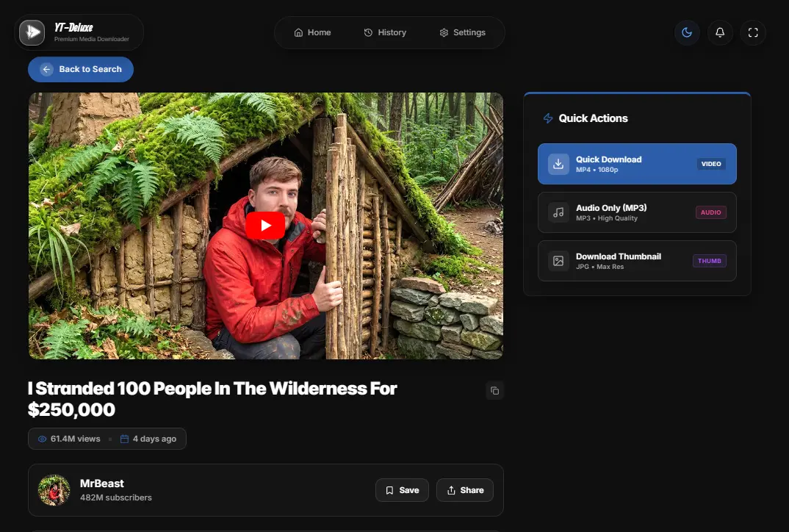
  &nbsp;
  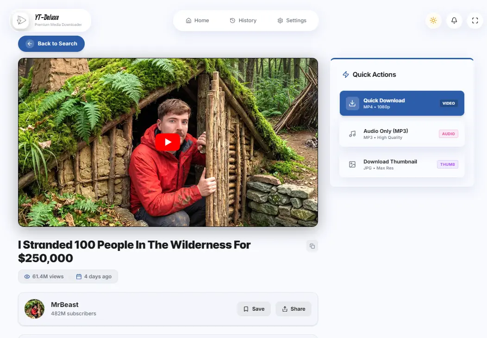
</p>

---

**Quick Download**
<p align="center">
  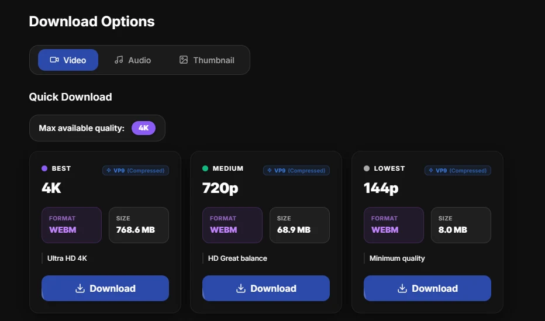
  &nbsp;
  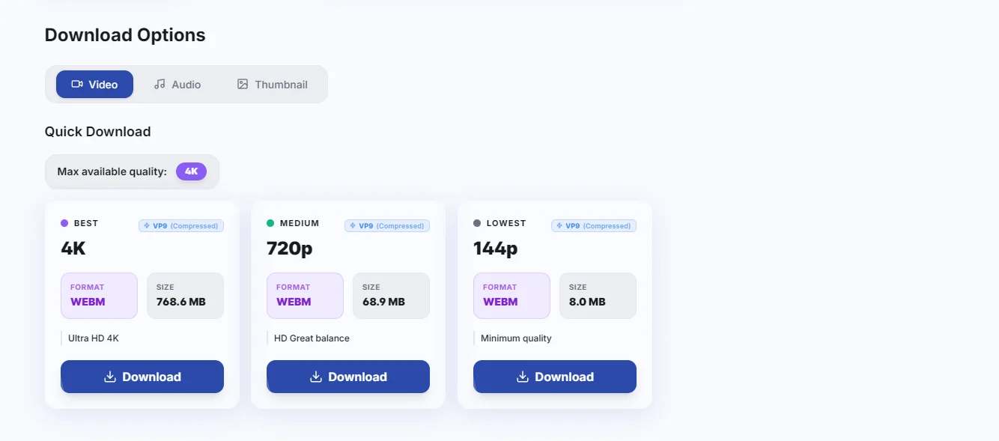
</p>

---

**Advanced Download Options**
<p align="center">
  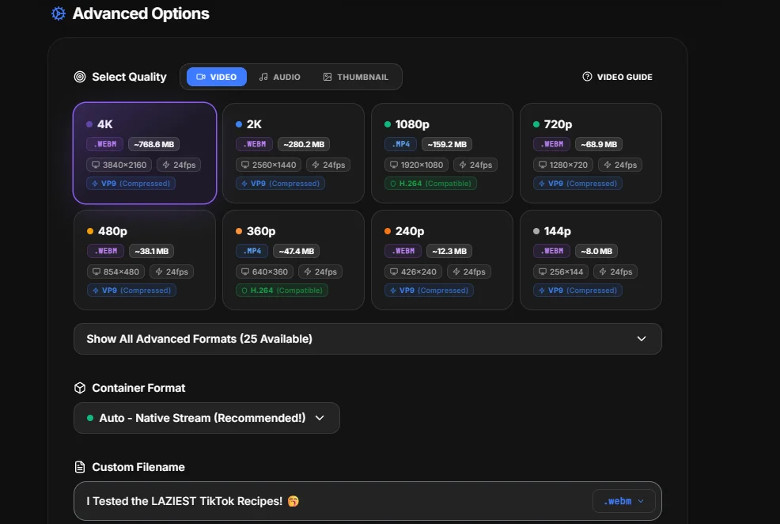
  &nbsp;
  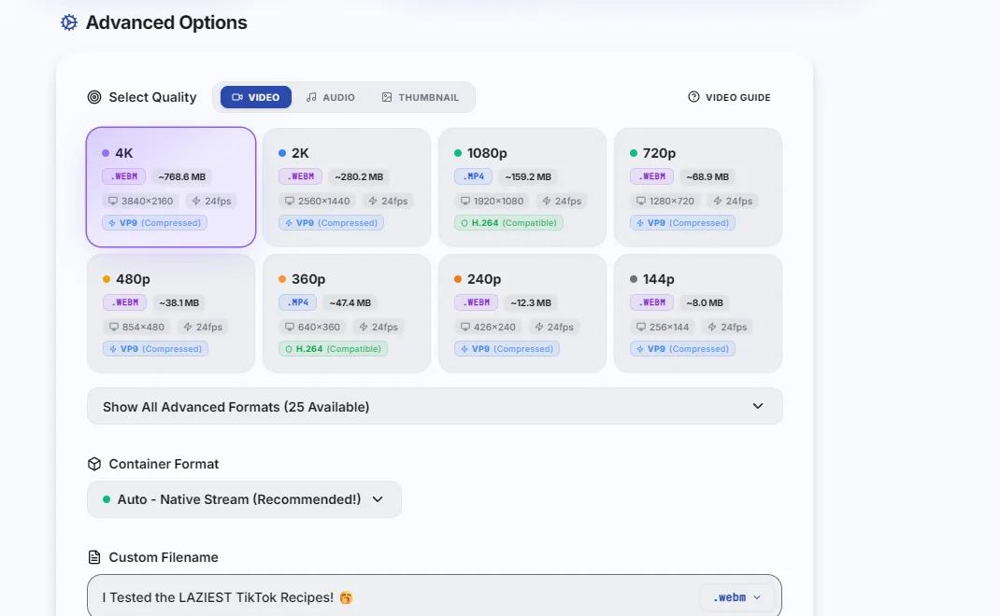
</p>

---

**Precision Trimmer**
<p align="center">
  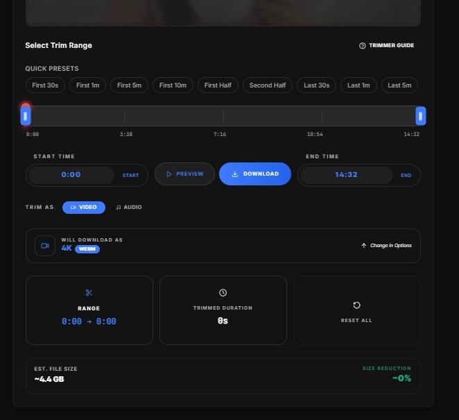
  &nbsp;
  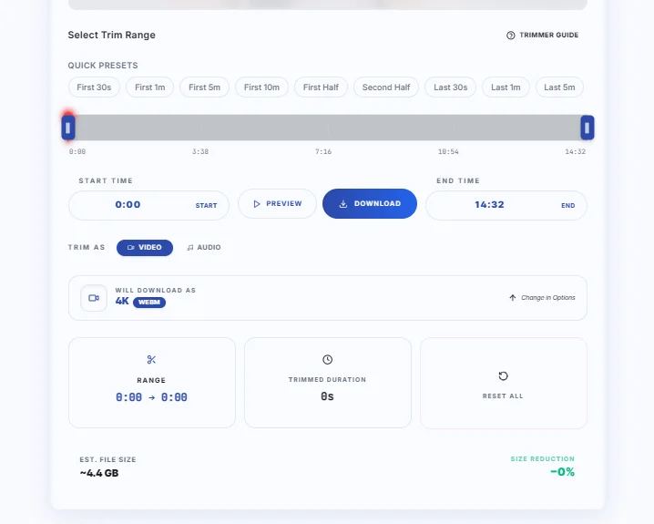
</p>

---


---

**Download History**
<p align="center">
  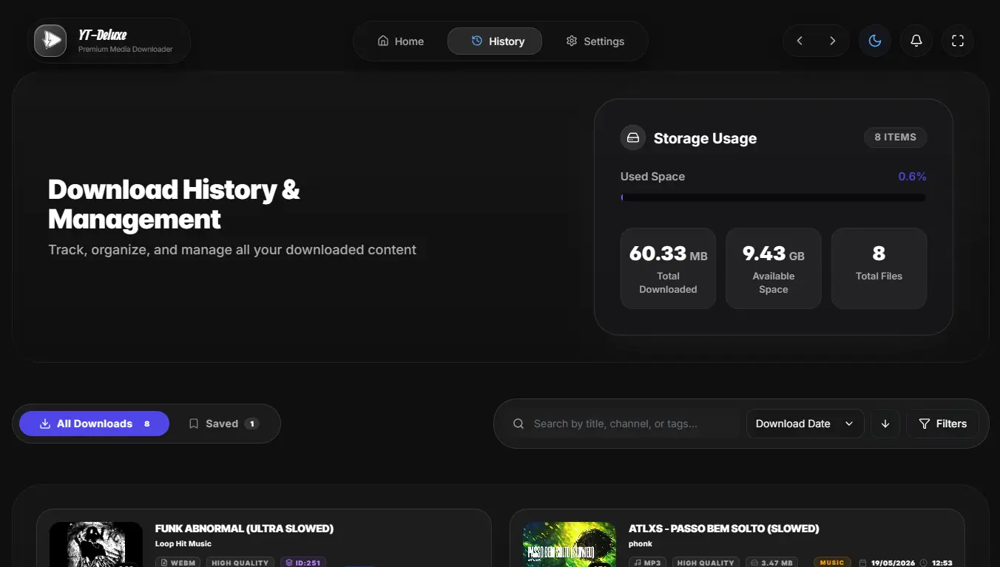
  &nbsp;
  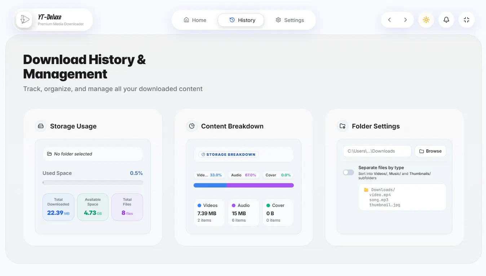
</p>

---

**Profile / About**
<p align="center">
  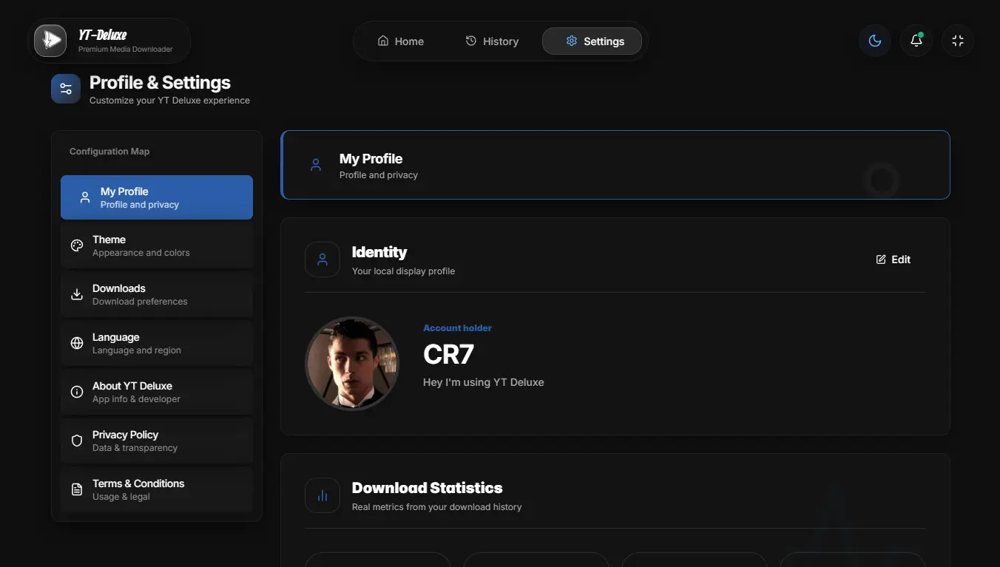
  &nbsp;
  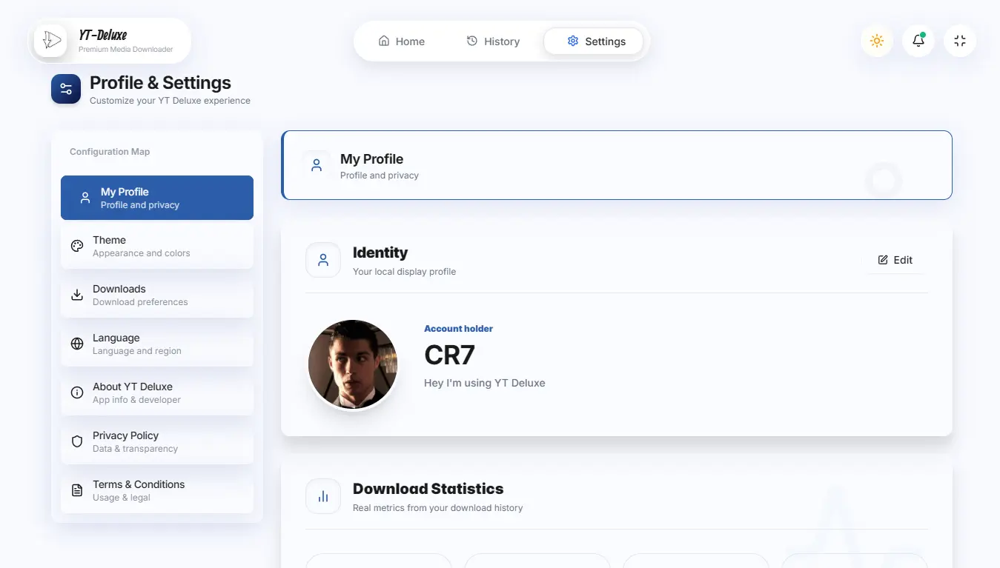
</p>

---

**Theme Settings**
<p align="center">
  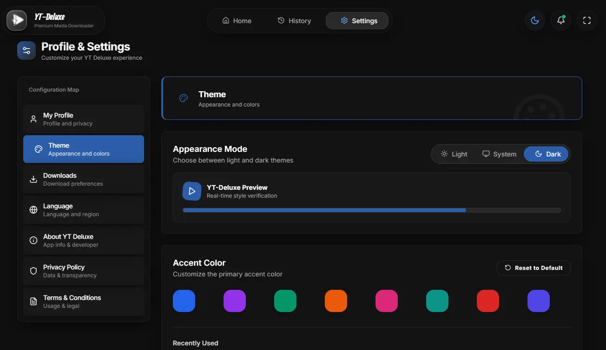
  &nbsp;
  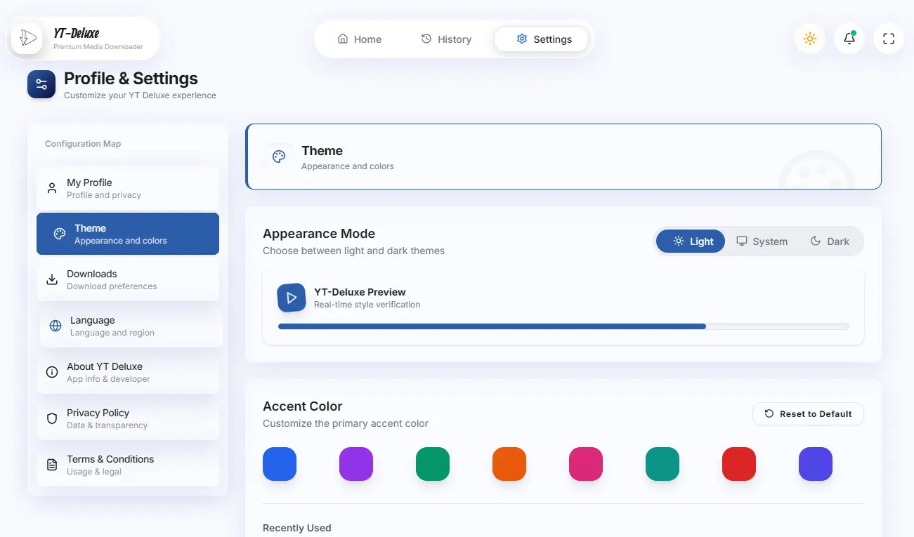
</p>

---

**Language Settings**
<p align="center">
  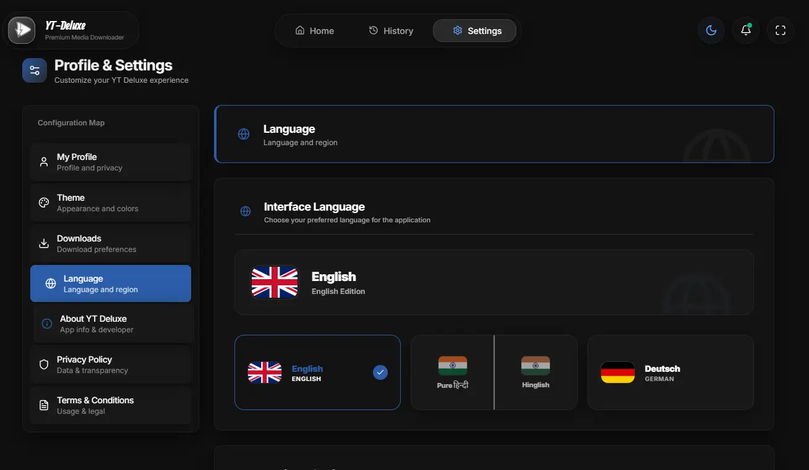
  &nbsp;
  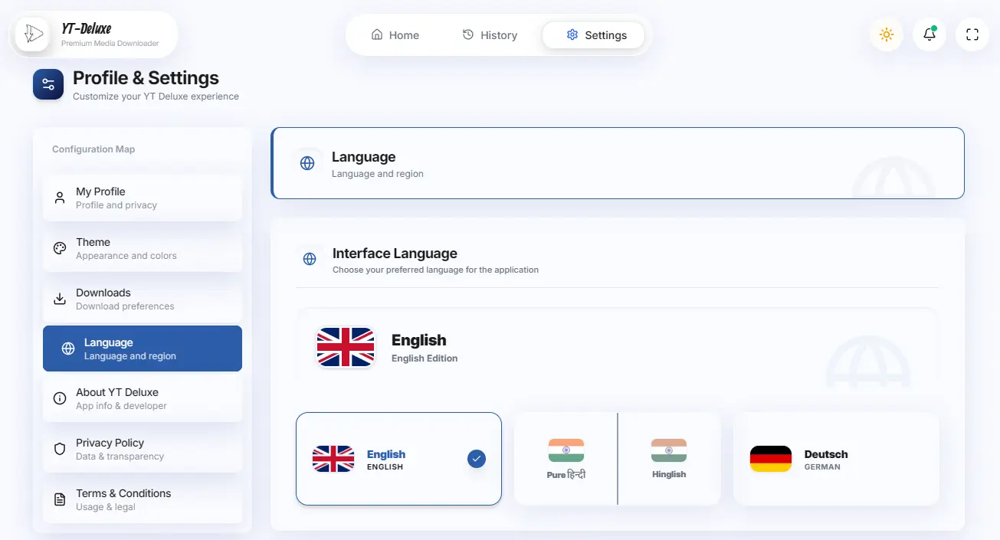
</p>

---

## 6. Vision & Roadmap

YT Deluxe is still growing. Here's where we're headed:

### 6.1 In Progress
- Playlist batch download support
- Subtitle/caption embedding
- macOS & Linux desktop builds
- Progress notifications (OS-native)

### 6.2 Future Ideas
- Browser extension integration
- Scheduled / queued downloads
- SponsorBlock segment removal
- Cloud sync for download history
- Mobile web PWA support
- Plugin/extension system for custom post-processors

> [!TIP]
> Have an idea? [Open a discussion](https://github.com/Utsavstack/YT-Deluxe/discussions) - all suggestions are welcome!

---

## 7. Quick Start

> [!IMPORTANT]
> For full setup instructions, architecture deep-dives, API references, and build guides, see [ARCHITECTURE.md](./ARCHITECTURE.md).

### 7.1 Prerequisites
- **Node.js** v18 or LTS
- **Python** 3.10+ (tested on 3.13)
- **FFmpeg** - must be in system PATH ([download here](https://ffmpeg.org/download.html))
- **yt-dlp** `>= 2026.3.17` (keep updated)

### 7.2 Frontend
```bash
cd frontend
npm install
npm run dev       # http://localhost:5848
```

### 7.3 Backend
```bash
cd backend
python -m venv .venv
.venv\Scripts\activate   # Windows
pip install -r requirements.txt
uvicorn main:app --reload  # http://localhost:8000
```

> The frontend auto-connects to `localhost:8000`. Set `VITE_API_BASE_URL` in `.env` to change this.

---

## 8. Contributing

Contributions make open-source great - and YT Deluxe better for everyone. All kinds of contributions are welcome!

### 8.1 How to Contribute

1. **Fork** this repository
2. **Create a feature branch**: `git checkout -b feature/your-feature-name`
3. **Make your changes** and test thoroughly
4. **Commit** with a clear message: `git commit -m "feat: add subtitle embedding"`
5. **Push** to your fork: `git push origin feature/your-feature-name`
6. **Open a Pull Request** - describe what you changed and why

### 8.2 Contribution Guidelines
- Keep PRs focused - one feature or fix per PR
- Follow existing code style and conventions
- Write clear commit messages (use [Conventional Commits](https://www.conventionalcommits.org/))
- Test your changes before submitting
- For major changes, open an issue first to discuss

### 8.3 Reporting Bugs
Found something broken? [Open an issue](https://github.com/Utsavstack/YT-Deluxe/issues) with:
- Steps to reproduce
- Expected vs actual behavior
- Your OS, browser/app version
- Any relevant logs

### 8.4 Suggesting Features
Have an idea? [Open a discussion](https://github.com/Utsavstack/YT-Deluxe/discussions) - let's talk about it before implementation.

---

## 9. Donate

YT Deluxe is and will always be **free**. If you find it useful and want to support the project:

> *Donation link coming soon*

<!-- Uncomment when ready:
[](https://buymeacoffee.com/YOUR_LINK)
[](https://github.com/sponsors/Utsavstack)
-->

Even a star on GitHub helps a lot - it shows others the project is worth their time!

---

## 10. About the Developer

**YT Deluxe** is designed and built by **Utsav Parmar**, a full-stack developer passionate about building tools that are both powerful and beautiful.

<table>
  <tr>
    <td align="center">
      <strong>Utsav Parmar</strong><br>
      Full-Stack Developer<br>
      <br>
      <a href="https://github.com/Utsavstack"></a>
      <a href="https://www.linkedin.com/in/utsavparmar-full-stack-dev"></a>
      <a href="https://x.com/iutsavparmar"></a>
      <a href="https://instagram.com/_its_me_utsav_"></a>
    </td>
  </tr>
</table>

> *Built with love - Made with❤️UP7*

---

## 11. Credits & Acknowledgments

YT Deluxe is built on the shoulders of giants. None of this would be possible without the open-source community and the dedicated developers behind these tools.

> [!NOTE]
> All libraries listed below are used in compliance with their respective licenses. No modifications have been made to their source code unless explicitly stated.

### 11.1 Core Engine

The heart of YT Deluxe's media pipeline. These tools handle all YouTube extraction, stream merging, codec conversion, and bot-detection bypass entirely on the server side.

| Project | Role | License |
|---|---|---|
| [yt-dlp](https://github.com/yt-dlp/yt-dlp) | YouTube video/audio extraction engine | Unlicense |
| [FFmpeg](https://ffmpeg.org) | Video/audio merging, trimming & transcoding | LGPL / GPL |
| [bgutil-ytdlp-pot-provider](https://github.com/Brainicism/bgutil-ytdlp-pot-provider) | Automatic PO Token generation for bot detection bypass | MIT |

### 11.2 Frontend

The full React ecosystem powering the Liquid Glass UI from routing and state management to animations, internationalization, and icon rendering.

| Project | Role | License |
|---|---|---|
| [React](https://react.dev) | UI library | MIT |
| [Vite](https://vitejs.dev) | Build tool & dev server | MIT |
| [TailwindCSS](https://tailwindcss.com) | Utility-first CSS framework | MIT |
| [Framer Motion](https://www.framer.com/motion/) | Animation library | MIT |
| [Lucide React](https://lucide.dev) | Icon library | ISC |
| [React Router](https://reactrouter.com) | Client-side routing | MIT |
| [Redux Toolkit](https://redux-toolkit.js.org) | State management | MIT |
| [Axios](https://axios-http.com) | HTTP client | MIT |
| [i18next](https://www.i18next.com) | Internationalization | MIT |
| [Recharts](https://recharts.org) | Data visualization | MIT |
| [React Hook Form](https://react-hook-form.com) | Form state management | MIT |
| [date-fns](https://date-fns.org) | Date utility library | MIT |
| [Radix UI](https://www.radix-ui.com) | Accessible UI primitives | MIT |

### 11.3 UI Component Credits

Certain bespoke UI components were inspired or adapted from the open-source component community. All are used in compliance with their respective source terms.

| Component | Author / Source | Link |
|---|---|---|
| **Infinite Grid Background** | Shadway-21st.dev | [View Component](https://21st.dev/community/components/shadway/the-infinite-grid/default) |
| **Custom Dropdown** | ReUI-21st.dev | [View Component](https://21st.dev/community/components/reui/accordion-1/nested) |
| **Spinner / Loader** | mobinkakei-UIverse.io | [View Component](https://uiverse.io/mobinkakei/pink-deer-76) |
| **Search Bar** | Smit-Prajapati-UIverse.io | [View Component](https://uiverse.io/Smit-Prajapati/brave-hound-66) |
| **Bell / Notification Icon** | vinodjangid07-UIverse.io | [View Component](https://uiverse.io/vinodjangid07/tricky-bullfrog-41) |

### 11.4 Backend

The Python server layer that handles all media processing, async task management, file I/O, and REST API communication between the UI and the download engine.

| Project | Role | License |
|---|---|---|
| [FastAPI](https://fastapi.tiangolo.com) | Async API framework | MIT |
| [Uvicorn](https://www.uvicorn.org) | ASGI server | BSD |
| [aiofiles](https://github.com/Tinche/aiofiles) | Async file I/O | Apache 2.0 |
| [python-multipart](https://github.com/andrew-d/python-multipart) | Form-data parsing | Apache 2.0 |
| [Requests](https://requests.readthedocs.io) | HTTP library | Apache 2.0 |

### 11.5 Desktop Packaging

Tools used to bundle the full application Python backend, React frontend, and system dependencies into a single native Windows `.exe` installer.

| Project | Role | License |
|---|---|---|
| [pywebview](https://pywebview.flowrl.com) | Native OS window (Chromium/Edge) | BSD |
| [PyInstaller](https://pyinstaller.org) | Python -> .exe bundler | GPL + Bootloader Exception |
| [Inno Setup 6](https://jrsoftware.org/isinfo.php) | Windows installer compiler | Custom Free |


### 11.6 Special Thanks

A sincere thank you to:
- The **[yt-dlp](https://github.com/yt-dlp/yt-dlp) contributors** - for building and maintaining the most powerful YouTube extraction tool available. YT Deluxe is fundamentally powered by their work.
- The **[FFmpeg](https://ffmpeg.org) team** - for decades of unmatched multimedia processing that runs quietly behind every download and trim.
- The **[Brainicism](https://github.com/Brainicism)** team - for the bgutil PO Token provider that keeps downloads working reliably.
- The **open-source community at large** - every Stack Overflow answer, GitHub issue, and documentation page that made this project possible.
- **Every contributor, tester, and user** of YT Deluxe - your feedback and support drive this project forward.

> [!TIP]
> If any of these projects have helped you too, consider starring or sponsoring them directly. Open source thrives on appreciation.

---

## 12. Legal

### 12.1 License

This project is licensed under the **GNU General Public License v3.0 (GPL-3.0)**.

> [!NOTE]
> **Community Intent: Personal & Non-Commercial Use**
> While the GPL-3.0 license guarantees your right to use, modify, and distribute the code, the primary intent of this project is for **personal, educational, and non-commercial use**. 
> 
> We strongly discourage using this software for commercial monetization, selling, or hiding it behind paywalls. Please respect the open-source spirit and keep it free for everyone.

You are free to:
- **Use** this software for personal or educational purposes
- **Study** and inspect the source code
- **Modify** it for your own use
- **Distribute** your modifications, provided they remain under GPL-3.0

> [!WARNING]
> You **may not**:
> - Distribute this software under a different license
> - Use this in a closed-source/proprietary product without complying with GPL terms
> - Remove copyright or license notices
> - Use the "YT Deluxe" name or branding for unofficial forks or derivatives without permission

See the full license text in [LICENSE](./LICENSE).

> [!IMPORTANT]
> All third-party libraries used in this project retain their own licenses. See the [Credits section](#credits--acknowledgments) for individual license details.

---

### 12.2 Privacy Policy

> [!TIP]
> **YT Deluxe does not collect, store, or sell any personal data.**

#### 12.2.1 What We Do Not Collect
- No user accounts, no sign-in, no profile data
- No analytics or telemetry
- No crash reporting sent to external services
- No cookies set by this application
- No IP address logging

#### 12.2.2 What Is Stored Locally
- Download history is stored **on your own device only** - in `~/.yt-deluxe/history.json` (Desktop) or your browser's `localStorage` (Web)
- User preferences and language settings are stored locally
- No data is synced to any cloud or remote server

> [!NOTE]
> #### Third-Party Services
> - **YouTube / Google**: When you search or download, your requests go through the backend (which uses yt-dlp). YouTube's own [Privacy Policy](https://policies.google.com/privacy) and [Terms of Service](https://www.youtube.com/static?template=terms) apply to all interactions with their platform.
> - **Shield.io** (README badges only): No user data is involved.

#### 12.2.3 Web-Hosted Instance
- Temporary download files are processed and **auto-deleted** from the server after 10 minutes
- No user data is retained between sessions
- The server operator (whoever hosts the instance) is responsible for their own data handling

#### 12.2.4 Self-Hosted / Desktop
- You are entirely in control of your own data
- No network connection is made except to YouTube (via yt-dlp) and optionally to GitHub for updates

> [!NOTE]
> This policy applies to the official YT Deluxe project. Third-party forks or hosted instances may have different data practices.

---

### 12.3 Terms & Conditions

> [!IMPORTANT]
> By downloading, installing, or using YT Deluxe, you agree to the following terms. If you do not agree, do not use this software.

#### 1. Acceptance of Terms
Use of this software constitutes your acceptance of these terms. These terms may be updated at any time without prior notice. Continued use implies acceptance of any changes.

#### 2. Personal Use Only
YT Deluxe is intended strictly for **personal, non-commercial use**. You may not use it to build a commercial product, resell downloads, or operate it as a service for others without compliance with the GPL-3.0 license.

#### 3. Copyright & Content Responsibility
> [!WARNING]
> You are **solely responsible** for ensuring that any content you download complies with:
> - The copyright laws of your country or jurisdiction
> - The rights of the original content creator
> - [YouTube's Terms of Service](https://www.youtube.com/static?template=terms)
>
> The developers of YT Deluxe are not responsible for how you use downloaded content.

> [!CAUTION]
> #### 4. No Warranty
> YT Deluxe is provided **as-is**, without warranties of any kind - express or implied. This includes but is not limited to warranties of merchantability, fitness for a particular purpose, or non-infringement. The developers make no guarantees about uptime, accuracy, or suitability for any specific use.

> [!CAUTION]
> #### 5. Limitation of Liability
> To the maximum extent permitted by applicable law, the developers of YT Deluxe shall not be liable for:
> - Any direct, indirect, incidental, or consequential damages
> - Data loss, corruption, or unauthorized access
> - Service interruption or failure of YouTube's APIs
> - Any legal action arising from your use of this software

> [!WARNING]
> #### 6. Responsible Use
> Do not use YT Deluxe to:
> - Infringe on intellectual property rights of creators or rights holders
> - Circumvent DRM (Digital Rights Management) protections
> - Enable piracy or unauthorized redistribution of content
> - Violate any applicable law or regulation

> [!NOTE]
> #### 7. Age Restriction
> This software is intended for users aged **13 and above**. By using it, you confirm that you meet this requirement or have parental/guardian consent.

#### 8. Changes to Terms
These terms may be updated at any time. The latest version will always be available in this repository. Significant changes will be noted in the changelog.

> [!NOTE]
> YT Deluxe is an open-source, educational project. It does not host, cache, or redistribute any YouTube content.

---

### 12.4 Disclaimer

> [!CAUTION]
> **No Affiliation**: YT Deluxe is **not affiliated with, endorsed by, or sponsored by YouTube, Google LLC, or any of their subsidiaries** in any way. All YouTube trademarks, service marks, trade names, and logos are the property of their respective owners.
>
> **No Legal Responsibility**: The developers of YT Deluxe take no responsibility for the misuse of this software, any legal consequences arising from its use, or any content downloaded using this tool.
>
> **Stability**: YT Deluxe depends on yt-dlp and YouTube's internal APIs. These may break without notice due to changes on YouTube's end. The developers make no guarantees of continued functionality.
>
> **Use at Your Own Risk**: Downloading copyrighted content without permission may be illegal in your country. You are fully responsible for your own actions.

---

<p align="center">
  Built with love as a Free &amp; Open Source Project<br>
  <strong>Made With❤️UP7</strong><br><br>
  <em>Last Updated: May 2026</em>
</p>

