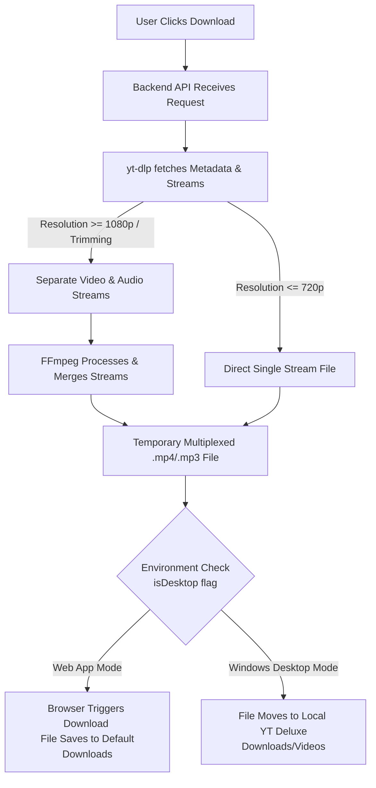
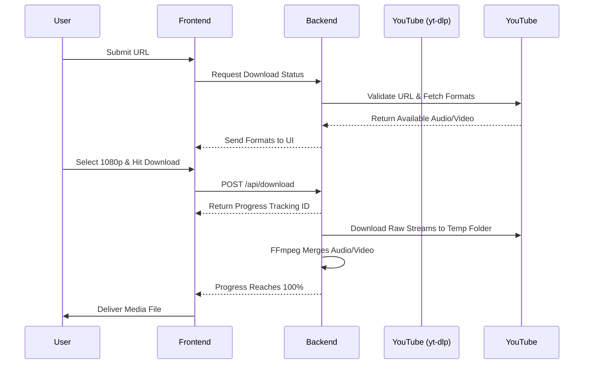
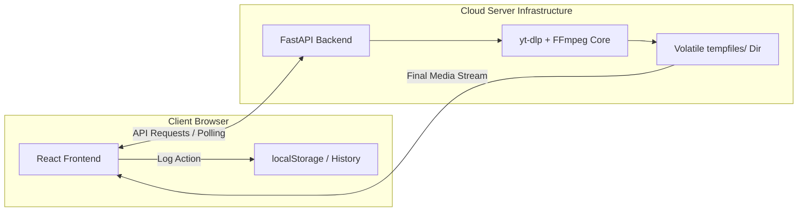
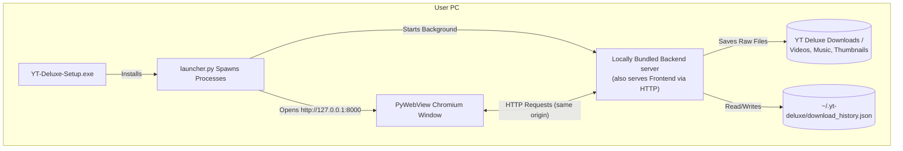

# YT Deluxe

[](https://react.dev)
[](https://vitejs.dev)
[](https://www.python.org)
[](https://fastapi.tiangolo.com)
[](https://pywebview.flowrl.com)
[](https://github.com/yt-dlp/yt-dlp)
[](https://ffmpeg.org)
[](https://github.com/Brainicism/bgutil-ytdlp-pot-provider)

**YT Deluxe** is a Free & OpenSource, Full-stack, Feature-rich YouTube Downloader and Media Management Web Application with a premium **"Liquid Glass"** UI. Built with a React frontend and a robust FastAPI backend, **YT Deluxe** empowers users to search, preview, and download YouTube videos and audio with a streamlined, premium experience.

It is designed with a **Hybrid Architecture** meaning it runs seamlessly as a Hosted **Web App** (browser-based) or as a Native **Windows App** (.exe), sharing the exact same codebase.

---

## 1. Features Overview

### 1.1 Frontend (Modern UI)

- **React 18 & Vite**: Ultra-fast, responsive UI leveraging modern concurrent rendering and hooks.
- **Liquid Glass Design Language**: Premium, high-blur, and transparent styling via TailwindCSS with **`rounded-xl`** geometry for consistent modern aesthetics.
- **Multilingual & Hinglish Support**: Native support for English, Hindi, German, and conversational **Hinglish** (Hindi-English) with persistent state synchronization.
- **Dynamic Mode Detection**: React automatically switches UI features (like local paths) based on the `isDesktop` environment flag.
- **Framer Motion**: Smooth, high-performance UI animations, including premium 'Sliding Pill' tab transitions and entrance effects.
- **Integrated Legal Hub**: Dedicated informational sections for About, Privacy Policy, and Terms & Conditions directly inside the app.
- **Lucide Icons**: Clean, light-weight, and professional-grade icon library.

### 1.2 Backend (Advanced Engine)

- **FastAPI Core**: Blazing fast asynchronous processing with comprehensive endpoint management.
- **Advanced yt-dlp Extractor**: Robust video/audio fetching with **PO Token** (Proof of Origin) support to bypass bot detection.
- **Integrated FFmpeg Merge**: Seamlessly merges high-res (1080p+) DASH video/audio streams into a single high-quality file.
- **Unified Download Engine**: On Windows Desktop, files are natively routed to your `Downloads` folder, with an "Open Folder" feature.
- **Thumbnail API Proxy**: Bypasses CORS and environment restrictions in desktop mode by routing image downloads through a secure backend proxy.
- **Precision Trimming**: Trim specific segments from your downloads with no quality re-encoding loss, featuring **MM:SS** time formatting.
- **Streamlined Preferences**: Removed technical "Advanced" overhead to focus on a cleaner, simplified user experience.
- **Progress Tracking**: Real-time download speed, percentage, and ETA polling.
- **History Persistence**: User downloads are logged and persist across sessions (JSON on Desktop, LocalStorage on Web).
- **Auto-Cleanup Daemon**: Server-side temp files are wiped after delivery to ensure data privacy and prevent bloating.
- **CORS Enabled**: Secure communication between frontend and backend.

---

## 2. Demo

> _Add screenshots or a GIF here to showcase the UI and features!_

---

## 3. Project Structure

```text
yt-deluxe/
├── .env            # Environment variables
├── .gitignore         # Git ignore rules
├── README.md          # This file
│
├── frontend/          # React app (Vite + TailwindCSS)
│  ├── package.json      # NPM dependencies & scripts
│  ├── vite.config.mjs     # Vite build config
│  └── src/
│    ├── pages/       # Core UI (Search, Details, History, Settings)
│    ├── components/     # Reusable UI parts
│    └── utils/api.js    # Backend communication client
│
├── backend/          # FastAPI application
│  ├── main.py         # Routes, FFmpeg execution, Background Tasks
│  ├── requirements.txt    # Python module dependencies
│  └── tempfiles/       # Ephemeral processing directory
│
└── desktop/          # Native Windows Wrappers
   ├── launcher.py       # Spawns Backend & PyWebView window
   ├── build.spec       # PyInstaller build config
   └── installer/       # Inno Setup 6 Distribution Scripts
       └── setup.iss     # Builds the final .exe Windows Installer
```

---

## 4. Architecture & Workflows

### 4.1 Unified Download Flow (yt-dlp to User Output)

_How a video converts from a YouTube URL into a file on your device._



**Detailed Step-by-Step Flow Explanation:**

1. **Request Initiation**: When a user selects a format and clicks Download, the React frontend sends a `POST` request to the `/api/download` endpoint with the video URL and selected quality parameters.
2. **Metadata Extraction**: The FastAPI backend invokes `yt-dlp` to fetch metadata. If a "PO Token" is required to bypass bot detection, it is automatically generated and injected into the request.
3. **Stream Selection Logic**:
   - **Standard Quality (<= 720p)**: YouTube provides these as "progressive" streams (Video and Audio combined). The app downloads this as a single coherent file directly to the temporary processing directory.
   - **High Quality (>= 1080p) & MP3**: YouTube serves these as separate "DASH" streams. The background task downloads the high-res video (without audio) and the high-bitrate audio (without video) as two distinct temporary files.
4. **Processing & Merging (FFmpeg)**:
   - If streams were split (High Quality), `FFmpeg` is automatically triggered to multiplex (merge) the video and audio into a single `.mp4` container.
   - If "Trimming" was requested, `FFmpeg` cuts the file at the specified `start` and `end` timestamps without re-encoding when possible, ensuring zero quality loss.
5. **Environment Check (`isDesktop` Flag)**:
   - **Web Mode**: Once the file is ready in the `tempfiles/` folder, the backend returns a success status. The frontend then uses a hidden `<a>` tag to trigger a native browser download, saving the file to the user's default browser downloads folder.
   - **Desktop Mode**: The `isDesktop` flag (detected via `window.pywebview`) tells the backend to handle the file writes natively. The file is downloaded directly to the user's local `YT Deluxe Downloads/` subdirectories (Videos, Music, or Thumbnails) instead of a temporary folder. The user can then click "Open in Explorer" in the UI to trigger a background API call that natively highlights the file in Windows Explorer.
6. **Auto-Cleanup**: After the user receives the file, a self-destruct timer wipes the file from the server's temporary storage to keep it lightweight.

---

### 4.2 Download Architecture Details

The application uses a sophisticated **Server-Merged Tempfile Architecture** to ensure the smoothest user experience:

1. **Background Tasks**: All extraction (including `<720p` progressive and `1080p+` DASH formats) occurs in a robust background worker inside the FastAPI backend.
2. **WebSocket/Polling Progress**: Frontend seamlessly pulls download speed, ETA, and progress from the backend without heavy page reloads, showing a smooth in-app progress bar.
3. **Seamless Native Delivery**: Upon 100% completion in the backend `tempfiles` directory, the UI assesses the `{Environment Check}` via the `isDesktop` flag (detected through `window.pywebview`).
    - **Web Form**: A hidden `<a download>` tag silently triggers the browser's native file saving window.
    - **Desktop Form**: FastAPI natively saves the file directly to your Custom Download Directory. An "Open Folder" button in the UI can execute a foreground Windows Explorer window to highlight the file.
4. **Auto-Cleanup**: A background threading daemon automatically sets self-destruct timers for completed files, wiping them from the `tempfiles` folder exactly 10 minutes after download to eliminate permanent server storage bloat.
5. **Anti-Bot Engine (PO Tokens)**: Deeply integrates a Node.js-based HTTP server inside the container alongside FastAPI that silently negotiates Proof-of-Origin limits with YouTube via mobile web profiles, effectively avoiding `HTTP 403 Forbidden` bans.
6. **Hybrid Architecture (`isDesktop`)**: Automatically detects if it's running in a browser or as an installed Windows app via `window.pywebview` presence. This detection dictates the **{Environment Check}** step in the workflow — altering features (like hiding Storage Settings on the Web) seamlessly.
7. **Hybrid Storage & History Handling**:
   - `tempfiles/`: Used internally by the backend for processing FFmpeg merges.
   - `localStorage`: Fast, isolated history storage specifically for Web deployments.
   - `~/.yt-deluxe/`: Persistent local JSON for Desktop installations.

### 4.3 End-to-End System Structure

_How the entire platform communicates during a download lifecycle._



**End-to-End Sequence Breakdown:**

1. **Discovery**: The user enters a search term or URL. The frontend calls the backend which uses `yt-dlp` to fetch all available metadata (resolutions, formats, thumbnails).
2. **Configuration**: The backend sends the available formats back to the UI. The user selects their desired quality (e.g., 1080p MP4) and optional settings like "Trimming".
3. **Task Initiation**: Clicking "Download" sends a `POST` request. The backend initializes a `Background Task`, generates a unique `task_id`, and returns it immediately to the frontend.
4. **Active Processing**: While the backend is busy downloading and merging streams using FFmpeg, the frontend uses the `task_id` to poll for real-time progress updates.
5. **Final Delivery**: Once progress reaches 100%, the backend prepares the final file. The frontend then triggers the final download/move logic based on the detected environment.

---

### 4.4 Hosted Web Application Architecture

_How the platform operates when hosted on cloud servers._



**Web Deployment Workflow:**

- **Client Layer**: The React frontend is served as static assets. It uses `localStorage` for local persistence of history and settings, ensuring that user data stays private and localized to their browser.
- **API Layer**: The FastAPI backend handles heavy lifting. It must be hosted on a service that supports persistent or scale-to-zero compute with `FFmpeg` installed.
- **Volatile Storage**: The `tempfiles/` directory acts as a high-speed workspace for stream merging. Files here are ephemeral and auto-deleted after 10 minutes to maintain server health.
- **Streaming**: The final file is streamed back to the user via an HTTP `FileResponse`, allowing the browser to handle the bitstream as a standard file download.

---

### 4.5 Native Windows Desktop Architecture

_How the platform operates when installed locally as an .exe via the Launcher._



**Desktop Integration Workflow:**

- **HTTP-Based Frontend Serving**: In packaged mode, the backend statically serves the React build at `http://127.0.0.1:8000`. The PyWebView wrapper loads this URL instead of a `file:///` path. This provides a valid HTTP origin, which is **critical** for YouTube iframe embeds (fixes Error 153: Video player configuration) and enables standard `BrowserRouter` routing.
- **Dynamic Path Resolution (YTDELUXE_FRONTEND_DIR)**: `launcher.py` safely evaluates the bundled frontend location at runtime and proxies it to the isolated `--onefile` backend via standard environment variables (`os.environ.get('YTDELUXE_FRONTEND_DIR')`). This fundamentally replaces hardcoded or `sys._MEIPASS` dependency checking, enabling modular pyinstaller build strategies.
- **Port Conflict Awareness**: If a developer launches the `YT-Deluxe.exe` application while their local Uvicorn dev server is active on `port 8000`, the bundled backend silently crashes (`winerror 10048 address already in use`), and the UI inadvertently communicates with the uncompiled dev server (resulting in a blank `{"detail":"Not Found"}` SPA fallback). Users must close dev shells before executing native wrapper tests.
- **Desktop Detection**: The frontend detects desktop mode natively via the `window.pywebview` object (injected by the compiled GUI framework), disregarding archaic `file:` protocol checks. This ensures reliable native download triggers.
- **Deep OS Access**:
  - **Native Downloads**: The backend has direct permission to write to the user's `Downloads/YT Deluxe Downloads` folder.
  - **Persistent History**: Instead of browser storage, the app writes to a standard JSON database located in the user's home directory (`~/.yt-deluxe/`).
- **One-Click Launch**: The `launcher.py` entry point ensures that both the server and the UI window open and close together gracefully.

---

## 5. Installation and Setup (Local Development)

Follow this setup to run both servers (React + FastAPI) locally on any development machine.

### 5.1 Frontend Dependencies

| Package | Version | Purpose |
|---|---|---|
| react | `^18.2.0` | UI library |
| react-router-dom | `6.0.2` | Client-side routing |
| @reduxjs/toolkit | `^2.6.1` | State management |
| tailwindcss | `3.4.6` | Utility-first CSS |
| framer-motion | `^10.16.4` | UI animations |
| axios | `^1.8.4` | Backend API communication |

### 5.2 Backend Dependencies

| Package | Version | Purpose |
|---|---|---|
| fastapi | `0.133.0` | High-performance async API |
| uvicorn[standard] | `0.41.0` | ASGI server |
| yt-dlp | `>=2026.3.17` | YouTube video/audio extraction |
| ffmpeg | `>=2025-09-25` | Video merging and MP3 conversion |
| bgutil-pot-provider | `latest` | Automatic PO token generation |
| requests | `2.32.5` | HTTP requests & Streaming |
| python-multipart | `0.0.22` | Form-data parsing for FastAPI |
| aiofiles | `25.1.0` | Async file operations |

### 5.3 Desktop Dependencies

| Package | Version | Purpose |
|---|---|---|
| pywebview | `>=4.4.1` | Native OS window encapsulation (Chromium Edge) |
| pyinstaller | `>=6.4.0` | Bundling Python application to `.exe` |

### 5.4 Prerequisites

- **Node.js**: `v18 or LTS`
- **Python**: `3.10+ (Tested on 3.13)`
- **yt-dlp** `>=2026.3.17 (keep as soon as possible updated)` _for YouTube Downloads_

- **FFmpeg**: `>=2025-09-25 (keep as soon as possible updated)` _for Merging Videos_

### 5.5 Frontend Setup (Local)

Open your first terminal window:

```bash
cd frontend
npm install
npm run dev     # Starts Vite Server on http://localhost:5848
```

#### Frontend Files Structure

```text
├── frontend/          # React app (Vite + TailwindCSS)
│  ├── package.json      # NPM dependencies & scripts
│  ├── vite.config.mjs     # Vite build config
│  └── src/
│    ├── pages/       # Core UI (Search, Details, History, Settings)
│    ├── components/     # Reusable UI parts
│    └── utils/api.js    # Backend communication client
```

### 5.6 Backend Setup (Local)

Open a second terminal window:

```bash
cd backend
python -m venv .venv

# Activate the venv:
# Windows:
.venv\Scripts\activate
# macOS/Linux:
source .venv/bin/activate

pip install -r requirements.txt

# Make sure FFmpeg is installed and added to your System's Environment Variables PATH
# Install FFmpeg:
# Windows: Download from https://ffmpeg.org/download.html OR
# https://www.gyan.dev/ffmpeg/builds/
# macOS: brew install ffmpeg
# Ubuntu/Debian: sudo apt install ffmpeg

# Starts FastAPI Dev server on http://localhost:8000
uvicorn main:app --reload  # Dev mode

# Check the API documentation at /docs
http://localhost:8000/docs

# for production:
uvicorn main:app --host 0.0.0.0 --port 8000
```

### Backend Files Structure

```text
├── backend/          # FastAPI application
│  ├── main.py         # Routes, FFmpeg execution, Background Tasks
│  ├── requirements.txt    # Python module dependencies
│  └── tempfiles/       # Ephemeral processing directory
```

_By default, the frontend expects the backend at `localhost:8000`. Set `VITE_API_BASE_URL` in your `.env` if this differs._

---

## 6. API Reference

| Endpoint                           | Method | Description                                      |
|------------------------------------|--------|--------------------------------------------------|
| `/api/search`                      | GET    | Search YouTube by keyword                        |
| `/api/video`                       | GET    | Get video details and available formats          |
| `/api/stream`                      | GET    | Stream video/audio content with range support    |
| `/api/download`                    | POST   | Download video/audio with quality options        |
| `/api/batch-download`              | POST   | Download multiple videos simultaneously          |
| `/api/progress/{id}`               | GET    | Get real-time download progress and ETA          |
| `/api/history`                     | GET    | List local download history                      |
| `/api/history/{id}`                | DELETE | Delete a single history tracking item            |
| `/api/history/delete`              | POST   | Batch delete multiple history tracking items     |
| `/api/desktop/open-file`           | POST   | Natively open Windows Explorer highlighting file |
| `/api/desktop/open-folder`         | POST   | Natively open Windows Explorer at folder         |
| `/api/system/storage`              | POST   | Get local disk usage statistics                  |
| `/api/feedback`                    | POST   | Submit user feedback via application forms       |

---

## 7. Usage Guide

### 7.1 Search and Discovery

- Enter keywords in the search bar to fetch top YouTube results including thumbnails, durations, and channel metadata.
- **REST API**: `GET /api/search?q=search_term`

### 7.2 Format Selection, Metadata & Streaming

- Click any search result to extract all available DASH (High-Def) and Progressive (Standard-Def) formats directly from YouTube. You can also stream content directly without downloading.
- **REST API**: `GET /api/video?url=youtube_url` | `GET /api/stream?url=youtube_url&quality=1080p`

### 7.3 Download Management

- Configure your download with quality options (144p to 8K), format selection (MP4, MP3), and precision trimming.
- Integrated automatic PO Token negotiation ensures your IP remains safe from 403 blocks.
- **REST API**: `POST /api/download`

### 7.4 Batch Processing

- Paste multiple YouTube URLs into the Batch Manager to download entire playlists or series simultaneously.
- **REST API**: `POST /api/batch-download`

### 7.5 Real-time Performance Tracking

- Monitor download speed (MB/s), percentage completed, and estimated time remaining (ETA) via a circular or linear visual progress bar.
- **REST API**: `GET /api/progress/{task_id}`

### 7.6 History and Storage Management

- Access your download history to re-download files, delete single entries, or clear multiple items at once. You can also monitor your local disk usage statistics.
- **REST API**: `GET /api/history` (List all), `DELETE /api/history/{id}` (Remove single entry), `POST /api/history/delete` (Batch remove), and `POST /api/system/storage` (Check disk availability).

### 7.7 Native Desktop Integrations

- For users on the Windows Desktop App, file exploration is deeply integrated. You can click to open specific files or their parent folders seamlessly inside Windows Explorer.
- **REST API**: `POST /api/desktop/open-file` and `POST /api/desktop/open-folder`

### 7.8 User Feedback

- Submit bug reports or suggestions directly from the application UI.
- **REST API**: `POST /api/feedback`

---

### 7.9 API Usage Examples (CLI/cURL)

#### Search for Videos

```bash
curl "http://localhost:8000/api/search?q=python+tutorial"
```

#### Download Video

```bash
curl -X POST "http://localhost:8000/api/download" \
 -F "url=https://www.youtube.com/watch?v=VIDEO_ID" \
 -F "quality=720" \
 -F "format=mp4"
```

#### Download Progress

```bash
curl "http://localhost:8000/api/progress/{task_id}"
```

---

## 8. Building & Deploying the Web App

To host YT Deluxe publicly on the internet (Vercel, Render, Heroku):

### 8.1 Backend (Cloud Web Service)

- Deploy the `backend/` directory as a standard Python Web Service.
- **Critical Build Logic**: The server _must_ install FFmpeg alongside Python.
  - Build Command: `pip install -r requirements.txt && apt-get update && apt-get install -y ffmpeg`
- **Start Command**: `uvicorn main:app --host 0.0.0.0 --port $PORT`
                        OR

- **Use `Dockerfile` in backend folder to build and deploy.**
`yt-deluxe\backend\Dockerfile`

### 8.2 Frontend (Static Hosted App)

- Deploy the `frontend/` directory to any static hosting provider.
- **Build Command**: `npm run build`
- **Environment Variable**: Ensure you add `VITE_API_BASE_URL` pointing to your automatically deployed Backend URL (e.g., `https://my-backend-domain.com`).

### 8.3 Connecting Frontend & Backend

- By default, the frontend expects the backend API at `http://localhost:8000`.
- CORS is enabled for local development.
- Adjust API endpoints in the frontend if your backend runs on a different host/port.

---

## 9. Building for Desktop (Windows .exe)

To bundle the entire project into a completely standalone Windows application, follow this exact sequential pipeline. Each step fundamentally depends on the compiled output of the previous step.

### 9.1 Environment Preparation (Crucial)

Before building, **both** backend and desktop dependencies must be installed into the **backend's isolated `.venv`**. This ensures PyInstaller bundles everything cohesively without `ModuleNotFoundError` crashes.

```powershell
cd backend
python -m venv .venv
.venv\Scripts\activate
pip install -r requirements.txt
pip install pyinstaller

# Critical: Install desktop dependencies into the SAME backend .venv
cd ..\desktop
..\backend\.venv\Scripts\pip.exe install -r requirements.txt
```

### 9.2 Build Static Frontend

```powershell
cd frontend
npm run build 
```

_(Packages React into optimized HTML/JS inside `frontend/build`. The desktop `build.spec` copies this folder into the final bundle)._

### 9.3 Bundle Backend via PyInstaller

```powershell
cd backend
.venv\Scripts\pyinstaller.exe main.spec --clean -y
```

_(Packages Python, FastAPI, and `ffmpeg.exe` into a headless `backend/dist/main.exe`)._ **Note:** You must re-run this step anytime `main.py` is edited so changes are included in the bundle.

### 9.4 Build UI Launcher via PyInstaller

```powershell
cd desktop
# MUST use the backend's PyInstaller to guarantee pywebview dependency inclusion
..\backend\.venv\Scripts\pyinstaller.exe build.spec --clean -y
```

_(Creates the massive `desktop/dist/YT-Deluxe` application folder containing the PyWebView edge browser, the copied backend server, and the static frontend assets)._

### 9.5 Post-Build Testing (Port 8000 Conflict Awareness)

Before distributing your app, you should manually run the generated wrapper at `desktop/dist/YT-Deluxe/YT-Deluxe.exe`.

⚠️ **CRITICAL WARNING:** You **MUST CLOSE** any running local development servers (`uvicorn main:app --reload`) before double-clicking the generated `.exe`.
If a dev server is active, it occupies `port 8000`. The bundled `.exe` will launch, silently crash in the background due to `winerror 10048 address already in use`, and the UI window will mistakenly hit your uncompiled Dev server resulting in a blank `{"detail":"Not Found"}` SPA response.

### 9.6 Create the Final Setup Installer (Inno Setup)

To generate the distribution `.exe` that users can install on any Windows machine:

1. **Install Compiler**: Download and install [Inno Setup 6 (Unicode)](https://jrsoftware.org/isinfo.php).
2. **Dependency Prep**: Download the **Microsoft Edge WebView2 Evergreen Bootstrapper** (`MicrosoftEdgeWebview2Setup.exe`) from Microsoft and place it inside the `desktop/installer/` directory.
3. **Compile via GUI**:
   - Open Inno Setup Compiler.
   - Open the file `desktop/installer/setup.iss`.
   - Click **Build > Compile** (or press `Ctrl+F9`).

4. **Compile via CLI / One-Shot Full Rebuild Command**:

   ```powershell
   # Automate the entire 4-step build from terminal root:
   cd "d:\MyProject Reserve\30-9-25_Experimental\yt-deluxe"
   
   cd frontend && npm run build && cd ..
   cd backend && .venv\Scripts\pyinstaller.exe main.spec --clean -y && cd ..
   cd desktop && ..\backend\.venv\Scripts\pyinstaller.exe build.spec --clean -y && cd ..
   & "C:\Program Files (x86)\Inno Setup 6\ISCC.exe" "desktop/installer/setup.iss"
   ```

**What `setup.iss` does (Deep-Dive):**

- **UAC Elevation**: Requests Administrator privileges to install into `C:\Program Files\YT Deluxe\`.
- **WebView2 Silent Fix**: Automatically checks the Windows Registry. If the runtime is missing, it triggers a silent installation of the bundled bootstrapper (`/silent /install`) before the app first launches, preventing `.NET/WinForms` dependency crashes.
- **Path Verification**: Bundles the `backend/dist/main` and `desktop/dist/YT-Deluxe` assets into a single compressed package (~84MB).
- **Permission Hardening**: Configures the app to redirect all write operations (temp files and history) to the user's `%TEMP%` and `%USERPROFILE%` directories, dodging `WinError 5: Access Denied` errors common in installed apps.
- **Standardized Deployment**: Creates Start Menu and Desktop shortcuts with the high-res app icon, and includes a clean uninstaller.

---

## 10. Contributing

1. Fork the repository
2. Create a feature branch
3. Make your changes
4. Test thoroughly
5. Submit a pull request

---

## 11. Legal Notice

This tool is for personal use only. Downloading copyrighted content may violate YouTube’s terms of service. Use responsibly and respect copyright laws.

---

## 12. License

This project is for educational purposes. Please respect YouTube’s terms of service and copyright laws.

---

## 13. Support & Maintenance

For issues and questions:

1. Check the API documentation at `/docs`
2. Review the error logs
3. Ensure FFmpeg is properly installed
4. Update yt-dlp to the latest version & documentations
5. Update PO token provider
6. Rotate Cookies file if needed.

---

**Built with as a Free & Open Source Project.**

👨‍💻 **Developer:** Utsav Parmar  
🔗 **LinkedIn:** [www.linkedin.com/in/utsavparmar-full-stack-dev](https://www.linkedin.com/in/utsavparmar-full-stack-dev)  
🐙 **GitHub:** [https://github.com/Utsavstack](https://github.com/Utsavstack)  

**Made With❤️UP7**

_Last Updated: April 2026_
